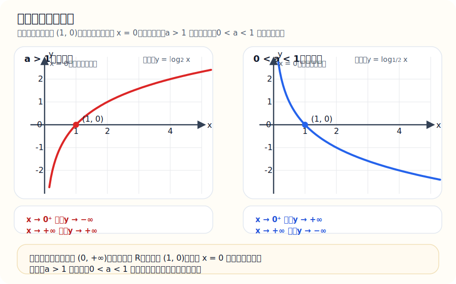
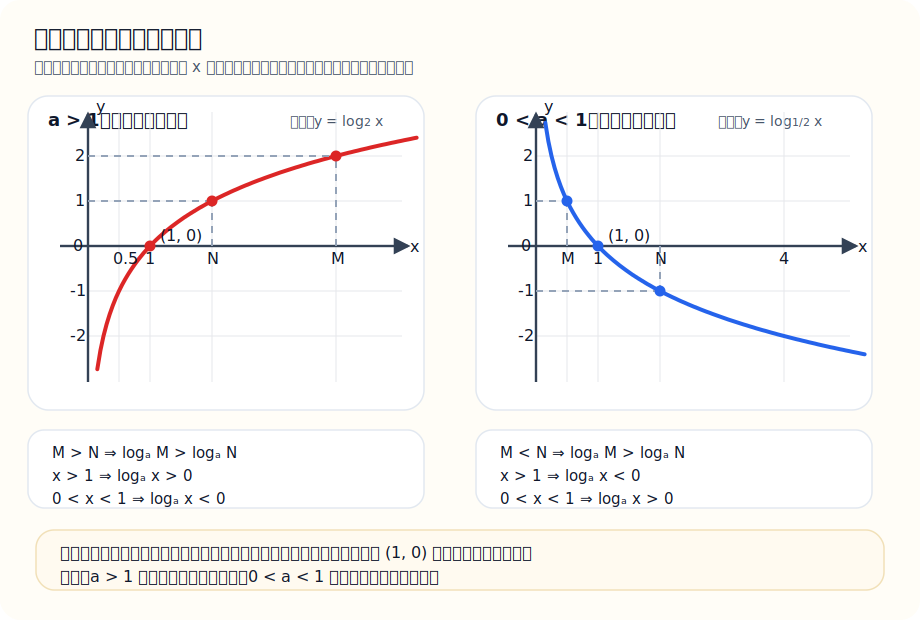

# 对数常用公式总表（含推导，附高中数学常用公式速查）

说明：这份文档适合考前速记，也适合基础阶段补理解。前半部分保留对数专题，后半部分补上高中数学高频公式速查。写法尽量统一成“结论 + 前提条件 + 一行推导”的形式，方便背诵和默写。

## 1. 对数的定义

若

$$
a > 0,\quad a \ne 1,\quad x > 0
$$

并且

$$
a^y = x
$$

那么定义

$$
y = \log_a x
$$

也就是说：

$$
a^y = x \iff y = \log_a x
$$

对数本质上就是指数的反运算。

## 2. 对数运算成立的前提

在实数范围内讨论对数时，要始终记住：

$$
a > 0,\quad a \ne 1
$$

真数必须大于 0，所以常见题目里还要满足：

$$
M > 0,\quad N > 0,\quad b > 0
$$

这是考研里最容易漏掉的条件之一。

## 3. 六条核心公式与推导

### 3.1 $\log_a 1 = 0$

因为

$$
a^0 = 1
$$

根据对数定义，"以 $a$ 为底，得到 1 的指数"就是 0，所以

$$
\log_a 1 = 0
$$

速记：真数是 1，对数就是 0。

### 3.2 $\log_a a = 1$

因为

$$
a^1 = a
$$

根据定义可得

$$
\log_a a = 1
$$

速记：底数和真数相同，对数就是 1。

### 3.3 $\log_a(MN)=\log_a M+\log_a N$

前提：

$$
M > 0,\quad N > 0
$$

设

$$
\log_a M = x,\quad \log_a N = y
$$

则由定义有

$$
M = a^x,\quad N = a^y
$$

所以

$$
MN = a^x \cdot a^y = a^{x+y}
$$

两边取以 $a$ 为底的对数，得

$$
\log_a(MN) = x + y
$$

即

$$
\log_a(MN)=\log_a M+\log_a N
$$

速记：积变和。

### 3.4 $\log_a \dfrac{M}{N}=\log_a M-\log_a N$

前提：

$$
M > 0,\quad N > 0
$$

设

$$
\log_a M = x,\quad \log_a N = y
$$

则

$$
M = a^x,\quad N = a^y
$$

于是

$$
\frac{M}{N} = \frac{a^x}{a^y} = a^{x-y}
$$

两边取对数得

$$
\log_a \frac{M}{N} = x - y
$$

即

$$
\log_a \frac{M}{N}=\log_a M-\log_a N
$$

速记：商变差。

### 3.5 $\log_a M^n = n\log_a M$

前提：

$$
M > 0
$$

设

$$
\log_a M = x
$$

则

$$
M = a^x
$$

所以

$$
M^n = (a^x)^n = a^{nx}
$$

两边取对数得

$$
\log_a M^n = nx
$$

即

$$
\log_a M^n = n\log_a M
$$

速记：幂拿下来。

### 3.6 $\log_a b=\dfrac{\ln b}{\ln a}$

这叫换底公式。

设

$$
\log_a b = x
$$

则

$$
a^x = b
$$

两边同时取自然对数：

$$
\ln(a^x)=\ln b
$$

由幂的对数公式得

$$
x\ln a = \ln b
$$

所以

$$
x = \frac{\ln b}{\ln a}
$$

即

$$
\log_a b=\frac{\ln b}{\ln a}
$$

速记：换底变除法。

## 4. 更一般的换底公式

不一定非要换成自然对数，换成任意底数 $c$ 的对数都可以，只要

$$
c > 0,\quad c \ne 1
$$

就有

$$
\log_a b = \frac{\log_c b}{\log_c a}
$$

由此还能推出两个高频结论：

$$
\log_a b = \frac{1}{\log_b a}
$$

以及

$$
\log_a b \cdot \log_b c = \log_a c
$$

特别地，

$$
\log_a b \cdot \log_b a = 1
$$

## 5. 最适合背诵的压缩版

### 5.1 结论

$$
\log_a 1 = 0
$$

$$
\log_a a = 1
$$

$$
\log_a(MN)=\log_a M+\log_a N
$$

$$
\log_a \frac{M}{N}=\log_a M-\log_a N
$$

$$
\log_a M^n = n\log_a M
$$

$$
\log_a b=\frac{\ln b}{\ln a}
$$

### 5.2 一行推导

$$
a^0 = 1 \Rightarrow \log_a 1 = 0
$$

$$
a^1 = a \Rightarrow \log_a a = 1
$$

$$
M = a^x,\ N = a^y \Rightarrow MN = a^{x+y}
$$

$$
M = a^x,\ N = a^y \Rightarrow \frac{M}{N} = a^{x-y}
$$

$$
M = a^x \Rightarrow M^n = a^{nx}
$$

$$
a^x=b \Rightarrow x\ln a=\ln b \Rightarrow x=\frac{\ln b}{\ln a}
$$

## 6. 指数函数与对数函数常用结论

### 6.1 指数函数

函数形式：

$$
y = a^x
$$

其中

$$
a > 0,\quad a \ne 1
$$

性质：

- 定义域：$\mathbb{R}$
- 值域：$(0,+\infty)$
- 过点：$(0,1)$
- 恒有：$a^x > 0$

单调性：

- 当 $a > 1$ 时，$y=a^x$ 单调递增
- 当 $0 < a < 1$ 时，$y=a^x$ 单调递减

### 6.2 对数函数

#### 6.2.1 定义

一般地，函数

$$
y = \log_a x \qquad (a > 0,\ a \ne 1)
$$

叫做对数函数，其中自变量的取值范围是

$$
x > 0
$$

它来自下面这组等价关系：

$$
a^y = x \iff y = \log_a x
$$

所以可以理解为：对数函数就是把指数函数反过来写得到的函数。

特别地：

- $\ln x = \log_e x$，叫自然对数函数
- $\lg x = \log_{10} x$，叫常用对数函数

#### 6.2.2 图像特征

- 图像只在 $y$ 轴右侧，因为真数必须满足 $x>0$
- 图像一定经过点 $(1,0)$，因为 $\log_a 1 = 0$
- 图像不过 $y$ 轴，因为 $x=0$ 时对数无意义
- 直线 $x=0$ 是它的竖直渐近线
- 它与指数函数 $y=a^x$ 互为反函数，所以两者图像关于直线 $y=x$ 对称

把图和文字一起看会更直观：

左图对应 $a>1$，右图对应 $0<a<1$。先把“都过 $(1,0)$、都以 $x=0$ 为竖直渐近线”记住，再去记单调性和极限方向会轻松很多。

#### 6.2.3 基本性质

- 定义域：$(0,+\infty)$
- 值域：$\mathbb{R}$
- 定点：$(1,0)$
- 当 $x=1$ 时，$\log_a x = 0$

当 $a>1$ 时：

$$
x \to 0^+ \Rightarrow \log_a x \to -\infty
$$

$$
x \to +\infty \Rightarrow \log_a x \to +\infty
$$

当 $0<a<1$ 时：

$$
x \to 0^+ \Rightarrow \log_a x \to +\infty
$$

$$
x \to +\infty \Rightarrow \log_a x \to -\infty
$$

#### 6.2.4 单调性

- 当 $a > 1$ 时，$y=\log_a x$ 在 $(0,+\infty)$ 上单调递增
- 当 $0 < a < 1$ 时，$y=\log_a x$ 在 $(0,+\infty)$ 上单调递减

比较大小时可以直接用：

当 $a > 1$ 时，

$$
\log_a M > \log_a N \iff M > N
$$

当 $0 < a < 1$ 时，

$$
\log_a M > \log_a N \iff M < N
$$

#### 6.2.5 对数值的正负

当 $a > 1$ 时：

$$
x > 1 \Rightarrow \log_a x > 0
$$

$$
x = 1 \Rightarrow \log_a x = 0
$$

$$
0 < x < 1 \Rightarrow \log_a x < 0
$$

当 $0 < a < 1$ 时，上述结论方向相反：

$$
x > 1 \Rightarrow \log_a x < 0
$$

$$
0 < x < 1 \Rightarrow \log_a x > 0
$$

把“比较大小”和“正负判断”放到图里一起看：

看图时先抓住两点：一是图像到底递增还是递减，二是图像在 $x=1$ 左右分别落在 $x$ 轴上方还是下方。这样比较大小和判断正负都会自然很多。

#### 6.2.6 速记版

对数函数：

$$
y = \log_a x \qquad (a > 0,\ a \ne 1,\ x > 0)
$$

要点速记：

- 底数满足：$a>0,\ a\ne1$
- 真数满足：$x>0$
- 过点 $(1,0)$
- 渐近线是 $x=0$
- $a>1$ 时递增，$0<a<1$ 时递减
- 与指数函数 $y=a^x$ 关于 $y=x$ 对称

## 7. 比较大小常用结论

### 7.1 同底指数比较

当 $a > 1$ 时：

$$
a^m > a^n \iff m > n
$$

当 $0 < a < 1$ 时：

$$
a^m > a^n \iff m < n
$$

### 7.2 同底对数比较

当 $a > 1$ 时：

$$
\log_a M > \log_a N \iff M > N
$$

当 $0 < a < 1$ 时：

$$
\log_a M > \log_a N \iff M < N
$$

### 7.3 对数值的正负

当 $a > 1$ 时：

$$
x > 1 \Rightarrow \log_a x > 0
$$

$$
x = 1 \Rightarrow \log_a x = 0
$$

$$
0 < x < 1 \Rightarrow \log_a x < 0
$$

当 $0 < a < 1$ 时，上述结论方向相反：

$$
x > 1 \Rightarrow \log_a x < 0
$$

$$
0 < x < 1 \Rightarrow \log_a x > 0
$$

## 8. 解题常用变形

### 8.1 对数式化指数式

$$
\log_a M = b \iff M = a^b
$$

这是最根本、最高频的变形。

### 8.2 同底对数相等

$$
\log_a f(x) = \log_a g(x) \iff f(x) = g(x)
$$

但一定要同时满足：

$$
f(x) > 0,\quad g(x) > 0
$$

### 8.3 对数不等式

当 $a > 1$ 时：

$$
\log_a f(x) > \log_a g(x) \iff f(x) > g(x)
$$

当 $0 < a < 1$ 时：

$$
\log_a f(x) > \log_a g(x) \iff f(x) < g(x)
$$

考题里最常错的点就是：底数在 $(0,1)$ 内时，不等号方向会反。

## 9. 常见易错点

### 9.1 不能拆加减

下面两式一般不成立：

$$
\log_a(M+N)\ne\log_a M+\log_a N
$$

$$
\log_a(M-N)\ne\log_a M-\log_a N
$$

能拆的只有：

- 乘法
- 除法
- 乘方

### 9.2 不要忘记真数大于 0

例如

$$
\log_a(x-1)
$$

必须先满足

$$
x-1 > 0
$$

即

$$
x > 1
$$

### 9.3 换底时分母不能为 0

在

$$
\log_a b=\frac{\ln b}{\ln a}
$$

中，因为

$$
a \ne 1
$$

所以

$$
\ln a \ne 0
$$

## 10. 一句口诀

底正且不一，真数必大零；  
积变和，商变差，幂次提到前边来；  
换底变除法；  
底大于一同向走，底在零一反着来。

## 11. 二次函数与一元二次方程常用公式

### 11.1 三种常用形式

一般式：

$$
y=ax^2+bx+c \qquad (a\ne 0)
$$

顶点式：

$$
y=a(x-h)^2+k
$$

这时可直接看出：

- 顶点是 $(h,k)$
- 对称轴是 $x=h$

两根式：

$$
y=a(x-x_1)(x-x_2)
$$

这时可直接看出：

- 图像与 $x$ 轴交点横坐标是 $x_1,\ x_2$
- 对称轴是

$$
x=\frac{x_1+x_2}{2}
$$

### 11.2 顶点坐标计算公式

设

$$
y=ax^2+bx+c \qquad (a\ne 0)
$$

则对称轴为：

$$
x=-\frac{b}{2a}
$$

顶点坐标为：

$$
\left(-\frac{b}{2a},\ f\left(-\frac{b}{2a}\right)\right)
$$

把纵坐标继续化简，可得：

$$
\left(-\frac{b}{2a},\ \frac{4ac-b^2}{4a}\right)
$$

若记

$$
\Delta=b^2-4ac
$$

则顶点纵坐标也可写成：

$$
y_{\text{顶}}=-\frac{\Delta}{4a}
$$

所以顶点还可以写成：

$$
\left(-\frac{b}{2a},\ -\frac{\Delta}{4a}\right)
$$

### 11.3 顶点公式的配方法推导

从

$$
y=ax^2+bx+c
$$

开始，先把 $a$ 提出来：

$$
y=a\left(x^2+\frac{b}{a}x\right)+c
$$

对括号内配方：

$$
x^2+\frac{b}{a}x=\left(x+\frac{b}{2a}\right)^2-\frac{b^2}{4a^2}
$$

代回原式：

$$
y=a\left[\left(x+\frac{b}{2a}\right)^2-\frac{b^2}{4a^2}\right]+c
$$

$$
y=a\left(x+\frac{b}{2a}\right)^2-\frac{b^2}{4a}+c
$$

$$
y=a\left(x+\frac{b}{2a}\right)^2+\frac{4ac-b^2}{4a}
$$

所以：

- 对称轴是

$$
x=-\frac{b}{2a}
$$

- 顶点坐标是

$$
\left(-\frac{b}{2a},\ \frac{4ac-b^2}{4a}\right)
$$

### 11.4 开口方向、最值与单调区间

对于

$$
y=ax^2+bx+c
$$

有：

- 当 $a>0$ 时，抛物线开口向上，顶点处取最小值
- 当 $a<0$ 时，抛物线开口向下，顶点处取最大值
- $|a|$ 越大，图像越窄；$|a|$ 越小，图像越宽

若对称轴为

$$
x=-\frac{b}{2a}
$$

则：

- 当 $a>0$ 时，在 $\left(-\infty,-\frac{b}{2a}\right]$ 上递减，在 $\left[-\frac{b}{2a},+\infty\right)$ 上递增
- 当 $a<0$ 时，在 $\left(-\infty,-\frac{b}{2a}\right]$ 上递增，在 $\left[-\frac{b}{2a},+\infty\right)$ 上递减

### 11.5 一元二次方程求根公式

对于方程

$$
ax^2+bx+c=0 \qquad (a\ne 0)
$$

判别式定义为：

$$
\Delta=b^2-4ac
$$

求根公式：

$$
x=\frac{-b\pm\sqrt{\Delta}}{2a}
$$

根的情况：

- 当 $\Delta>0$ 时，有两个不相等的实数根
- 当 $\Delta=0$ 时，有两个相等的实数根
- 当 $\Delta<0$ 时，在实数范围内无解

### 11.6 韦达定理

若

$$
ax^2+bx+c=0 \qquad (a\ne 0)
$$

的两个根为 $x_1,\ x_2$，则：

$$
x_1+x_2=-\frac{b}{a}
$$

$$
x_1x_2=\frac{c}{a}
$$

常配合“两根式”

$$
ax^2+bx+c=a(x-x_1)(x-x_2)
$$

一起使用。

### 11.7 求根公式的配方法推导

从

$$
ax^2+bx+c=0 \qquad (a\ne 0)
$$

开始，两边同除以 $a$：

$$
x^2+\frac{b}{a}x+\frac{c}{a}=0
$$

移项得：

$$
x^2+\frac{b}{a}x=-\frac{c}{a}
$$

两边同时加上

$$
\left(\frac{b}{2a}\right)^2
$$

得：

$$
x^2+\frac{b}{a}x+\frac{b^2}{4a^2}=\frac{b^2-4ac}{4a^2}
$$

左边配成完全平方：

$$
\left(x+\frac{b}{2a}\right)^2=\frac{b^2-4ac}{4a^2}
$$

记

$$
\Delta=b^2-4ac
$$

则

$$
\left(x+\frac{b}{2a}\right)^2=\frac{\Delta}{4a^2}
$$

两边开方：

$$
x+\frac{b}{2a}=\pm\frac{\sqrt{\Delta}}{2a}
$$

所以

$$
x=\frac{-b\pm\sqrt{\Delta}}{2a}
$$

### 11.8 韦达定理的比较系数推导

若方程

$$
ax^2+bx+c=0
$$

的两个根为 $x_1,\ x_2$，那么它可以写成：

$$
a(x-x_1)(x-x_2)=0
$$

展开得：

$$
a\left(x^2-(x_1+x_2)x+x_1x_2\right)=0
$$

即

$$
ax^2-a(x_1+x_2)x+ax_1x_2=0
$$

与

$$
ax^2+bx+c=0
$$

比较对应项系数，可得：

$$
-a(x_1+x_2)=b
$$

$$
ax_1x_2=c
$$

所以：

$$
x_1+x_2=-\frac{b}{a}
$$

$$
x_1x_2=\frac{c}{a}
$$

## 12. 函数题常用结论

### 12.1 定义域判断四条规则

求定义域时，优先检查下面四件事：

- 分母不能为 $0$
- 偶次根号内必须 $\ge 0$
- 若偶次根号在分母里，则被开方式必须 $>0$
- 对数真数必须 $>0$

例如：

$$
\frac{1}{x-1} \Rightarrow x\ne 1
$$

$$
\sqrt{x-2} \Rightarrow x-2\ge 0
$$

$$
\frac{1}{\sqrt{x^2-4}} \Rightarrow x^2-4>0
$$

$$
\ln(x-1) \Rightarrow x-1>0
$$

### 12.2 奇函数与偶函数

偶函数定义：

$$
f(-x)=f(x)
$$

图像关于 $y$ 轴对称。

奇函数定义：

$$
f(-x)=-f(x)
$$

图像关于原点对称。

### 12.3 一次函数与反比例函数

一次函数：

$$
y=kx+b
$$

有：

- 当 $k>0$ 时，单调递增
- 当 $k<0$ 时，单调递减

反比例函数：

$$
y=\frac{k}{x} \qquad (k\ne 0)
$$

有：

- 定义域：$x\ne 0$
- 值域：$y\ne 0$
- 当 $k>0$ 时，图像在第一、三象限
- 当 $k<0$ 时，图像在第二、四象限

### 12.4 二次函数值域速记

若

$$
y=a(x-h)^2+k
$$

则：

- 当 $a>0$ 时，值域是 $[k,+\infty)$
- 当 $a<0$ 时，值域是 $(-\infty,k]$

特别地，若

$$
y=ax^2+bx+c
$$

则只要求出顶点纵坐标，就能直接判断值域。

### 12.5 反求解析式的常用代换

若已知

$$
f(x+a)
$$

要求

$$
f(x)
$$

最常用的方法是把原式中的 $x$ 换成 $x-a$。

例如已知

$$
f(x+1)=2x+5
$$

把 $x$ 换成 $x-1$：

$$
f((x-1)+1)=2(x-1)+5
$$

于是

$$
f(x)=2x+3
$$

背后的原因是：我们想把左边的自变量从 $x+1$ 改回 $x$，所以要让

$$
(x-1)+1=x
$$

## 13. 代数运算与因式分解常用公式

### 13.1 幂与根式公式

设有关式子都有意义，则：

$$
a^m\cdot a^n=a^{m+n}
$$

$$
\frac{a^m}{a^n}=a^{m-n} \qquad (a\ne 0)
$$

$$
\left(a^m\right)^n=a^{mn}
$$

$$
(ab)^n=a^n b^n
$$

$$
\left(\frac{a}{b}\right)^n=\frac{a^n}{b^n} \qquad (b\ne 0)
$$

$$
a^{-n}=\frac{1}{a^n} \qquad (a\ne 0)
$$

$$
a^{\frac{1}{n}}=\sqrt[n]{a}
$$

$$
a^{\frac{m}{n}}=\sqrt[n]{a^m}=\left(\sqrt[n]{a}\right)^m
$$

在实数范围内，若 $n$ 是偶数，则通常还要求

$$
a\ge 0
$$

### 13.2 乘法公式

$$
(a+b)^2=a^2+2ab+b^2
$$

$$
(a-b)^2=a^2-2ab+b^2
$$

$$
a^2-b^2=(a-b)(a+b)
$$

$$
(a+b)^3=a^3+3a^2b+3ab^2+b^3
$$

$$
(a-b)^3=a^3-3a^2b+3ab^2-b^3
$$

$$
a^3+b^3=(a+b)(a^2-ab+b^2)
$$

$$
a^3-b^3=(a-b)(a^2+ab+b^2)
$$

### 13.3 配方公式

$$
x^2+2px+p^2=(x+p)^2
$$

$$
x^2-2px+p^2=(x-p)^2
$$

$$
x^2+bx=\left(x+\frac{b}{2}\right)^2-\frac{b^2}{4}
$$

这个公式在求顶点、求最值、解二次函数题时非常常用。

### 13.4 一眼因式分解的常见形式

$$
x^2+(m+n)x+mn=(x+m)(x+n)
$$

$$
x^2-(m+n)x+mn=(x-m)(x-n)
$$

若多项式有公因式，要先提公因式；若是三项式，优先想“十字相乘”或配方。

### 13.5 幂运算法则的由来

以

$$
a^m\cdot a^n=a^{m+n}
$$

为例，若 $m,n$ 都是正整数，则

$$
a^m=\underbrace{a\cdot a\cdots a}_{m\text{ 个}}
$$

$$
a^n=\underbrace{a\cdot a\cdots a}_{n\text{ 个}}
$$

两者相乘后，一共就是 $m+n$ 个 $a$ 相乘，所以：

$$
a^m\cdot a^n=a^{m+n}
$$

再由除法是乘法的逆运算，可得：

$$
\frac{a^m}{a^n}=a^{m-n} \qquad (a\ne 0)
$$

因为

$$
a^m\cdot a^{-m}=a^0=1
$$

所以：

$$
a^{-m}=\frac{1}{a^m}
$$

### 13.6 乘法公式的展开推导

由分配律：

$$
(a+b)^2=(a+b)(a+b)
$$

$$
=a^2+ab+ab+b^2
$$

$$
=a^2+2ab+b^2
$$

同理：

$$
(a-b)^2=(a-b)(a-b)=a^2-2ab+b^2
$$

平方差公式也可由分配律直接得到：

$$
(a-b)(a+b)=a^2+ab-ab-b^2=a^2-b^2
$$

### 13.7 配方公式的推导

因为

$$
\left(x+\frac{b}{2}\right)^2=x^2+bx+\frac{b^2}{4}
$$

所以移项可得：

$$
x^2+bx=\left(x+\frac{b}{2}\right)^2-\frac{b^2}{4}
$$

这个公式的本质就是：把“二次项 + 一次项”改写成“完全平方 + 常数”。

## 14. 不等式常用结论

### 14.1 绝对值不等式

当 $k>0$ 时：

$$
|A|<k \iff -k<A<k
$$

$$
|A|\le k \iff -k\le A\le k
$$

$$
|A|>k \iff A>k \text{ 或 } A<-k
$$

$$
|A|\ge k \iff A\ge k \text{ 或 } A\le -k
$$

### 14.2 平方非负

任意实数 $t$ 都满足：

$$
t^2\ge 0
$$

因此常推出：

$$
(a-b)^2\ge 0 \Rightarrow a^2+b^2\ge 2ab
$$

### 14.3 基本不等式

当

$$
a>0,\quad b>0
$$

时，有：

$$
\frac{a+b}{2}\ge \sqrt{ab}
$$

等号成立当且仅当：

$$
a=b
$$

等价写法：

$$
a+b\ge 2\sqrt{ab}
$$

两个高频结论：

当 $x>0$ 时，

$$
x+\frac{1}{x}\ge 2
$$

当 $x>1$ 时，

$$
x+\frac{1}{x-1}\ge 3
$$

第二个式子可令

$$
t=x-1>0
$$

则

$$
x+\frac{1}{x-1}=1+t+\frac{1}{t}\ge 1+2=3
$$

### 14.4 解不等式的易错点

若不等式两边同乘或同除一个负数，不等号方向要反向。

例如：

$$
-2x>6
$$

两边同除以 $-2$ 后，要写成：

$$
x<-3
$$

### 14.5 绝对值不等式为什么这样拆

绝对值

$$
|A|
$$

表示数轴上点 $A$ 到原点的距离。

所以

$$
|A|<k
$$

就是“点 $A$ 到原点的距离小于 $k$”，于是它必须落在区间

$$
(-k,k)
$$

内，即：

$$
-k<A<k
$$

同理：

$$
|A|>k
$$

表示点 $A$ 离原点超过 $k$，所以只能落在两边外侧：

$$
A>k \text{ 或 } A<-k
$$

### 14.6 基本不等式的平方推导

因为任意实数的平方都不小于 $0$，所以：

$$
(\sqrt{a}-\sqrt{b})^2\ge 0 \qquad (a>0,\ b>0)
$$

展开得：

$$
a-2\sqrt{ab}+b\ge 0
$$

移项可得：

$$
a+b\ge 2\sqrt{ab}
$$

两边同除以 $2$，就得到：

$$
\frac{a+b}{2}\ge \sqrt{ab}
$$

当且仅当

$$
\sqrt{a}-\sqrt{b}=0
$$

也就是

$$
a=b
$$

时取等号。

## 15. 数列常用公式

### 15.1 等差数列

通项公式：

$$
a_n=a_1+(n-1)d
$$

前 $n$ 项和：

$$
S_n=\frac{n(a_1+a_n)}{2}
$$

也可写成：

$$
S_n=na_1+\frac{n(n-1)}{2}d
$$

### 15.2 等比数列

通项公式：

$$
a_n=a_1q^{n-1}
$$

前 $n$ 项和：

$$
S_n=\frac{a_1(1-q^n)}{1-q} \qquad (q\ne 1)
$$

也可写成：

$$
S_n=\frac{a_1(q^n-1)}{q-1} \qquad (q\ne 1)
$$

若

$$
|q|<1
$$

则无穷等比数列和为：

$$
S_{\infty}=\frac{a_1}{1-q}
$$

### 15.3 等差数列前 $n$ 项和推导

设

$$
S_n=a_1+a_2+\cdots+a_n
$$

把它倒过来写一遍：

$$
S_n=a_n+a_{n-1}+\cdots+a_1
$$

两式相加：

$$
2S_n=(a_1+a_n)+(a_2+a_{n-1})+\cdots+(a_n+a_1)
$$

因为等差数列首尾两项和都相等，所以每一组都等于

$$
a_1+a_n
$$

一共有 $n$ 组，因此：

$$
2S_n=n(a_1+a_n)
$$

所以

$$
S_n=\frac{n(a_1+a_n)}{2}
$$

### 15.4 等比数列前 $n$ 项和推导

设

$$
S_n=a_1+a_1q+a_1q^2+\cdots+a_1q^{n-1}
$$

两边同乘以 $q$：

$$
qS_n=a_1q+a_1q^2+\cdots+a_1q^{n-1}+a_1q^n
$$

两式相减：

$$
S_n-qS_n=a_1-a_1q^n
$$

即：

$$
(1-q)S_n=a_1(1-q^n)
$$

当

$$
q\ne 1
$$

时，

$$
S_n=\frac{a_1(1-q^n)}{1-q}
$$

## 16. 三角函数常用公式

### 16.1 同角关系

$$
\sin^2 x+\cos^2 x=1
$$

$$
\tan x=\frac{\sin x}{\cos x} \qquad (\cos x\ne 0)
$$

$$
1+\tan^2 x=\frac{1}{\cos^2 x}
$$

### 16.2 和差公式

$$
\sin(\alpha+\beta)=\sin\alpha\cos\beta+\cos\alpha\sin\beta
$$

$$
\sin(\alpha-\beta)=\sin\alpha\cos\beta-\cos\alpha\sin\beta
$$

$$
\cos(\alpha+\beta)=\cos\alpha\cos\beta-\sin\alpha\sin\beta
$$

$$
\cos(\alpha-\beta)=\cos\alpha\cos\beta+\sin\alpha\sin\beta
$$

$$
\tan(\alpha+\beta)=\frac{\tan\alpha+\tan\beta}{1-\tan\alpha\tan\beta}
$$

$$
\tan(\alpha-\beta)=\frac{\tan\alpha-\tan\beta}{1+\tan\alpha\tan\beta}
$$

### 16.3 二倍角公式

$$
\sin 2x=2\sin x\cos x
$$

$$
\cos 2x=\cos^2 x-\sin^2 x
$$

$$
\cos 2x=1-2\sin^2 x
$$

$$
\cos 2x=2\cos^2 x-1
$$

$$
\tan 2x=\frac{2\tan x}{1-\tan^2 x}
$$

### 16.4 特殊角三角函数值

| 角 | $0$ | $\frac{\pi}{6}$ | $\frac{\pi}{4}$ | $\frac{\pi}{3}$ | $\frac{\pi}{2}$ |
| --- | --- | --- | --- | --- | --- |
| $\sin$ | $0$ | $\frac{1}{2}$ | $\frac{\sqrt{2}}{2}$ | $\frac{\sqrt{3}}{2}$ | $1$ |
| $\cos$ | $1$ | $\frac{\sqrt{3}}{2}$ | $\frac{\sqrt{2}}{2}$ | $\frac{1}{2}$ | $0$ |
| $\tan$ | $0$ | $\frac{\sqrt{3}}{3}$ | $1$ | $\sqrt{3}$ | 不存在 |

### 16.5 同角关系的直角三角形推导

在直角三角形中，设一个锐角为 $x$，对边、邻边、斜边分别为

$$
a,\ b,\ c
$$

则：

$$
\sin x=\frac{a}{c},\qquad \cos x=\frac{b}{c}
$$

所以

$$
\sin^2 x+\cos^2 x=\frac{a^2}{c^2}+\frac{b^2}{c^2}
$$

$$
=\frac{a^2+b^2}{c^2}
$$

由勾股定理

$$
a^2+b^2=c^2
$$

可得：

$$
\sin^2 x+\cos^2 x=1
$$

又因为

$$
\tan x=\frac{\text{对边}}{\text{邻边}}=\frac{a}{b}
$$

而

$$
\frac{\sin x}{\cos x}=\frac{a/c}{b/c}=\frac{a}{b}
$$

所以：

$$
\tan x=\frac{\sin x}{\cos x}
$$

进一步得到：

$$
1+\tan^2 x=1+\frac{\sin^2 x}{\cos^2 x}
$$

$$
=\frac{\sin^2 x+\cos^2 x}{\cos^2 x}
$$

$$
=\frac{1}{\cos^2 x}
$$

### 16.6 二倍角公式由和角公式推出

在和角公式

$$
\sin(\alpha+\beta)=\sin\alpha\cos\beta+\cos\alpha\sin\beta
$$

中令

$$
\alpha=\beta=x
$$

就得到：

$$
\sin 2x=\sin(x+x)=2\sin x\cos x
$$

同理，在

$$
\cos(\alpha+\beta)=\cos\alpha\cos\beta-\sin\alpha\sin\beta
$$

中令

$$
\alpha=\beta=x
$$

可得：

$$
\cos 2x=\cos^2 x-\sin^2 x
$$

再利用

$$
\sin^2 x+\cos^2 x=1
$$

替换其中一项，就得到：

$$
\cos 2x=1-2\sin^2 x
$$

以及

$$
\cos 2x=2\cos^2 x-1
$$

## 17. 解析几何高频公式

### 17.1 两点间距离与中点

设

$$
A(x_1,y_1),\quad B(x_2,y_2)
$$

则两点间距离：

$$
AB=\sqrt{(x_2-x_1)^2+(y_2-y_1)^2}
$$

中点坐标：

$$
\left(\frac{x_1+x_2}{2},\ \frac{y_1+y_2}{2}\right)
$$

### 17.2 直线斜率与方程

斜率公式：

$$
k=\frac{y_2-y_1}{x_2-x_1} \qquad (x_1\ne x_2)
$$

点斜式：

$$
y-y_0=k(x-x_0)
$$

斜截式：

$$
y=kx+b
$$

一般式：

$$
Ax+By+C=0
$$

平行与垂直：

- 两直线平行：$k_1=k_2$
- 两直线垂直：$k_1k_2=-1$（非竖直直线时）

### 17.3 点到直线距离

点

$$
P(x_0,y_0)
$$

到直线

$$
Ax+By+C=0
$$

的距离为：

$$
d=\frac{|Ax_0+By_0+C|}{\sqrt{A^2+B^2}}
$$

### 17.4 圆的标准方程

圆心为

$$
(a,b)
$$

半径为

$$
r
$$

的圆方程：

$$
(x-a)^2+(y-b)^2=r^2
$$

### 17.5 两点间距离公式的勾股推导

设

$$
A(x_1,y_1),\quad B(x_2,y_2)
$$

从点 $A$ 向点 $B$ 作水平和竖直辅助线，可以得到一个直角三角形。

它的两条直角边长度分别是：

$$
|x_2-x_1|
$$

和

$$
|y_2-y_1|
$$

由勾股定理：

$$
AB^2=(x_2-x_1)^2+(y_2-y_1)^2
$$

所以：

$$
AB=\sqrt{(x_2-x_1)^2+(y_2-y_1)^2}
$$

### 17.6 点到直线距离公式的思路说明

设点

$$
P(x_0,y_0)
$$

到直线

$$
Ax+By+C=0
$$

的距离为 $d$。

这个公式的严格证明通常会用“作垂线 + 相似”或“面积法”，最终得到：

$$
d=\frac{|Ax_0+By_0+C|}{\sqrt{A^2+B^2}}
$$

其中：

- 分子 $|Ax_0+By_0+C|$ 表示点代入直线方程后的偏离量
- 分母 $\sqrt{A^2+B^2}$ 用来把偏离量标准化成真正的几何距离

做题时这个公式通常直接使用即可。
