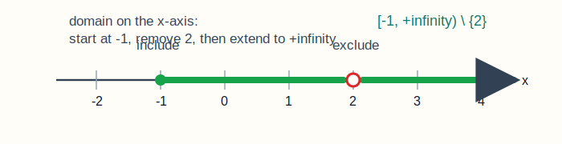
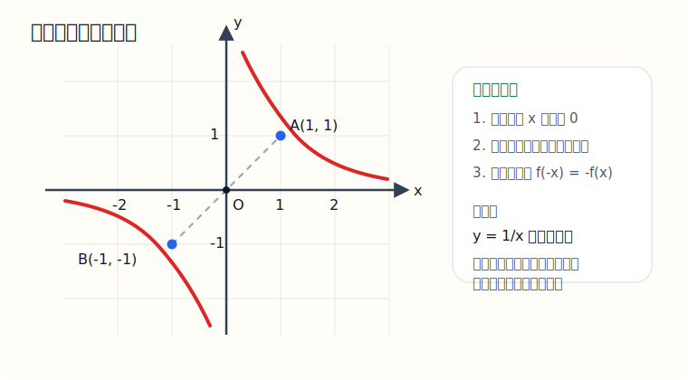
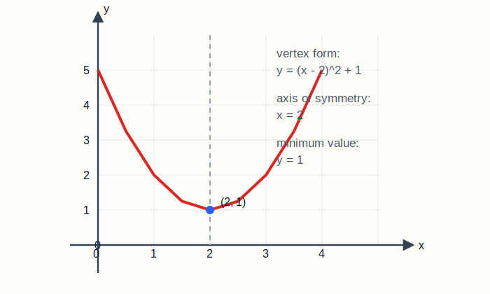

# 三、函数基础

## 章节导学

这一章最重要的不是背几个名词，而是先把函数看成“输入和输出之间的确定对应”：

- 每给一个允许的输入，只能对应唯一的输出；
- 定义域是“能不能代”，值域是“最后能得到什么”；
- 图像、单调性、奇偶性、最值，其实都是在描述这个对应关系的不同侧面。

## 3.1 函数概念、定义域与值域

这一节到底在学什么：

- 学的是“函数能不能取，能取成什么样”；
- 定义域是“自变量能取什么”；
- 值域是“函数值能取什么”；
- 很多考研高数前置题，本质上都在考定义域。

定义域常见限制：

- 分母不为 0；
- 根号下大于等于 0；
- 根号在分母时，根号下大于 0；
- 对数真数大于 0。

示例题：

求函数 $f(x)=\frac{\sqrt{x+1}}{x-2}$ 的定义域

图示：先只看自变量 $x$ 能不能取，所以这里用数轴看定义域最直观。

讲解：

这个式子同时有根号和分母，所以要同时满足两个条件。

先看根号：

$$
x+1\ge0
$$

所以：

$$
x\ge-1
$$

再看分母：

$$
x-2\ne0
$$

所以：

$$
x\ne2
$$

综合起来，定义域是：

$$
[-1,+\infty)\setminus\{2\}
$$

易错点：

- 多个条件是“同时满足”，不是“满足一个就行”；
- 值域常常要结合定义域一起看；
- 题目里有 $\ln x$、$\sqrt{\ln x}$ 这类复合式时，限制条件要一层层写。

## 3.2 函数性质

这一节到底在学什么：

- 学的是函数的性格：它对称不对称、越来越大还是越来越小；
- 奇偶性和单调性是最重要的两个基础性质；
- 这部分后面会和导数自然接上。

奇偶性判断口诀：

- 先看定义域是否关于原点对称；
- 再算 $f(-x)$；
- 若 $f(-x)=f(x)$，是偶函数；
- 若 $f(-x)=-f(x)$，是奇函数。

示例题：

判断函数 $f(x)=\frac1x$ 的奇偶性

图示：$y=\frac1x$ 的图像关于原点对称，所以它天然很适合和“奇函数”联系起来看。

讲解：

先看定义域：

$$
x\ne0
$$

它关于原点对称，可以继续判断。

计算：

$$
f(-x)=\frac1{-x}=-\frac1x=-f(x)
$$

所以这个函数是奇函数。

易错点：

- 不检查定义域，直接谈奇偶性，容易错；
- “既不是奇也不是偶”是很常见的情况；
- 单调性要看区间，不是整个数轴一刀切。

## 3.3 常见基本函数

这一节到底在学什么：

- 学的是后面所有函数题的“原型”；
- 一次函数要会看斜率；
- 二次函数要会看顶点和最值；
- 指数、对数、幂函数要会看定义域、值域和单调性。

最该会的几类：

- 一次函数：$y=kx+b$；
- 二次函数：$y=ax^2+bx+c$；
- 幂函数：$y=x^\alpha$；
- 指数函数：$y=a^x$；
- 对数函数：$y=\log_a x$。

示例题：

求二次函数 $y=x^2-4x+5$ 的顶点坐标和最小值

图示：配方后是 $y=(x-2)^2+1$，图像是开口向上的抛物线，顶点就是最低点。

讲解：

二次函数最稳的方法是配方：

$$
y=x^2-4x+5=(x^2-4x+4)+1=(x-2)^2+1
$$

所以它的顶点是：

$$
(2,1)
$$

因为 $(x-2)^2\ge0$，所以最小值是：

$$
1
$$

当且仅当 $x=2$ 时取到。

易错点：

- 顶点坐标不是把式子看一眼猜出来，要通过配方或公式确定；
- 二次函数开口向上才是最小值，开口向下是最大值；
- 指数函数和对数函数都要先确认底数条件。

