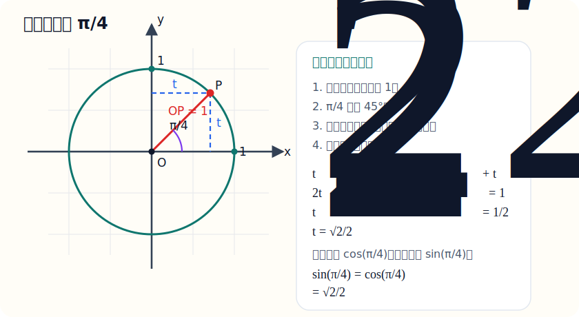
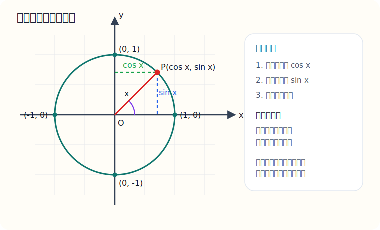
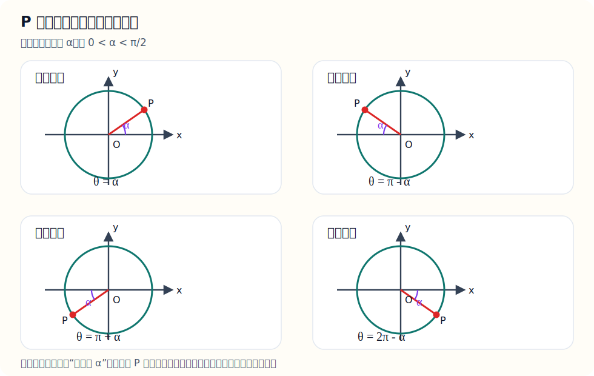

# 五、三角函数

## 章节导学

三角函数这一章经常让人觉得公式很多，但真正的主线很清楚：

- 先从直角三角形里理解“边比”和角的关系；
- 再升级到单位圆，把锐角推广到任意角；
- 最后再把几何图像、代数恒等式、化简与求值题串起来。

## 5.1 特殊角三角函数值与定义

这一节到底在学什么：

- 学的是“常见角度下三角函数的固定值”；
- 这一块必须熟，很多题根本不值得现推；
- 单位圆和象限符号一定要有感觉。

先把“三角函数的定义”补完整：

在直角三角形中，对锐角 $x$，定义

$$
\sin x=\frac{\text{对边}}{\text{斜边}},\qquad
\cos x=\frac{\text{邻边}}{\text{斜边}},\qquad
\tan x=\frac{\text{对边}}{\text{邻边}}
$$

为什么同一个角的这些比值是固定的，而不随三角形大小变化？

因为只要两个直角三角形有一个锐角相等，它们就互相相似。相似三角形的对应边成比例，所以“对边比斜边”“邻边比斜边”这些比值不变。

但高中里角不只停留在锐角，所以还要把定义推广到单位圆：

- 在单位圆上，角 $x$ 的终边与圆交于点 $P(x_0,y_0)$；
- 则 $\cos x=x_0$，$\sin x=y_0$；
- 当 $\cos x\ne0$ 时，$\tan x=\frac{y_0}{x_0}$。

这就是为什么三角函数既像几何，又像坐标。

先把“为什么会写成 $\frac{\pi}{4}$”这件事补清楚：

### 补充：任意角与弧度制

这一块到底在学什么：

- 同一个角，既可以写成 $45^\circ$，也可以写成 $\frac{\pi}{4}$；
- $\pi\text{ rad}=180^\circ$ 不是硬背定义，而是由两套定义推出的换算关系；
- 图上写的 $\frac{\pi}{4}$ 表示角的大小，不表示边长。

老师这样讲：

- 在角度制里，规定一周角是 $360^\circ$；
- 在弧度制里，规定角的弧度数为

$$
\theta=\frac{s}{r}
$$

其中 $s$ 是弧长，$r$ 是半径；
- 对整圆来说，弧长就是圆周长 $2\pi r$，所以一周角的弧度数为

$$
\theta=\frac{2\pi r}{r}=2\pi
$$

- 也就是说，一周角在角度制里写成 $360^\circ$，在弧度制里写成 $2\pi$；
- 那么半圈角在角度制里是 $180^\circ$，在弧度制里就是 $\pi$；
- 所以

$$
\pi\text{ rad}=180^\circ
$$

这是推导出来的换算关系，不是又额外给了一个新定义。

最常用的换算公式：

$$
1^\circ=\frac{\pi}{180}\text{ rad},\qquad
1\text{ rad}=\frac{180^\circ}{\pi}
$$

例如：

$$
45^\circ=45\cdot\frac{\pi}{180}=\frac{\pi}{4}
$$

$$
60^\circ=60\cdot\frac{\pi}{180}=\frac{\pi}{3}
$$

所以图中写的 $\frac{\pi}{4}$，本质上就是在说：

$$
\angle XOP=\frac{\pi}{4}=45^\circ
$$

常见角度制与弧度制对照表：

| 角度制 | $0^\circ$ | $30^\circ$ | $45^\circ$ | $60^\circ$ | $90^\circ$ | $180^\circ$ |
| --- | --- | --- | --- | --- | --- | --- |
| 弧度制 | $0$ | $\frac{\pi}{6}$ | $\frac{\pi}{4}$ | $\frac{\pi}{3}$ | $\frac{\pi}{2}$ | $\pi$ |

最该背熟的角：

- $0$
- $\frac{\pi}{6}$
- $\frac{\pi}{4}$
- $\frac{\pi}{3}$
- $\frac{\pi}{2}$
- $\pi$
- $\frac{3\pi}{2}$
- $2\pi$

这些特殊角不是死背出来的，可以从两个最经典的三角形里推出来：

1. $45^\circ$ 来自等腰直角三角形

设两条直角边都为 $1$，则斜边为

$$
\sqrt{1^2+1^2}=\sqrt2
$$

所以

$$
\sin\frac{\pi}{4}=\cos\frac{\pi}{4}=\frac{1}{\sqrt2}=\frac{\sqrt2}{2},\qquad
\tan\frac{\pi}{4}=1
$$

如果你对这一步没有画面感，可以把“单位圆放进平面直角坐标系”来看。你记得的“把一个圆画在坐标轴上讲”，本质上就是这个思路：

老师这样讲：

- 先画半径为 $1$ 的单位圆，所以 $OP=1$；
- 当角是 $\frac{\pi}{4}$ 时，点 $P$ 落在第一象限，对应一个 $45^\circ$ 的直角三角形；
- 因为是 $45^\circ-45^\circ-90^\circ$ 三角形，所以两条直角边相等，设都为 $t$；
- 由勾股定理得 $t^2+t^2=1$，即 $2t^2=1$，所以 $t^2=\frac12$；
- 又因为点在第一象限，所以 $t>0$，于是 $t=\frac{\sqrt2}{2}$；
- 单位圆上点 $P$ 的横坐标是 $\cos\frac{\pi}{4}$，纵坐标是 $\sin\frac{\pi}{4}$，所以二者都等于 $\frac{\sqrt2}{2}$。

因此

$$
\cos\frac{\pi}{4}=\sin\frac{\pi}{4}=\frac{\sqrt2}{2}
$$

又因为

$$
\tan\frac{\pi}{4}
=\frac{\sin\frac{\pi}{4}}{\cos\frac{\pi}{4}}
=\frac{\frac{\sqrt2}{2}}{\frac{\sqrt2}{2}}
=1
$$

2. $30^\circ,60^\circ$ 来自等边三角形的一刀两半

设等边三角形边长为 $2$，从顶点向底边作高，可把它分成两个直角三角形。

这时斜边是 $2$，较短直角边是 $1$，另一条直角边由勾股定理得

$$
\sqrt{2^2-1^2}=\sqrt3
$$

所以

$$
\sin\frac{\pi}{6}=\frac12,\qquad
\cos\frac{\pi}{6}=\frac{\sqrt3}{2},\qquad
\tan\frac{\pi}{6}=\frac{\sqrt3}{3}
$$

$$
\sin\frac{\pi}{3}=\frac{\sqrt3}{2},\qquad
\cos\frac{\pi}{3}=\frac12,\qquad
\tan\frac{\pi}{3}=\sqrt3
$$

最常用的特殊角表可以这样记：

| 角 | $0$ | $\frac{\pi}{6}$ | $\frac{\pi}{4}$ | $\frac{\pi}{3}$ | $\frac{\pi}{2}$ |
| --- | --- | --- | --- | --- | --- |
| $\sin x$ | $0$ | $\frac12$ | $\frac{\sqrt2}{2}$ | $\frac{\sqrt3}{2}$ | $1$ |
| $\cos x$ | $1$ | $\frac{\sqrt3}{2}$ | $\frac{\sqrt2}{2}$ | $\frac12$ | $0$ |
| $\tan x$ | $0$ | $\frac{\sqrt3}{3}$ | $1$ | $\sqrt3$ | 不存在 |

图示：单位圆、象限符号与正余弦投影

看图时重点抓住三件事：

- 单位圆上点 $P$ 的横坐标就是 $\cos x$，纵坐标就是 $\sin x$；
- 点落在哪个象限，就决定 $\sin x$、$\cos x$、$\tan x$ 的符号；
- 特殊角本质上是在单位圆上读固定点的坐标。

象限符号也要有一句速记：

- 第一象限：三者都为正；
- 第二象限：$\sin x$ 为正；
- 第三象限：$\tan x$ 为正；
- 第四象限：$\cos x$ 为正。

看图时这样记最稳：

- 第一象限里，点的横坐标和纵坐标都为正，所以 $\sin x,\cos x,\tan x$ 都为正；
- 第二象限里，横坐标负、纵坐标正，所以只有 $\sin x$ 为正；
- 第三象限里，横坐标负、纵坐标也负，所以 $\tan x=\frac{\sin x}{\cos x}$ 为正；
- 第四象限里，横坐标正、纵坐标负，所以只有 $\cos x$ 为正。

如果你更想看“点 $P$ 落在各个象限时，角一般怎么表示”，可以直接看这张图：

这张图里统一设参考角为 $\alpha$，并且

$$
0<\alpha<\frac{\pi}{2}
$$

那么：

- 第一象限：$\theta=\alpha$；
- 第二象限：$\theta=\pi-\alpha$；
- 第三象限：$\theta=\pi+\alpha$；
- 第四象限：$\theta=2\pi-\alpha$，也常写成 $\theta=-\alpha$。

示例题：

已知 $\sin x=\frac{\sqrt2}{2}$，且 $x$ 在第二象限，求 $\cos x$ 和 $\tan x$

讲解：

先判断符号。

第二象限里：

- 正弦为正；
- 余弦为负；
- 正切为负。

由恒等式：

$$
\sin^2x+\cos^2x=1
$$

代入：

$$
\cos^2x=1-\left(\frac{\sqrt2}{2}\right)^2=1-\frac12=\frac12
$$

所以：

$$
\cos x=-\frac{\sqrt2}{2}
$$

再算正切：

$$
\tan x=\frac{\sin x}{\cos x}=\frac{\frac{\sqrt2}{2}}{-\frac{\sqrt2}{2}}=-1
$$

易错点：

- 已知一个三角函数值，不能只算绝对值，还要看象限；
- $\tan x=\frac{\sin x}{\cos x}$，前提是 $\cos x\ne0$；
- 角度制和弧度制不要混。

## 5.2 三角函数公式与化简

这一节到底在学什么：

- 学的是“三角式怎么变简单”；
- 真正的核心不是公式数量，而是你能不能一眼看出该往哪种形式变；
- 同角关系和二倍角公式最常用。

先把公式分成三层来理解：

1. 同角基本关系：同一个角里，$\sin x,\cos x,\tan x$ 彼此可以互相转化；
2. 奇偶与周期：帮助你处理负角、补角、加上整圈后的角；
3. 和差与二倍角：帮助你把“两个角”压成“一个角”，或者把“一个角”拆成“两个角”。

必记公式：

- $\sin^2x+\cos^2x=1$；
- $\tan x=\frac{\sin x}{\cos x}\ (\cos x\ne0)$；
- $1+\tan^2x=\frac{1}{\cos^2x}$；
- $\sin(-x)=-\sin x$；
- $\cos(-x)=\cos x$；
- $\tan(-x)=-\tan x$；
- $\sin(\alpha+\beta)=\sin\alpha\cos\beta+\cos\alpha\sin\beta$；
- $\cos(\alpha+\beta)=\cos\alpha\cos\beta-\sin\alpha\sin\beta$；
- $\sin2x=2\sin x\cos x$；
- $\cos2x=2\cos^2x-1$；
- $\cos2x=1-2\sin^2x$。

### 补充：和角公式与二倍角公式

这一块最容易单独拎出来背，因为很多题会直接让你套：

1. 和角公式

$$
\sin(\alpha+\beta)=\sin\alpha\cos\beta+\cos\alpha\sin\beta
$$

$$
\cos(\alpha+\beta)=\cos\alpha\cos\beta-\sin\alpha\sin\beta
$$

$$
\tan(\alpha+\beta)=\frac{\tan\alpha+\tan\beta}{1-\tan\alpha\tan\beta}
\qquad \left(1-\tan\alpha\tan\beta\ne0\right)
$$

2. 差角公式

它本质上就是在和角公式里把 $\beta$ 换成 $-\beta$ 得到的，所以也最好一起记：

$$
\sin(\alpha-\beta)=\sin\alpha\cos\beta-\cos\alpha\sin\beta
$$

$$
\cos(\alpha-\beta)=\cos\alpha\cos\beta+\sin\alpha\sin\beta
$$

$$
\tan(\alpha-\beta)=\frac{\tan\alpha-\tan\beta}{1+\tan\alpha\tan\beta}
\qquad \left(1+\tan\alpha\tan\beta\ne0\right)
$$

3. 二倍角公式

二倍角公式其实就是在和角公式里令

$$
\alpha=\beta=x
$$

得到的：

$$
\sin2x=2\sin x\cos x
$$

$$
\cos2x=\cos^2x-\sin^2x
$$

再利用

$$
\sin^2x+\cos^2x=1
$$

还可以把它变形成：

$$
\cos2x=2\cos^2x-1
$$

$$
\cos2x=1-2\sin^2x
$$

正切的二倍角也很常用：

$$
\tan2x=\frac{2\tan x}{1-\tan^2x}
\qquad \left(1-\tan^2x\ne0\right)
$$

这些公式怎么推导，也补一条最常用的主线：

如果你现在还没学到平面坐标、点旋转这些内容，这里先不要有心理压力，可以这样分层来学：

- 第一步：先把和角公式当成现阶段需要记住的结论；
- 第二步：重点学会“差角公式怎么从和角公式变出来”；
- 第三步：重点学会“二倍角公式怎么从和角公式令 $\alpha=\beta=x$ 得到”；
- 第四步：正切和角公式再由 $\tan=\frac{\sin}{\cos}$ 推出来。

也就是说，对你当前阶段来说，真正必须会推的其实是后面这三步：

- 和角 $\rightarrow$ 差角；
- 和角 $\rightarrow$ 二倍角；
- 正弦余弦和角 $\rightarrow$ 正切和角。

至于“和角公式本身最完整的推导”，通常会借助坐标、旋转或者向量来讲。你现在如果还没学到那部分，可以先把下面这一段当成“提前了解”，不要求现在就完全吃透。

1. 和角公式从“坐标旋转”来

在单位圆上，角 $\alpha$ 对应的点可以写成

$$
A(\cos\alpha,\sin\alpha)
$$

如果把点 $A$ 再逆时针旋转 $\beta$，就会到达角 $\alpha+\beta$ 对应的点

$$
B(\cos(\alpha+\beta),\sin(\alpha+\beta))
$$

现在关键是：一个点 $(x,y)$ 逆时针旋转 $\beta$ 后，新坐标怎么写？

先看两个最基本的单位方向：

- 横向单位方向 $(1,0)$ 旋转 $\beta$ 后，变成 $(\cos\beta,\sin\beta)$；
- 纵向单位方向 $(0,1)$ 旋转 $\beta$ 后，变成 $(-\sin\beta,\cos\beta)$。

所以点 $(x,y)$ 可以拆成

$$
(x,y)=x(1,0)+y(0,1)
$$

旋转以后就变成

$$
x(\cos\beta,\sin\beta)+y(-\sin\beta,\cos\beta)
$$

也就是

$$
(x',y')=(x\cos\beta-y\sin\beta,\ x\sin\beta+y\cos\beta)
$$

现在令

$$
x=\cos\alpha,\qquad y=\sin\alpha
$$

就得到旋转后的点坐标：

$$
(\cos(\alpha+\beta),\sin(\alpha+\beta))
=(\cos\alpha\cos\beta-\sin\alpha\sin\beta,\ \cos\alpha\sin\beta+\sin\alpha\cos\beta)
$$

于是直接读出：

$$
\cos(\alpha+\beta)=\cos\alpha\cos\beta-\sin\alpha\sin\beta
$$

$$
\sin(\alpha+\beta)=\sin\alpha\cos\beta+\cos\alpha\sin\beta
$$

2. 差角公式由和角公式代换得到

把和角公式中的 $\beta$ 换成 $-\beta$：

$$
\sin(\alpha-\beta)=\sin\bigl(\alpha+(-\beta)\bigr)
$$

再利用

$$
\cos(-\beta)=\cos\beta,\qquad \sin(-\beta)=-\sin\beta
$$

就得到

$$
\sin(\alpha-\beta)=\sin\alpha\cos\beta-\cos\alpha\sin\beta
$$

同理可得

$$
\cos(\alpha-\beta)=\cos\alpha\cos\beta+\sin\alpha\sin\beta
$$

3. 正切的和角公式由正弦、余弦相除得到

由

$$
\tan(\alpha+\beta)=\frac{\sin(\alpha+\beta)}{\cos(\alpha+\beta)}
$$

代入上面的和角公式：

$$
\tan(\alpha+\beta)
=\dfrac{\sin\alpha\cos\beta+\cos\alpha\sin\beta}
{\cos\alpha\cos\beta-\sin\alpha\sin\beta}
$$

分子分母同除以 $\cos\alpha\cos\beta$，就得到

$$
\tan(\alpha+\beta)=\frac{\tan\alpha+\tan\beta}{1-\tan\alpha\tan\beta}
$$

差角的正切公式同理可得。

4. 二倍角公式是和角公式的特例

在和角公式里令

$$
\alpha=\beta=x
$$

就得到

$$
\sin2x=2\sin x\cos x
$$

$$
\cos2x=\cos^2x-\sin^2x
$$

再利用

$$
\sin^2x+\cos^2x=1
$$

就能继续变形成

$$
\cos2x=2\cos^2x-1
$$

$$
\cos2x=1-2\sin^2x
$$

而

$$
\tan2x=\tan(x+x)
$$

再代入正切和角公式，就得到

$$
\tan2x=\frac{2\tan x}{1-\tan^2x}
$$

老师这样记：

- $\sin(\alpha+\beta)$ 是“正正 + 余余”；
- $\cos(\alpha+\beta)$ 中间一定是减号；
- 差角公式不要硬背，可以由和角公式把 $\beta$ 换成 $-\beta$ 得到；
- 二倍角公式不要当成新东西，它就是和角公式的特例。

最容易错的地方：

- $\sin(\alpha+\beta)\ne\sin\alpha+\sin\beta$；
- $\cos(\alpha+\beta)$ 中间是减，不是加；
- $\tan(\alpha+\beta)$ 和 $\tan(\alpha-\beta)$ 的分母很容易写反；
- $\cos2x$ 有三个常见写法，做题时要按题目需要选最方便的那个。

前面已经把和角、差角、二倍角公式的推导补了，下面再把同角关系的来路补一下：

1. 为什么

$$
\sin^2x+\cos^2x=1
$$

因为单位圆上点

$$
P(\cos x,\sin x)
$$

满足圆方程

$$
x^2+y^2=1
$$

所以自然有

$$
\cos^2x+\sin^2x=1
$$

2. 为什么

$$
\tan x=\frac{\sin x}{\cos x}
$$

无论是从直角三角形定义，还是从单位圆坐标

$$
(\cos x,\sin x)
$$

来看，正切都是“纵坐标比横坐标”，所以

$$
\tan x=\frac{\sin x}{\cos x}
$$

再把

$$
\sin^2x+\cos^2x=1
$$

两边同除以 $\cos^2x$，就得到

$$
1+\tan^2x=\frac{1}{\cos^2x}
$$

示例题：

化简：$\frac{1-\cos2x}{\sin2x}$

讲解：

先把二倍角公式代进去：

$$
1-\cos2x=2\sin^2x
$$

$$
\sin2x=2\sin x\cos x
$$

所以原式变成：

$$
\frac{2\sin^2x}{2\sin x\cos x}
$$

约分得到：

$$
\frac{\sin x}{\cos x}=\tan x
$$

所以化简结果是：

$$
\tan x
$$

易错点：

- 化简三角式时，优先统一成 $\sin,\cos$；
- 分子分母同时变形时，要注意分母不能为 0；
- 看到 $\sin2x$、$\cos2x$，就要想到二倍角公式。

## 5.3 三角函数综合

这一节到底在学什么：

- 学的是“多个公式一起用”；
- 这类题最常见的是已知 $\sin x\pm\cos x$，求 $\sin2x$ 或 $\cos2x$；
- 关键手法通常是“先平方”。

示例题：

已知 $\sin x-\cos x=\frac12$，求 $\sin2x$

讲解：

两边平方：

$$
(\sin x-\cos x)^2=\left(\frac12\right)^2
$$

展开左边：

$$
\sin^2x-2\sin x\cos x+\cos^2x=\frac14
$$

利用 $\sin^2x+\cos^2x=1$：

$$
1-2\sin x\cos x=\frac14
$$

而：

$$
2\sin x\cos x=\sin2x
$$

所以：

$$
1-\sin2x=\frac14
$$

移项得：

$$
\sin2x=\frac34
$$

易错点：

- 平方后别忘了中间项；
- $\sin2x=2\sin x\cos x$，不是 $\sin^2x\cos^2x$；
- 这类题常用“平方 + 同角关系 + 二倍角”一套连招。

