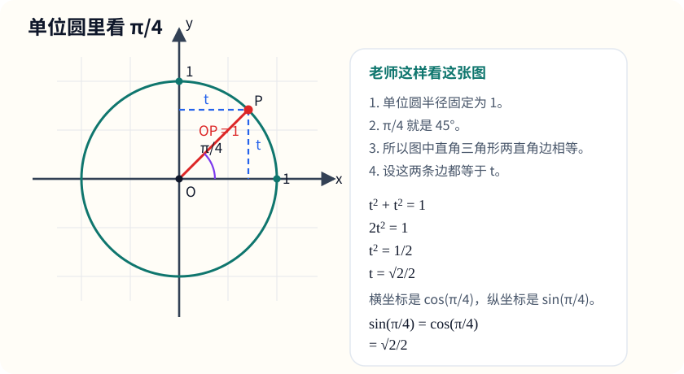
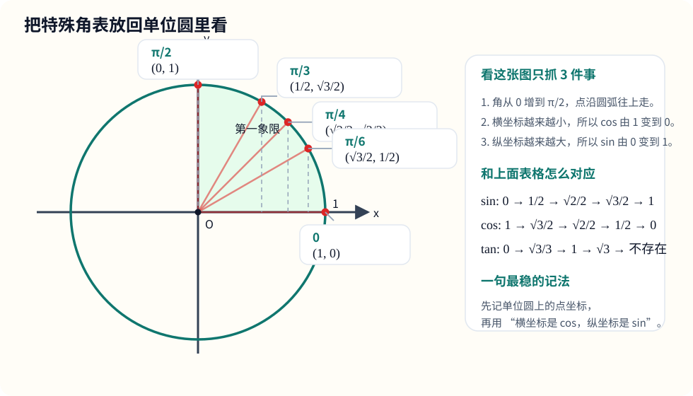
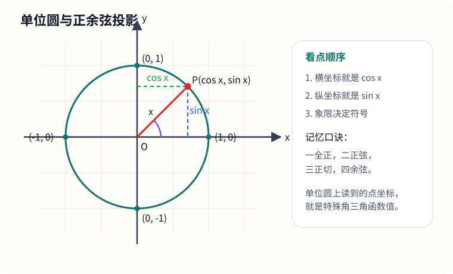
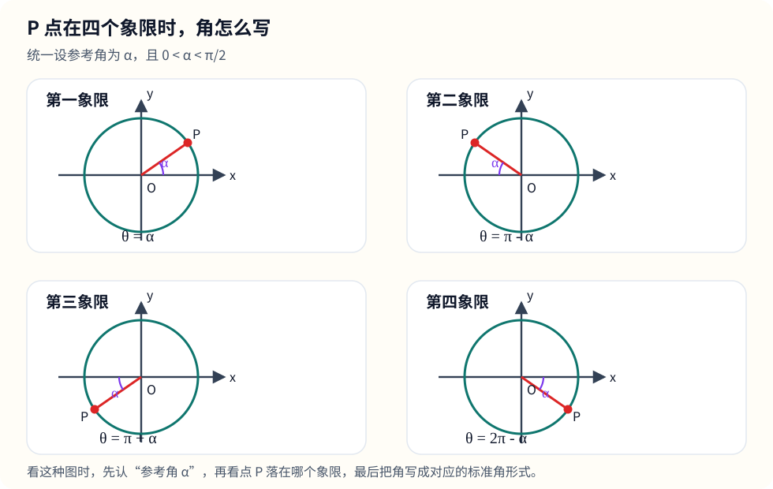
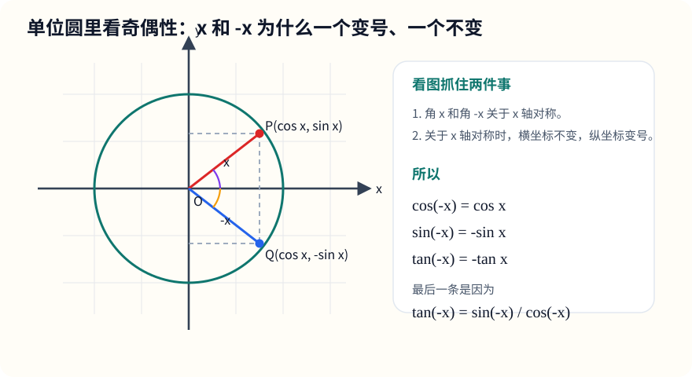
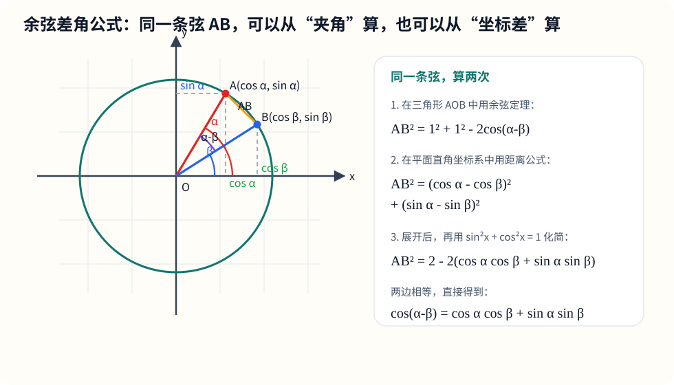
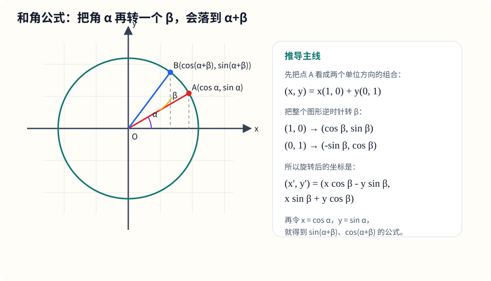
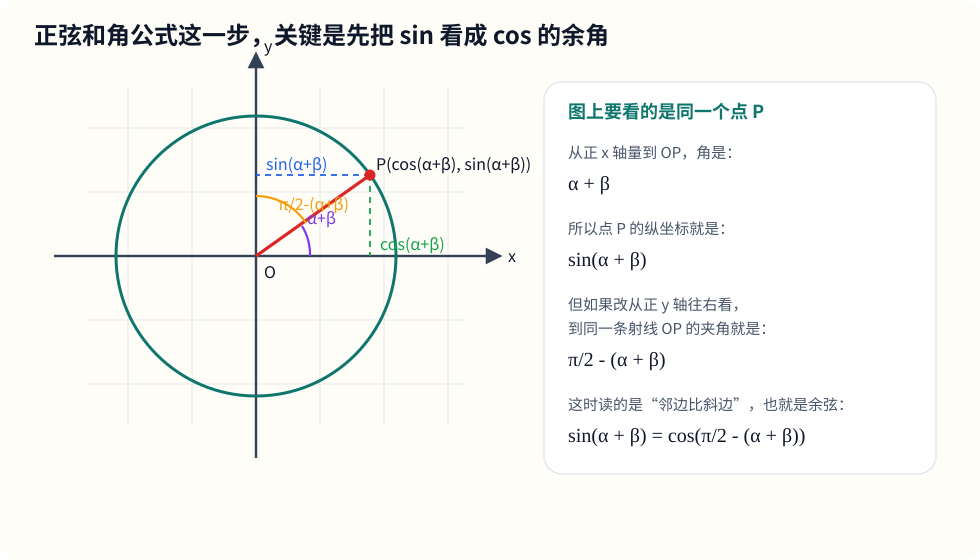
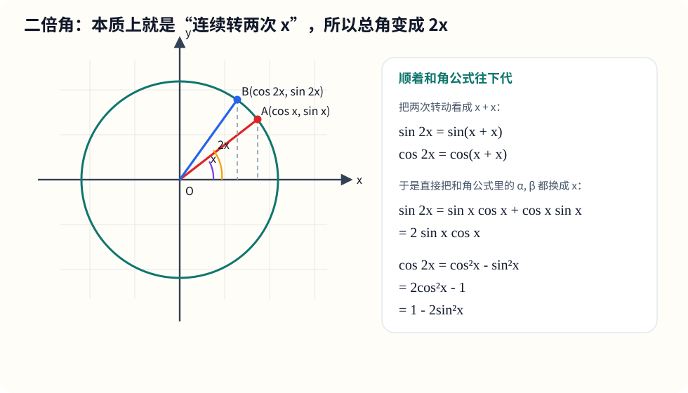

# 六、三角函数

## 章节导学

三角函数这一章经常让人觉得公式很多，但真正的主线很清楚：

- 先从直角三角形里理解“边比”和角的关系；
- 再升级到单位圆，把锐角推广到任意角；
- 最后再把几何图像、代数恒等式、化简与求值题串起来。

## 6.1 特殊角三角函数值与定义

这一节到底在学什么：

- 学的是“常见角度下三角函数的固定值”；
- 这一块必须熟，很多题根本不值得现推；
- 单位圆和象限符号一定要有感觉。

先把“三角函数的定义”补完整：

在直角三角形中，对锐角 $x$，定义

$$
\sin x=\frac{\text{对边}}{\text{斜边}},\qquad
\cos x=\frac{\text{邻边}}{\text{斜边}},\qquad
\tan x=\frac{\text{对边}}{\text{邻边}},\qquad
\cot x=\frac{\text{邻边}}{\text{对边}}
$$

为什么同一个角的这些比值是固定的，而不随三角形大小变化？

因为在直角三角形里，如果两个三角形都有一个直角，并且还有一个锐角也相等，那么第三个角也就自动相等，所以这两个三角形的三个角都分别相等，它们就是相似三角形。

“相似”可以理解成：形状一样，只是大小不同。也就是说，一个三角形只是另一个三角形按同一个倍数放大或缩小。

比如，对同一个锐角 $x$，你可以画出两个不同大小的直角三角形：

- 第一个三角形三边分别是：对边 $3$，邻边 $4$，斜边 $5$；
- 第二个三角形只是把它整体放大 2 倍：对边 $6$，邻边 $8$，斜边 $10$。

这时虽然三角形变大了，但对应边是按同一个倍数变化的，所以

$$
\frac{\text{对边}}{\text{斜边}}=\frac35=\frac6{10}
$$

$$
\frac{\text{邻边}}{\text{斜边}}=\frac45=\frac8{10}
$$

$$
\frac{\text{对边}}{\text{邻边}}=\frac34=\frac68
$$

你会发现：边长变了，但这些“边与边的比值”没有变。

所以，对一个固定的角 $x$ 来说：

- $\sin x=\frac{\text{对边}}{\text{斜边}}$ 是固定的；
- $\cos x=\frac{\text{邻边}}{\text{斜边}}$ 是固定的；
- $\tan x=\frac{\text{对边}}{\text{邻边}}$ 也是固定的；
- $\cot x=\frac{\text{邻边}}{\text{对边}}$ 也是固定的。

也就是说，三角函数真正记录的不是边长本身，而是这个角所对应的“形状比例”。

但高中里角不只停留在锐角，所以还要把定义推广到单位圆：

- 在单位圆上，角 $x$ 的终边与圆交于点 $P(x_0,y_0)$；
- 则 $\cos x=x_0$，$\sin x=y_0$；
- 当 $\cos x\ne0$ 时，$\tan x=\frac{y_0}{x_0}$；
- 当 $\sin x\ne0$ 时，$\cot x=\frac{x_0}{y_0}$。

这就是为什么三角函数既像几何，又像坐标。

先把“为什么会写成 $\frac{\pi}{4}$”这件事补清楚：

### 补充：任意角与弧度制

这一块到底在学什么：

- 同一个角，既可以写成 $45^\circ$，也可以写成 $\frac{\pi}{4}$；
- $\pi\text{ rad}=180^\circ$ 不是硬背定义，而是由两套定义推出的换算关系；
- 图上写的 $\frac{\pi}{4}$ 表示角的大小，不表示边长。

老师这样讲：

- 在角度制里，规定一周角是 $360^\circ$；
- 在弧度制里，规定角的弧度数为

$$
\theta=\frac{s}{r}
$$

其中 $s$ 是弧长，$r$ 是半径；
- 对整圆来说，弧长就是圆周长 $2\pi r$，所以一周角的弧度数为

$$
\theta=\frac{2\pi r}{r}=2\pi
$$

- 也就是说，一周角在角度制里写成 $360^\circ$，在弧度制里写成 $2\pi$；
- 那么半圈角在角度制里是 $180^\circ$，在弧度制里就是 $\pi$；
- 所以

$$
\pi\text{ rad}=180^\circ
$$

这是推导出来的换算关系，不是又额外给了一个新定义。

最常用的换算公式：

$$
1^\circ=\frac{\pi}{180}\text{ rad},\qquad
1\text{ rad}=\frac{180^\circ}{\pi}
$$

例如：

$$
45^\circ=45\cdot\frac{\pi}{180}=\frac{\pi}{4}
$$

$$
60^\circ=60\cdot\frac{\pi}{180}=\frac{\pi}{3}
$$

所以图中写的 $\frac{\pi}{4}$，本质上就是在说：

$$
\angle XOP=\frac{\pi}{4}=45^\circ
$$

常见角度制与弧度制对照表：

| 角度制 | $0^\circ$ | $30^\circ$ | $45^\circ$ | $60^\circ$ | $90^\circ$ | $180^\circ$ |
| --- | --- | --- | --- | --- | --- | --- |
| 弧度制 | $0$ | $\frac{\pi}{6}$ | $\frac{\pi}{4}$ | $\frac{\pi}{3}$ | $\frac{\pi}{2}$ | $\pi$ |

最该背熟的角：

- $0$
- $\frac{\pi}{6}$
- $\frac{\pi}{4}$
- $\frac{\pi}{3}$
- $\frac{\pi}{2}$
- $\pi$
- $\frac{3\pi}{2}$
- $2\pi$

这些特殊角不是死背出来的，可以从两个最经典的三角形里推出来：

1. $45^\circ$ 来自等腰直角三角形

设两条直角边都为 $1$，则斜边为

$$
\sqrt{1^2+1^2}=\sqrt2
$$

所以

$$
\sin\frac{\pi}{4}=\cos\frac{\pi}{4}=\frac{1}{\sqrt2}=\frac{\sqrt2}{2},\qquad
\tan\frac{\pi}{4}=1
$$

如果你对这一步没有画面感，可以把“单位圆放进平面直角坐标系”来看。你记得的“把一个圆画在坐标轴上讲”，本质上就是这个思路：

老师这样讲：

- 先画半径为 $1$ 的单位圆，所以 $OP=1$；
- 当角是 $\frac{\pi}{4}$ 时，点 $P$ 落在第一象限，对应一个 $45^\circ$ 的直角三角形；
- 因为是 $45^\circ-45^\circ-90^\circ$ 三角形，所以两条直角边相等，设都为 $t$；
- 由勾股定理得 $t^2+t^2=1$，即 $2t^2=1$，所以 $t^2=\frac12$；
- 又因为点在第一象限，所以 $t>0$，于是 $t=\frac{\sqrt2}{2}$；
- 单位圆上点 $P$ 的横坐标是 $\cos\frac{\pi}{4}$，纵坐标是 $\sin\frac{\pi}{4}$，所以二者都等于 $\frac{\sqrt2}{2}$。

因此

$$
\cos\frac{\pi}{4}=\sin\frac{\pi}{4}=\frac{\sqrt2}{2}
$$

又因为

$$
\tan\frac{\pi}{4}
=\frac{\sin\frac{\pi}{4}}{\cos\frac{\pi}{4}}
=\frac{\frac{\sqrt2}{2}}{\frac{\sqrt2}{2}}
=1
$$

2. $30^\circ,60^\circ$ 来自等边三角形的一刀两半

设等边三角形边长为 $2$，从顶点向底边作高，可把它分成两个直角三角形。

这时斜边是 $2$，较短直角边是 $1$，另一条直角边由勾股定理得

$$
\sqrt{2^2-1^2}=\sqrt3
$$

所以

$$
\sin\frac{\pi}{6}=\frac12,\qquad
\cos\frac{\pi}{6}=\frac{\sqrt3}{2},\qquad
\tan\frac{\pi}{6}=\frac{\sqrt3}{3}
$$

$$
\sin\frac{\pi}{3}=\frac{\sqrt3}{2},\qquad
\cos\frac{\pi}{3}=\frac12,\qquad
\tan\frac{\pi}{3}=\sqrt3
$$

最常用的特殊角表可以这样记：

| 角 | $0$ | $\frac{\pi}{6}$ | $\frac{\pi}{4}$ | $\frac{\pi}{3}$ | $\frac{\pi}{2}$ |
| --- | --- | --- | --- | --- | --- |
| $\sin x$ | $0$ | $\frac12$ | $\frac{\sqrt2}{2}$ | $\frac{\sqrt3}{2}$ | $1$ |
| $\cos x$ | $1$ | $\frac{\sqrt3}{2}$ | $\frac{\sqrt2}{2}$ | $\frac12$ | $0$ |
| $\tan x$ | $0$ | $\frac{\sqrt3}{3}$ | $1$ | $\sqrt3$ | 不存在 |
| $\cot x$ | 不存在 | $\sqrt3$ | $1$ | $\frac{\sqrt3}{3}$ | $0$ |

这里顺手记一句就够了：

- $\cot x=\frac{1}{\tan x}$，所以它和 $\tan x$ 互为倒数。

图示：把最常用的特殊角表重新放回单位圆里看

如果你看到这里会想：

- 为什么 $\frac{\pi}{6}$ 的点坐标是 $\left(\frac{\sqrt3}{2},\frac12\right)$？
- 为什么 $\frac{\pi}{4}$ 的点坐标是 $\left(\frac{\sqrt2}{2},\frac{\sqrt2}{2}\right)$？

这里不要先想三角函数，先想三角形本身的性质。

最核心的出发点只有一句：

- 在单位圆里，半径恒等于 $1$，所以作出来的直角三角形，斜边都固定是 $1$。

所以问题就变成了：

- 已知一个特殊角，且斜边是 $1$，另外两条直角边各是多少？

可以分成 3 类来看：

1. 当 $x=0$ 时

- 点就在 $x$ 轴正半轴上；
- 半径全在水平方向，所以横坐标是 $1$，纵坐标是 $0$；
- 因此点坐标是

$$
(1,0)
$$

2. 当 $x=\frac{\pi}{2}$ 时

- 点就在 $y$ 轴正半轴上；
- 半径全在竖直方向，所以横坐标是 $0$，纵坐标是 $1$；
- 因此点坐标是

$$
(0,1)
$$

3. 当 $x=\frac{\pi}{6},\frac{\pi}{4},\frac{\pi}{3}$ 时

这时都能在单位圆里作出一个直角三角形，然后靠特殊直角三角形的性质来算。

先看

$$ 
\frac{\pi}{4}
$$

它对应的是 $45^\circ$，所以这个直角三角形的另外一个锐角也一定是 $45^\circ$。

于是它是一个等腰直角三角形，两条直角边相等。

因为斜边已经固定是 $1$，设两条直角边都等于 $t$，则

$$
t^2+t^2=1
$$

$$
2t^2=1
$$

$$ 
t=\frac{\sqrt2}{2}
$$

所以两条直角边都是

$$
\frac{\sqrt2}{2}
$$

如果斜边不是 $1$，而是任意一个长度 $c$，那整个三角形只是按比例放大，所以两条直角边都会同时变成

$$
\frac{\sqrt2}{2}c
$$

于是点坐标就是

$$
\left(\frac{\sqrt2}{2},\frac{\sqrt2}{2}\right)
$$

再看

$$ 
\frac{\pi}{6},\frac{\pi}{3}
$$

它们对应的是 $30^\circ-60^\circ-90^\circ$ 三角形。

这个边长关系不是凭空来的，而是从等边三角形拆出来的：

- 先取一个边长为 $2$ 的等边三角形；
- 从一个顶点向底边作高，会把它分成两个全等的直角三角形；
- 等边三角形每个角都是 $60^\circ$，被高平分后，就得到 $30^\circ-60^\circ-90^\circ$ 三角形；
- 底边被平分，所以短直角边是 $1$；
- 斜边还是原来等边三角形的边长，所以是 $2$；
- 另一条直角边用勾股定理算出是 $\sqrt3$。

所以这个特殊直角三角形的边长比是

$$
1:\sqrt3:2
$$

如果把斜边 $2$ 缩成 $1$，那么另外两边也一起缩小一半，得到

$$ 
\frac12:\frac{\sqrt3}{2}:1
$$

所以这类三角形里，两条直角边长度一定是

$$ 
\frac12,\qquad \frac{\sqrt3}{2}
$$

同样地，如果斜边不是 $1$，而是 $c$，那这两条直角边就分别变成

$$
\frac c2,\qquad \frac{\sqrt3}{2}c
$$

至于谁更长、谁更短，不需要引入三角函数，只看角和对边的关系：

- 大角对大边；
- 小角对小边。

所以谁是横坐标、谁是纵坐标，只要看这个角对应的“高”和“底”谁长谁短：

- 对 $\frac{\pi}{6}$ 来说，角比较小，所以“对边短、邻边长”；
- 所以竖着的那条边短，横着的那条边长；
- 点坐标是

$$
\left(\frac{\sqrt3}{2},\frac12\right)
$$

- 对 $\frac{\pi}{3}$ 来说，角更大，所以“对边长、邻边短”；
- 所以竖着的那条边长，横着的那条边短；
- 点坐标是

$$
\left(\frac12,\frac{\sqrt3}{2}\right)
$$

你可以把第一象限最常用的 5 个点统一记成：

$$
(1,0),\quad
\left(\frac{\sqrt3}{2},\frac12\right),\quad
\left(\frac{\sqrt2}{2},\frac{\sqrt2}{2}\right),\quad
\left(\frac12,\frac{\sqrt3}{2}\right),\quad
(0,1)
$$

它们其实不是硬背出来的，而是：

- 先用“半径 = 1”固定斜边；
- 再用特殊三角形边比求两条直角边；
- 最后按图形位置把“横边、竖边”写成坐标。

如果走到第二、第三、第四象限，也不是重新算一遍长度，而是：

- 先看参考角，确定绝对值；
- 再根据象限决定正负号。

例如

$$
\frac{5\pi}{6}
$$

它的参考角是

$$
\frac{\pi}{6}
$$

所以绝对值和 $\frac{\pi}{6}$ 一样，只是它在第二象限，因此：

$$
\left(-\frac{\sqrt3}{2},\frac12\right)
$$

图示：单位圆、象限符号与正余弦投影

看图时重点抓住三件事：

- 单位圆上点 $P$ 的横坐标就是 $\cos x$，纵坐标就是 $\sin x$；
- 点落在哪个象限，就决定 $\sin x$、$\cos x$、$\tan x$、$\cot x$ 的符号；
- 特殊角本质上是在单位圆上读固定点的坐标。

象限符号也要有一句速记：

- 第一象限：前三者都为正；
- 第二象限：$\sin x$ 为正；
- 第三象限：$\tan x$ 为正；
- 第四象限：$\cos x$ 为正。

如果把 $\cot x$ 也算进去，可以直接记：

- $\cot x$ 和 $\tan x$ 同号，因为 $\cot x=\frac{1}{\tan x}$。

看图时这样记最稳：

- 第一象限里，点的横坐标和纵坐标都为正，所以 $\sin x,\cos x,\tan x,\cot x$ 都为正；
- 第二象限里，横坐标负、纵坐标正，所以只有 $\sin x$ 为正；
- 第三象限里，横坐标负、纵坐标也负，所以 $\tan x=\frac{\sin x}{\cos x}$ 和 $\cot x=\frac{\cos x}{\sin x}$ 都为正；
- 第四象限里，横坐标正、纵坐标负，所以只有 $\cos x$ 为正。

如果你更想看“点 $P$ 落在各个象限时，角一般怎么表示”，可以直接看这张图：

这张图里统一设参考角为 $\alpha$，并且

$$
0<\alpha<\frac{\pi}{2}
$$

那么：

- 第一象限：$\theta=\alpha$；
- 第二象限：$\theta=\pi-\alpha$；
- 第三象限：$\theta=\pi+\alpha$；
- 第四象限：$\theta=2\pi-\alpha$，也常写成 $\theta=-\alpha$。

示例题：

已知 $\sin x=\frac{\sqrt2}{2}$，且 $x$ 在第二象限，求 $\cos x$ 和 $\tan x$

讲解：

先判断符号。

第二象限里：

- 正弦为正；
- 余弦为负；
- 正切为负。

由恒等式：

$$
\sin^2x+\cos^2x=1
$$

代入：

$$
\cos^2x=1-\left(\frac{\sqrt2}{2}\right)^2=1-\frac12=\frac12
$$

所以：

$$
\cos x=-\frac{\sqrt2}{2}
$$

再算正切：

$$
\tan x=\frac{\sin x}{\cos x}=\frac{\frac{\sqrt2}{2}}{-\frac{\sqrt2}{2}}=-1
$$

易错点：

- 已知一个三角函数值，不能只算绝对值，还要看象限；
- $\tan x=\frac{\sin x}{\cos x}$，前提是 $\cos x\ne0$；
- 角度制和弧度制不要混。

## 6.2 三角函数公式与化简

这一节到底在学什么：

- 学的是“三角式怎么变简单”；
- 真正的核心不是公式数量，而是你能不能一眼看出该往哪种形式变；
- 同角关系和二倍角公式最常用。

先把公式分成三层来理解：

1. 同角基本关系：同一个角里，$\sin x,\cos x,\tan x$ 彼此可以互相转化；
2. 奇偶与周期：帮助你处理负角、补角、加上整圈后的角；
3. 和差与二倍角：帮助你把“两个角”压成“一个角”，或者把“一个角”拆成“两个角”。

必记公式：

- $\sin^2x+\cos^2x=1$；
- $\tan x=\frac{\sin x}{\cos x}\ (\cos x\ne0)$；
- $1+\tan^2x=\frac{1}{\cos^2x}$；
- $\sin(-x)=-\sin x$；
- $\cos(-x)=\cos x$；
- $\tan(-x)=-\tan x$；
- $\cos(\alpha-\beta)=\cos\alpha\cos\beta+\sin\alpha\sin\beta$；
- $\sin(\alpha+\beta)=\sin\alpha\cos\beta+\cos\alpha\sin\beta$；
- $\cos(\alpha+\beta)=\cos\alpha\cos\beta-\sin\alpha\sin\beta$；
- $\sin(\alpha-\beta)=\sin\alpha\cos\beta-\cos\alpha\sin\beta$；
- $\sin2x=2\sin x\cos x$；
- $\cos2x=2\cos^2x-1$；
- $\cos2x=1-2\sin^2x$。

### 补充：这些公式怎么推

这一块不要只背结果。最稳的顺序是：

1. 先会推同角关系；
2. 再会推奇偶性；
3. 再先从余弦差角公式开始，因为它最适合作为三角恒等式推导的起点；
4. 最后再由它推出和角、正弦差角、正切公式和二倍角。

### 1. 同角关系怎么来的

图示：单位圆里看同角关系

先看

$$
\sin^2x+\cos^2x=1
$$

单位圆上角 $x$ 对应的点是

$$
P(\cos x,\sin x)
$$

而单位圆的半径是 $1$，所以点 $P$ 一定满足圆方程

$$
x^2+y^2=1
$$

把

$$
x=\cos x,\qquad y=\sin x
$$

代进去，就得到

$$
\cos^2x+\sin^2x=1
$$

这就是

$$
\sin^2x+\cos^2x=1
$$

再看

$$
\tan x=\frac{\sin x}{\cos x}\qquad (\cos x\ne0)
$$

从单位圆坐标看，角 $x$ 对应的点是

$$
(\cos x,\sin x)
$$

横坐标是 $\cos x$，纵坐标是 $\sin x$，所以“纵比横”就是

$$
\frac{\sin x}{\cos x}
$$

这正是正切。

最后看

$$
1+\tan^2x=\frac{1}{\cos^2x}
$$

只要把

$$
\sin^2x+\cos^2x=1
$$

两边同时除以 $\cos^2x$：

$$
\frac{\sin^2x}{\cos^2x}+\frac{\cos^2x}{\cos^2x}=\frac{1}{\cos^2x}
$$

于是得到

$$
\tan^2x+1=\frac{1}{\cos^2x}
$$

也就是

$$
1+\tan^2x=\frac{1}{\cos^2x}
$$

### 2. 奇偶性怎么来的

图示：角 $x$ 和角 $-x$ 关于 $x$ 轴对称

先看负角对应的点。

角 $x$ 在单位圆上对应点

$$
P(\cos x,\sin x)
$$

角 $-x$ 对应的点，就是把点 $P$ 关于 $x$ 轴对称得到的点

$$
Q(\cos x,-\sin x)
$$

关于 $x$ 轴对称时：

- 横坐标不变；
- 纵坐标变号。

所以直接得到

$$
\cos(-x)=\cos x
$$

$$
\sin(-x)=-\sin x
$$

再由

$$
\tan x=\frac{\sin x}{\cos x}
$$

可得

$$
\tan(-x)=\frac{\sin(-x)}{\cos(-x)}
=\frac{-\sin x}{\cos x}
=-\tan x
$$

### 3. 先从余弦差角公式开始

这一块如果一上来就先背一堆和角、差角、二倍角，最容易乱。更自然的顺序其实是：

- 先从余弦差角公式开始；
- 因为它最容易借助单位圆和距离公式直接推出；
- 后面的和角、正弦差角、二倍角都可以顺着它往下推。

图示：同一条弦 $AB$，一边用余弦定理算，一边用坐标距离公式算

设单位圆上有两点

$$
A(\cos\alpha,\sin\alpha),\qquad B(\cos\beta,\sin\beta)
$$

则

$$
OA=OB=1
$$

若先设 $\alpha\ge\beta$，则两条半径的夹角就是

$$
\angle AOB=\alpha-\beta
$$

如果 $\alpha<\beta$ 也没关系，因为最后会用到

$$
\cos(-x)=\cos x
$$

所以结果不受这个先后顺序影响。

先在三角形 $AOB$ 中用余弦定理。

因为两边都是 $1$，夹角是 $\alpha-\beta$，所以

$$
AB^2=1^2+1^2-2\cdot1\cdot1\cdot\cos(\alpha-\beta)
=2-2\cos(\alpha-\beta)
$$

再从坐标角度去算同一条线段 $AB$ 的长度平方：

$$
AB^2=(\cos\alpha-\cos\beta)^2+(\sin\alpha-\sin\beta)^2
$$

展开得

$$
\begin{aligned}
AB^2
&=\cos^2\alpha-2\cos\alpha\cos\beta+\cos^2\beta \\
&\quad +\sin^2\alpha-2\sin\alpha\sin\beta+\sin^2\beta
\end{aligned}
$$

利用

$$
\sin^2x+\cos^2x=1
$$

可化成

$$
AB^2=2-2(\cos\alpha\cos\beta+\sin\alpha\sin\beta)
$$

这两个 $AB^2$ 表示的是同一个量，所以直接相等：

$$
2-2\cos(\alpha-\beta)=2-2(\cos\alpha\cos\beta+\sin\alpha\sin\beta)
$$

约去前面的 $2$，再同除以 $-2$，得到

$$
\cos(\alpha-\beta)=\cos\alpha\cos\beta+\sin\alpha\sin\beta
$$

这就是最适合作为起点的公式。

### 4. 再由它推出和角与正弦公式

先推余弦和角公式。

图示：把角 $\beta$ 换成 $-\beta$，差角就转成了和角

把上式中的 $\beta$ 换成 $-\beta$：

$$
\cos(\alpha-(-\beta))=\cos\alpha\cos(-\beta)+\sin\alpha\sin(-\beta)
$$

再利用奇偶性

$$
\cos(-\beta)=\cos\beta,\qquad \sin(-\beta)=-\sin\beta
$$

就得到

$$
\cos(\alpha+\beta)=\cos\alpha\cos\beta-\sin\alpha\sin\beta
$$

接着推正弦和角公式。

图示：先盯住同一个点 $P$，它的纵坐标是 $\sin(\alpha+\beta)$；再把视角换成“从 $y$ 轴量角”，就会看到对应的余角

因为

$$
\sin x=\cos\left(\frac{\pi}{2}-x\right)
$$

所以

$$
\sin(\alpha+\beta)=\cos\left(\frac{\pi}{2}-(\alpha+\beta)\right)
$$

把括号整理成差角：

$$
\sin(\alpha+\beta)=\cos\left(\left(\frac{\pi}{2}-\alpha\right)-\beta\right)
$$

这时直接套刚刚得到的余弦差角公式：

$$
\sin(\alpha+\beta)
=\cos\left(\frac{\pi}{2}-\alpha\right)\cos\beta
+\sin\left(\frac{\pi}{2}-\alpha\right)\sin\beta
$$

再用余函数关系

$$
\cos\left(\frac{\pi}{2}-\alpha\right)=\sin\alpha,\qquad
\sin\left(\frac{\pi}{2}-\alpha\right)=\cos\alpha
$$

就得到

$$
\sin(\alpha+\beta)=\sin\alpha\cos\beta+\cos\alpha\sin\beta
$$

差角公式也就顺手出来了。

图示：把 $\beta$ 关于 $x$ 轴翻到 $-\beta$，就能直观看到“代入 $-\beta$”这一步

把 $\beta$ 换成 $-\beta$：

$$
\sin(\alpha-\beta)=\sin\bigl(\alpha+(-\beta)\bigr)
$$

代入和角公式并利用奇偶性：

$$
\sin(\alpha-\beta)=\sin\alpha\cos\beta-\cos\alpha\sin\beta
$$

于是这一组核心公式就串起来了：

$$
\cos(\alpha-\beta)=\cos\alpha\cos\beta+\sin\alpha\sin\beta
$$

$$
\cos(\alpha+\beta)=\cos\alpha\cos\beta-\sin\alpha\sin\beta
$$

$$
\sin(\alpha+\beta)=\sin\alpha\cos\beta+\cos\alpha\sin\beta
$$

$$
\sin(\alpha-\beta)=\sin\alpha\cos\beta-\cos\alpha\sin\beta
$$

正切公式最后再由坐标比定义推出。

图示：正切就是同一点“纵坐标比横坐标”，所以和差角正切公式本质上仍然是在看同一个终点的坐标比

$$
\tan x=\frac{\sin x}{\cos x}
$$

推出。

例如

$$
\tan(\alpha+\beta)=\frac{\sin(\alpha+\beta)}{\cos(\alpha+\beta)}
$$

代入上面两个公式：

$$
\tan(\alpha+\beta)
=\frac{\sin\alpha\cos\beta+\cos\alpha\sin\beta}
{\cos\alpha\cos\beta-\sin\alpha\sin\beta}
$$

分子分母同除以 $\cos\alpha\cos\beta$，得到

$$
\tan(\alpha+\beta)=\frac{\tan\alpha+\tan\beta}{1-\tan\alpha\tan\beta}
\qquad \left(1-\tan\alpha\tan\beta\ne0\right)
$$

同理

$$
\tan(\alpha-\beta)=\frac{\tan\alpha-\tan\beta}{1+\tan\alpha\tan\beta}
\qquad \left(1+\tan\alpha\tan\beta\ne0\right)
$$

### 5. 二倍角公式怎么来的

二倍角公式本质上就是和角或差角公式里令两个角相等。

图示：连续转两次 $x$，总角就是 $2x$

$$
\alpha=\beta=x
$$

先看正弦：

$$
\sin2x=\sin(x+x)
$$

代入和角公式：

$$
\sin2x=\sin x\cos x+\cos x\sin x
=2\sin x\cos x
$$

再看余弦：

$$
\cos2x=\cos(x+x)
$$

代入和角公式：

$$
\cos2x=\cos x\cos x-\sin x\sin x
=\cos^2x-\sin^2x
$$

这还可以继续变形。

由

$$
\sin^2x+\cos^2x=1
$$

得

$$
\sin^2x=1-\cos^2x
$$

代回去：

$$
\cos2x=\cos^2x-(1-\cos^2x)=2\cos^2x-1
$$

同理，由

$$
\cos^2x=1-\sin^2x
$$

可得

$$
\cos2x=(1-\sin^2x)-\sin^2x=1-2\sin^2x
$$

所以

$$
\cos2x=\cos^2x-\sin^2x=2\cos^2x-1=1-2\sin^2x
$$

正切二倍角也是同理：

$$
\tan2x=\tan(x+x)
=\frac{2\tan x}{1-\tan^2x}
\qquad \left(1-\tan^2x\ne0\right)
$$

老师这样记：

- $\sin(\alpha+\beta)$ 是“正正 + 余余”；
- $\cos(\alpha+\beta)$ 中间一定是减号；
- 差角公式不要硬背，把 $\beta$ 换成 $-\beta$ 就行；
- 二倍角公式不是新东西，就是和角公式把两个角取成一样。

最容易错的地方：

- $\sin(\alpha+\beta)\ne\sin\alpha+\sin\beta$；
- $\cos(\alpha+\beta)$ 中间是减，不是加；
- $\tan(\alpha+\beta)$ 和 $\tan(\alpha-\beta)$ 的分母很容易写反；
- $\cos2x$ 有三个常见写法，做题时要按题目需要选最方便的那个。

示例题：

化简：$\frac{1-\cos2x}{\sin2x}$

讲解：

先把二倍角公式代进去：

$$
1-\cos2x=2\sin^2x
$$

$$
\sin2x=2\sin x\cos x
$$

所以原式变成：

$$
\frac{2\sin^2x}{2\sin x\cos x}
$$

约分得到：

$$
\frac{\sin x}{\cos x}=\tan x
$$

所以化简结果是：

$$
\tan x
$$

易错点：

- 化简三角式时，优先统一成 $\sin,\cos$；
- 分子分母同时变形时，要注意分母不能为 0；
- 看到 $\sin2x$、$\cos2x$，就要想到二倍角公式。

### 补充：辅助角公式

这一块到底在学什么：

- 学的是把 $a\sin x+b\cos x$ 合成“一个三角函数”；
- 它的作用是把两个项压成一项，后面求最值、解方程、化简都很常用；
- 遇到 $\sin x+\cos x$、$2\sin x-\sqrt3\cos x$ 这种式子，要立刻想到它。

最常用的写法是：

$$
a\sin x+b\cos x=R\sin(x+\varphi)
$$

其中

$$
R=\sqrt{a^2+b^2}
$$

并且

$$
\cos\varphi=\frac{a}{R},\qquad
\sin\varphi=\frac{b}{R}
$$

这里默认把 $\varphi$ 取成一个合适的锐角或根据象限确定的角。

为什么这个式子成立？

把右边展开：

$$
R\sin(x+\varphi)=R(\sin x\cos\varphi+\cos x\sin\varphi)
$$

$$
=(R\cos\varphi)\sin x+(R\sin\varphi)\cos x
$$

如果要它和

$$
a\sin x+b\cos x
$$

完全一样，只要令

$$
R\cos\varphi=a,\qquad R\sin\varphi=b
$$

就行。

这时两式平方相加：

$$
R^2(\cos^2\varphi+\sin^2\varphi)=a^2+b^2
$$

所以

$$
R^2=a^2+b^2
$$

取 $R>0$，得

$$
R=\sqrt{a^2+b^2}
$$

于是

$$
\cos\varphi=\frac{a}{R},\qquad
\sin\varphi=\frac{b}{R}
$$

这就是辅助角公式。

也可以写成余弦形式：

$$
a\sin x+b\cos x=R\cos(x-\varphi)
$$

其中

$$
\cos\varphi=\frac{b}{R},\qquad
\sin\varphi=\frac{a}{R}
$$

做题时不必两种都背死，选你更顺手的一种就够了。

老师这样用：

1. 先看成 $a\sin x+b\cos x$；
2. 先算

$$
R=\sqrt{a^2+b^2}
$$

3. 再把它配成 $R\sin(x+\varphi)$ 或 $R\cos(x-\varphi)$；
4. 之后化简、恒等变形、综合题都会简单很多；值域这里只做顺带了解。

最经典的一种：

$$
\sin x+\cos x
$$

这里

$$
a=1,\qquad b=1
$$

所以

$$
R=\sqrt{1^2+1^2}=\sqrt2
$$

再由

$$
\cos\varphi=\frac{1}{\sqrt2},\qquad
\sin\varphi=\frac{1}{\sqrt2}
$$

可知

$$
\varphi=\frac{\pi}{4}
$$

因此

$$
\sin x+\cos x=\sqrt2\sin\left(x+\frac{\pi}{4}\right)
$$

也可以写成

$$
\sin x+\cos x=\sqrt2\cos\left(x-\frac{\pi}{4}\right)
$$

所以它的最值立刻就能看出来：

$$
-\sqrt2\le \sin x+\cos x\le \sqrt2
$$

因为正弦或余弦的取值范围本来就是

$$
-1\le \sin\theta\le 1,\qquad -1\le \cos\theta\le 1
$$

这里知道这个结论就够了：

- 看到 $a\sin x+b\cos x$，可以优先想到辅助角公式；
- 它有时能顺手看出范围，但本章先不把“值域题”当重点展开。

最容易错的地方：

- $R$ 一定是 $\sqrt{a^2+b^2}$，不是 $a+b$；
- 配角之后，前面的系数要整体提成 $R$；
- $\varphi$ 不是随便写的，要和 $\cos\varphi,\sin\varphi$ 同时对应上；
- 辅助角公式常常不是为了求出 $\varphi$ 的精确值，而是为了把式子压成一个整体。

## 6.3 三角函数综合

这一节到底在学什么：

- 学的是“多个公式一起用”；
- 这类题最常见的是已知 $\sin x\pm\cos x$，求 $\sin2x$ 或 $\cos2x$；
- 关键手法通常是“先平方”。

示例题：

已知 $\sin x-\cos x=\frac12$，求 $\sin2x$

讲解：

两边平方：

$$
(\sin x-\cos x)^2=\left(\frac12\right)^2
$$

展开左边：

$$
\sin^2x-2\sin x\cos x+\cos^2x=\frac14
$$

利用 $\sin^2x+\cos^2x=1$：

$$
1-2\sin x\cos x=\frac14
$$

而：

$$
2\sin x\cos x=\sin2x
$$

所以：

$$
1-\sin2x=\frac14
$$

移项得：

$$
\sin2x=\frac34
$$

易错点：

- 平方后别忘了中间项；
- $\sin2x=2\sin x\cos x$，不是 $\sin^2x\cos^2x$；
- 这类题常用“平方 + 同角关系 + 二倍角”一套连招。

## 6.4 练习题（25道，浅→深）

说明：

- 这 25 题按“特殊角与单位圆 → 同角关系 → 和差角与二倍角 → 综合”来排；
- 建议先独立做，再回头对照本章公式和例题检查；
- 这一组先不附答案，方便你先完整训练一轮。

1. 将 $60^\circ$ 化成弧度。
2. 将 $\frac{7\pi}{6}$ 化成角度制。
3. 求 $\sin\frac{\pi}{6},\cos\frac{\pi}{3},\tan\frac{\pi}{4}$。
4. 求 $\sin\frac{5\pi}{6},\cos\frac{5\pi}{6},\tan\frac{5\pi}{6}$。
5. 求 $\sin\frac{7\pi}{4},\cos\frac{7\pi}{4},\tan\frac{7\pi}{4}$。
6. 已知角 $x$ 在第二象限，且参考角为 $\frac{\pi}{3}$，求 $\sin x,\cos x,\tan x$。
7. 已知 $\sin x=-\frac35$，且 $x$ 在第四象限，求 $\cos x,\tan x$。
8. 已知 $\cos x=-\frac{12}{13}$，且 $x$ 在第三象限，求 $\sin x,\tan x$。
9. 已知 $\tan x=-\sqrt3$，且 $x$ 在第二象限，求 $\sin x,\cos x$。
10. 判断角 $\frac{11\pi}{6}$ 所在象限，并写出 $\sin x,\cos x,\tan x$ 的符号。
11. 化简：$\sin^2x+\cos^2x$。
12. 已知 $\sin x=\frac45$，且 $x$ 在第一象限，求 $\cos x,\tan x$。
13. 已知 $\tan x=2$，求 $1+\tan^2x$ 与 $\cos^2x$。
14. 化简：$\frac{1-\cos2x}{\sin2x}$。
15. 化简：$(\sin x+\cos x)^2$。
16. 化简：$(\cos x-\sin x)^2$。
17. 已知 $\sin x+\cos x=\sqrt2$，求 $\sin x\cos x$。
18. 已知 $\sin\alpha=\frac35,\cos\alpha=\frac45,\sin\beta=\frac{5}{13},\cos\beta=\frac{12}{13}$，求 $\sin(\alpha+\beta)$。
19. 求 $\cos\left(\frac{\pi}{3}-\frac{\pi}{6}\right)$。
20. 已知 $\tan\alpha=\frac12,\tan\beta=\frac13$，求 $\tan(\alpha+\beta)$。
21. 已知 $\sin x=\frac35,\cos x=\frac45$，求 $\sin2x,\cos2x,\tan2x$。
22. 已知 $\cos2x=\frac13$，求 $\sin^2x,\cos^2x$。
23. 已知 $\sin x-\cos x=\frac13$，求 $\sin2x$。
24. 已知 $\sin x+\cos x=\frac12$，求 $\sin x\cos x$ 与 $\cos2x$。
25. 已知 $\sin x+\cos x=\frac{\sqrt3}{2}$，且 $x$ 在第一象限，求 $\sin2x$。
