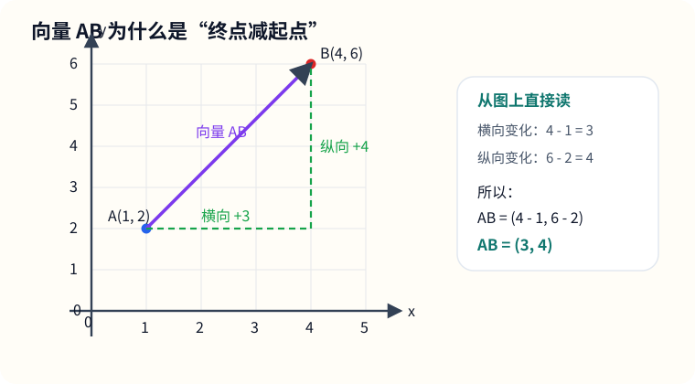
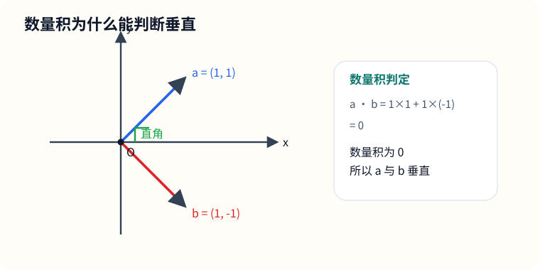
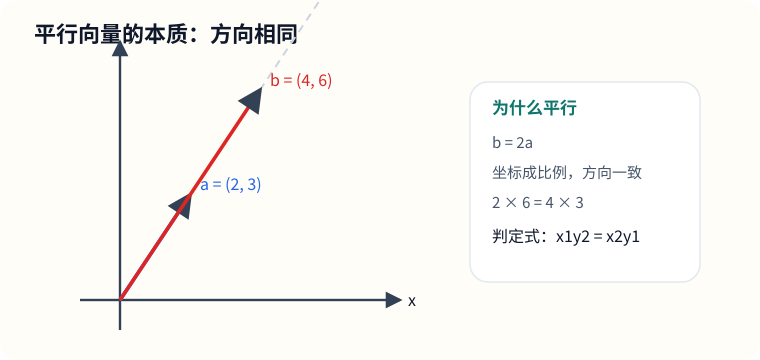

# 八、平面向量

## 章节导学

向量这一章的价值，在于把很多几何关系翻译成坐标运算：

- 向量不只看大小，还看方向；
- 加减、数乘、数量积都可以直接落到坐标上算；
- 平行、垂直、夹角、长度，本质上都能变成代数条件。

## 8.1 向量坐标与线性运算

这一节到底在学什么：

- 学的是“带方向的量”怎么用坐标表示；
- 向量加减和数乘，都是按坐标来算；
- 这一部分和线代思维很接近。

最基础规则：

- $(a,b)+(c,d)=(a+c,b+d)$；
- $(a,b)-(c,d)=(a-c,b-d)$；
- $k(a,b)=(ka,kb)$；
- $\overrightarrow{AB}=(x_B-x_A,y_B-y_A)$。

图示：从点 $A$ 指向点 $B$ 的向量，为什么要“终点减起点”

看这张图时，重点不是记图，而是记住一句话：

- 向量 $\overrightarrow{AB}$ 的横向变化量是 $x_B-x_A$；
- 纵向变化量是 $y_B-y_A$；
- 所以坐标一定写成“终点减起点”。

示例题：

已知点 $A(1,2),B(4,6)$，求 $\overrightarrow{AB}$

讲解：

从 $A$ 指向 $B$，就是“终点减起点”：

$$
\overrightarrow{AB}=(4-1,6-2)=(3,4)
$$

所以：

$$
\overrightarrow{AB}=(3,4)
$$

易错点：

- $\overrightarrow{AB}$ 和 $\overrightarrow{BA}$ 差一个负号；
- 别把向量和点混了；
- 坐标顺序不能颠倒。

## 8.2 数量积、模与夹角

这一节到底在学什么：

- 学的是两个向量之间“有多同向”；
- 数量积既能算夹角，也能判断垂直；
- 这是平面向量最重要的计算工具之一。

核心公式：

- $\vec a\cdot\vec b=x_1x_2+y_1y_2$；
- $\vec a\cdot\vec b=|\vec a||\vec b|\cos\theta$；
- 若 $\vec a\perp\vec b$，则 $\vec a\cdot\vec b=0$。

先把“模”和“数量积”讲透：

若

$$
\vec a=(x,y)
$$

那么它从原点指向点 $(x,y)$，所以模长就是这条线段的长度，由勾股定理可得

$$
|\vec a|=\sqrt{x^2+y^2}
$$

数量积可以理解成“一个向量在另一个向量方向上的投影长度，再乘上另一个向量的长度”，所以它既能反映大小，也能反映方向关系。

当夹角 $\theta=90^\circ$ 时，

$$
\cos\theta=0
$$

于是

$$
\vec a\cdot\vec b=|\vec a||\vec b|\cos\theta=0
$$

如果你想把这件事真正“推出来”，不能一上来就把角写成 $90^\circ$，而要先从一般夹角 $\theta$ 出发。

补充推导：先从一般夹角 $\theta$ 推出数量积公式

设

$$
\vec a=(x_1,y_1),\qquad \vec b=(x_2,y_2)
$$

它们的夹角是任意角 $\theta$。

我们先看向量

$$
\vec a-\vec b=(x_1-x_2,\ y_1-y_2)
$$

它的模长平方可以直接按坐标展开：

$$
|\vec a-\vec b|^2=(x_1-x_2)^2+(y_1-y_2)^2
$$

展开得

$$
|\vec a-\vec b|^2=x_1^2-2x_1x_2+x_2^2+y_1^2-2y_1y_2+y_2^2
$$

整理一下：

$$
|\vec a-\vec b|^2=(x_1^2+y_1^2)+(x_2^2+y_2^2)-2(x_1x_2+y_1y_2)
$$

而

$$
|\vec a|^2=x_1^2+y_1^2,\qquad |\vec b|^2=x_2^2+y_2^2
$$

所以

$$
|\vec a-\vec b|^2=|\vec a|^2+|\vec b|^2-2(x_1x_2+y_1y_2)
$$

另一方面，把 $\vec a,\vec b,\vec a-\vec b$ 看成同一起点引出的三角形三边，根据余弦定理，

$$
|\vec a-\vec b|^2=|\vec a|^2+|\vec b|^2-2|\vec a||\vec b|\cos\theta
$$

因为这两个式子都等于同一个量 $|\vec a-\vec b|^2$，所以右边可以直接比较：

$$
|\vec a|^2+|\vec b|^2-2(x_1x_2+y_1y_2)
=|\vec a|^2+|\vec b|^2-2|\vec a||\vec b|\cos\theta
$$

两边同时消去 $|\vec a|^2+|\vec b|^2$，再除以 $-2$，就得到

$$
x_1x_2+y_1y_2=|\vec a||\vec b|\cos\theta
$$

这就是数量积公式。于是我们把

$$
\vec a\cdot\vec b=x_1x_2+y_1y_2
$$

和

$$
\vec a\cdot\vec b=|\vec a||\vec b|\cos\theta
$$

统一起来了。

再回到“垂直判定”这件事：

如果 $\vec a\perp\vec b$，那么这时只是把一般角 $\theta$ 特殊化为

$$
\theta=90^\circ
$$

于是

$$
\cos\theta=0
$$

代回一般公式：

$$
\vec a\cdot\vec b=|\vec a||\vec b|\cos\theta=0
$$

所以垂直时，数量积一定等于 $0$。

反过来，对非零向量来说，如果

$$
\vec a\cdot\vec b=0
$$

那么由

$$
\vec a\cdot\vec b=|\vec a||\vec b|\cos\theta
$$

可得

$$
|\vec a||\vec b|\cos\theta=0
$$

因为非零向量满足

$$
|\vec a|>0,\qquad |\vec b|>0
$$

所以只能是

$$
\cos\theta=0
$$

也就是

$$
\theta=90^\circ
$$

因此：

- 若 $\vec a\perp\vec b$，则 $\vec a\cdot\vec b=0$；
- 对非零向量来说，若 $\vec a\cdot\vec b=0$，也能反过来推出 $\vec a\perp\vec b$。

这就是为什么数量积等于 $0$ 能判断垂直。

图示：数量积为什么能判断垂直

看图时这样理解最顺：

- 两个向量如果成直角，那它们的“同向程度”就是 0；
- 而数量积正是在量化这种“同向程度”；
- 所以垂直时，数量积等于 0。

示例题：

已知 $\vec a=(1,1),\vec b=(1,-1)$，判断是否垂直

讲解：

直接算数量积：

$$
\vec a\cdot\vec b=1\times1+1\times(-1)=0
$$

因为数量积为 0，所以：

$$
\vec a\perp\vec b
$$

也就是说，这两个向量垂直。

易错点：

- 数量积结果是一个数，不是向量；
- 垂直的判定最稳的方法就是点积等于 0；
- 求模时别忘了开根号。

## 8.3 平行、垂直与综合应用

这一节到底在学什么：

- 学的是“几何关系怎么翻译成坐标关系”；
- 共线、平行、垂直，本质上都可以用向量来判；
- 这部分很适合训练你把文字条件变成式子。

平行与垂直的常用判定：

- 平行：$(x_1,y_1)$ 与 $(x_2,y_2)$ 满足 $x_1y_2=x_2y_1$；
- 垂直：$x_1x_2+y_1y_2=0$。

图示：平行向量的本质是“同方向或反方向”

你可以把“平行”理解成：

- 两个向量虽然长短可以不同；
- 但只要方向一致或相反，本质上就在同一条方向线上；
- 用坐标写出来，就是两个坐标组彼此成比例。

示例题：

求 $\lambda$，使向量 $(2,\lambda)$ 与 $(4,6)$ 平行

讲解：

更本质的理解是：

- 两个非零向量平行，当且仅当其中一个向量是另一个向量的倍数；
- 也就是说，若 $(2,\lambda)\parallel(4,6)$，就一定存在实数 $k$，使得

$$
(2,\lambda)=k(4,6)
$$

把坐标对应起来，就是

$$
2=4k,\qquad \lambda=6k
$$

先由第一式求出

$$
k=\frac{2}{4}=\frac12
$$

再代入第二式：

$$
\lambda=6\times\frac12=3
$$

所以：

$$
\lambda=3
$$

你看到的“交叉相乘”其实只是把这个倍数关系消掉后的快捷写法。

因为平行时对应坐标成同一个比例，所以

$$
\frac{2}{4}=\frac{\lambda}{6}
$$

于是交叉相乘得到：

$$
2\times6=4\times\lambda
$$

所以：

$$
12=4\lambda
$$

$$
\lambda=3
$$

你可以把这个结论记成：

- 平行先想到“存在倍数 $k$”；
- 交叉相乘只是为了更快地把 $k$ 消掉；
- 所以 $(x_1,y_1)\parallel(x_2,y_2)$ 常写成 $x_1y_2=x_2y_1$。

易错点：

- 平行是“方向相同或相反”，不一定完全一样；
- 坐标成比例时别把顺序写乱；
- 综合题里经常要先求向量，再判关系。

## 8.4 练习题（25道，浅→深）

说明：

- 这 25 题按“基础计算 → 参数判断 → 综合应用”来排；
- 建议先自己做一遍，再回头对照本章知识点查漏补缺；
- 这一组现在附上简答版答案，建议先独立做一遍，再对照核查。

1. 已知点 $A(1,2),B(4,6)$，求 $\overrightarrow{AB}$。
- 解答 $\overrightarrow{AB}=(4-1,6-2)=(3,4)$。
2. 已知点 $P(-2,3),Q(1,-1)$，求 $\overrightarrow{PQ}$ 与 $\overrightarrow{QP}$。
- 解答 $\overrightarrow{PQ}=(1-(-2),-1-3)=(3,-4)$，$\overrightarrow{QP}=(-2-1,3-(-1))=(-3,4)$。
3. 已知 $\vec a=(2,-3),\vec b=(-1,4)$，求 $\vec a+\vec b$。
- 解答 $\vec a+\vec b=(2+(-1),-3+4)=(1,1)$。
4. 已知 $\vec a=(3,1),\vec b=(5,-2)$，求 $\vec a-\vec b$。
- 解答 $\vec a-\vec b=(3-5,1-(-2))=(-2,3)$。
5. 已知 $\vec a=(-2,5)$，求 $3\vec a$ 与 $-\frac12\vec a$。
- 解答 $3\vec a=3(-2,5)=(-6,15)$，$-\frac12\vec a=-\frac12(-2,5)=(1,-\frac52)$。

6. 已知 $\vec a=(6,8)$，求 $|\vec a|$。
- 解答 $|\vec a|=\sqrt{6^2+8^2}=\sqrt{100}=10$。
7. 已知 $\vec a=(m,4)$，且 $|\vec a|=5$，求 $m$。
- 解答 $\sqrt{m^2+4^2}=5$，所以 $m^2+16=25$，解得 $m=\pm3$。
8. 已知点 $A(2,-1),B(5,3)$，点 $P$ 满足 $\overrightarrow{AP}=2\overrightarrow{AB}$，求点 $P$ 的坐标。
- 解答 $\overrightarrow{AB}=(5-2,3-(-1))=(3,4)$，所以 $\overrightarrow{AP}=2\overrightarrow{AB}=(6,8)$，故 $P=(2+6,-1+8)=(8,7)$。
9. 已知 $\vec a=(1,2),\vec b=(3,-1)$，求 $\vec a\cdot\vec b$。
- 解答 $\vec a\cdot\vec b=1\times3+2\times(-1)=1$。
10. 已知 $\vec a=(2,3),\vec b=(3,-2)$，判断 $\vec a$ 与 $\vec b$ 是否垂直。
- 解答 $\vec a\cdot\vec b=2\times3+3\times(-2)=0$，所以 $\vec a\perp\vec b$。
11. 已知 $\vec a=(1,k),\vec b=(2,3)$，若 $\vec a\perp\vec b$，求 $k$。
- 解答 由 $\vec a\cdot\vec b=0$ 得 $1\times2+k\times3=0$，所以 $k=-\frac23$。
12. 已知 $\vec a=(2,-1),\vec b=(4,\lambda)$，若 $\vec a\parallel\vec b$，求 $\lambda$。
- 解答 由平行条件得 $2\lambda=4\times(-1)$，所以 $\lambda=-2$。
13. 已知 $\vec a=(1,2),\vec b=(-2,1)$，求 $|\vec a|$、$|\vec b|$ 与 $\vec a\cdot\vec b$。
- 解答 $|\vec a|=\sqrt{1^2+2^2}=\sqrt5$，$|\vec b|=\sqrt{(-2)^2+1^2}=\sqrt5$，$\vec a\cdot\vec b=1\times(-2)+2\times1=0$。
14. 已知 $\vec a=(1,2),\vec b=(2,1)$，求它们夹角的余弦值。
- 解答 $\cos\theta=\dfrac{\vec a\cdot\vec b}{|\vec a||\vec b|}=\dfrac{1\times2+2\times1}{\sqrt5\cdot\sqrt5}=\dfrac45$。
15. 已知 $\vec a=(3,4),\vec b=(-4,3)$，求这两个向量的夹角。
- 解答 $\vec a\cdot\vec b=3\times(-4)+4\times3=0$，所以夹角为 $90^\circ$。
16. 已知 $\vec a=(x,2),\vec b=(1,-4)$，若 $\vec a\cdot\vec b=0$，求 $x$。
- 解答 由 $x\times1+2\times(-4)=0$ 得 $x-8=0$，所以 $x=8$。
17. 已知点 $A(1,1),B(3,5),C(5,9)$，判断 $\overrightarrow{AB}$ 与 $\overrightarrow{BC}$ 的关系。
- 解答 $\overrightarrow{AB}=(3-1,5-1)=(2,4)$，$\overrightarrow{BC}=(5-3,9-5)=(2,4)$，所以二者平行且同向。
18. 已知点 $A(1,-1),B(3,2),C(6,m)$，若 $\overrightarrow{AB}\parallel\overrightarrow{BC}$，求 $m$。
- 解答 $\overrightarrow{AB}=(2,3)$，$\overrightarrow{BC}=(3,m-2)$。由平行条件得 $2(m-2)=3\times3$，解得 $m=\frac{13}{2}$。
19. 已知点 $A(0,0),B(2,1),C(1,3)$，判断 $\overrightarrow{AB}$ 与 $\overrightarrow{AC}$ 是否垂直。
- 解答 $\overrightarrow{AB}=(2,1)$，$\overrightarrow{AC}=(1,3)$，且 $\overrightarrow{AB}\cdot\overrightarrow{AC}=2\times1+1\times3=5\ne0$，所以不垂直。
20. 已知 $\vec a=(2,1),\vec b=(1,-2)$，求 $2\vec a-\vec b$ 及其模长。
- 解答 $2\vec a-\vec b=2(2,1)-(1,-2)=(4,2)-(1,-2)=(3,4)$，其模长为 $\sqrt{3^2+4^2}=5$。
21. 已知 $\vec a=(1,2),\vec b=(2,4),\vec c=(-2,-4)$，判断 $\vec a$ 与 $\vec b$、$\vec a$ 与 $\vec c$、$\vec b$ 与 $\vec c$ 是否平行，并说明是同向还是反向。
- 解答 $\vec b=2\vec a$，所以 $\vec a$ 与 $\vec b$ 平行且同向；$\vec c=-2\vec a$，所以 $\vec a$ 与 $\vec c$ 平行且反向；$\vec c=-\vec b$，所以 $\vec b$ 与 $\vec c$ 平行且反向。
22. 已知点 $A(1,2),B(4,1),C(2,5)$，求 $\overrightarrow{AB}\cdot\overrightarrow{AC}$，并判断 $\angle BAC$ 是锐角、直角还是钝角。
- 解答 $\overrightarrow{AB}=(3,-1)$，$\overrightarrow{AC}=(1,3)$，所以 $\overrightarrow{AB}\cdot\overrightarrow{AC}=3\times1+(-1)\times3=0$，故 $\angle BAC=90^\circ$，是直角。
23. 已知 $|\vec a|=2,|\vec b|=3$，且 $\vec a\cdot\vec b=3$，求两向量夹角的余弦值。
- 解答 $\cos\theta=\dfrac{\vec a\cdot\vec b}{|\vec a||\vec b|}=\dfrac{3}{2\times3}=\dfrac12$。
24. 已知 $\vec a=(x,1),\vec b=(2,x)$，若 $\vec a\perp\vec b$ 且 $x>0$，求 $x$。
- 解答 由 $\vec a\cdot\vec b=0$ 得 $x\times2+1\times x=0$，即 $3x=0$，解得 $x=0$，但题目要求 $x>0$，所以无解。
25. 在四边形 $ABCD$ 中，已知 $A(0,0),B(2,1),C(5,3),D(3,2)$，请用向量方法判断 $ABCD$ 是否为平行四边形。
- 解答 $\overrightarrow{AB}=(2,1)$，$\overrightarrow{DC}=(5-3,3-2)=(2,1)$；$\overrightarrow{AD}=(3,2)$，$\overrightarrow{BC}=(5-2,3-1)=(3,2)$。两组对边分别平行且相等，所以 $ABCD$ 是平行四边形。
