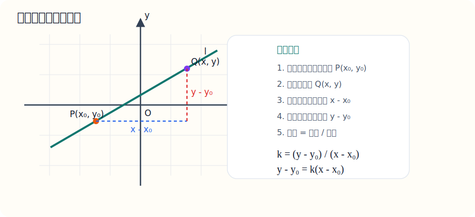
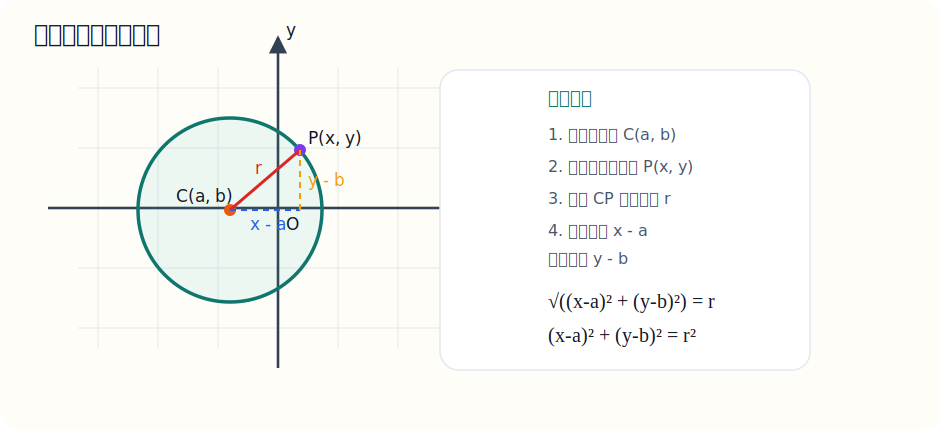
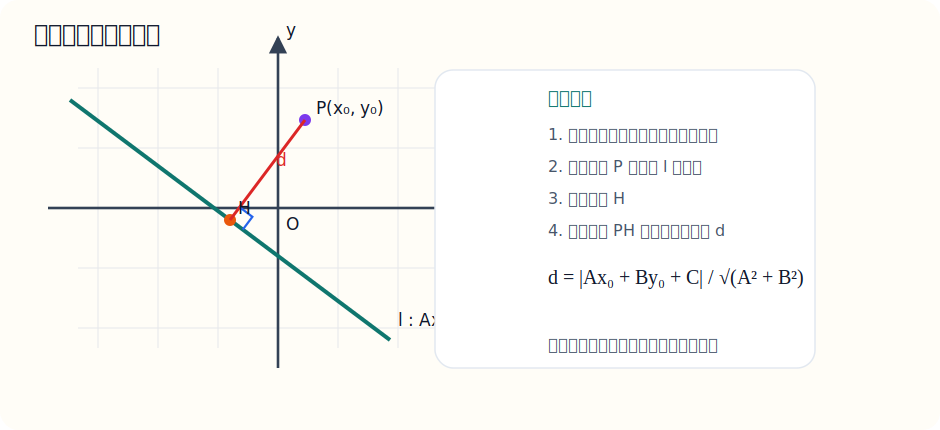
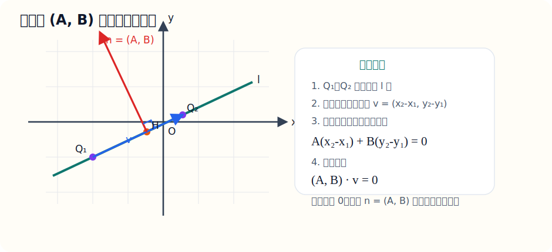
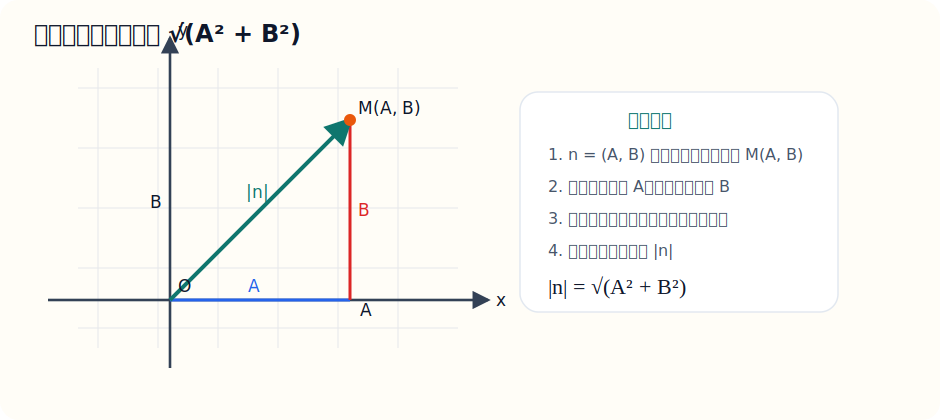
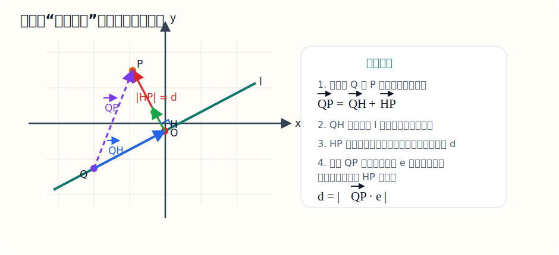
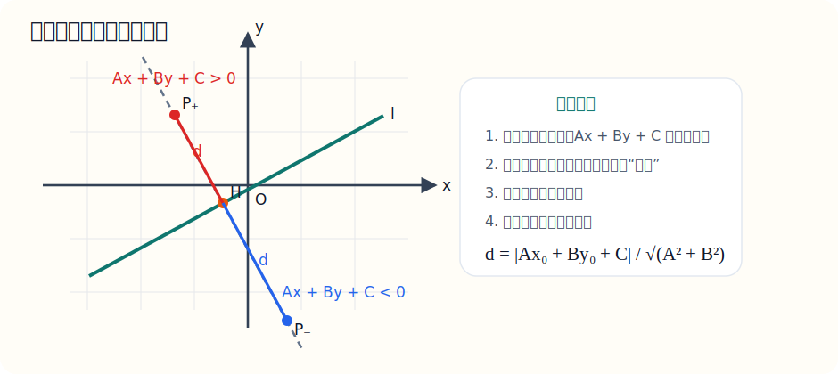

# 八、解析几何基础

## 章节导学

解析几何的核心思想是“用方程研究图形”：

- 点、直线、圆，都能翻译成坐标与方程；
- 斜率、距离、中点、位置关系是最常用的工具；
- 看到图形题时，要练习把几何语言翻译成代数语言。

## 8.1 直线方程

这一节到底在学什么：

- 学的是“怎么把一条直线写成方程”；
- 直线方程写法很多，但你真正会用的就那几种；
- 关键是根据题目条件选最方便的形式。

最常用形式：

- 点斜式：$y-y_0=k(x-x_0)$；
- 斜截式：$y=kx+b$；
- 一般式：$Ax+By+C=0$。

为什么点斜式是

$$
y-y_0=k(x-x_0)
$$

本质上就是斜率定义。

若一条直线过点 $(x_0,y_0)$，直线上任意一点为 $(x,y)$，那么斜率

$$
k=\frac{y-y_0}{x-x_0}
$$

移项后就得到

$$
y-y_0=k(x-x_0)
$$

所以点斜式其实就是“斜率公式的方程化”。

图示：点斜式为什么是这个样子

看图时这样理解：

- 固定点 $P(x_0,y_0)$ 在直线上；
- 直线上再取任意一点 $Q(x,y)$；
- 从 $P$ 到 $Q$ 的横向变化量是 $x-x_0$，纵向变化量是 $y-y_0$；
- 斜率本来就是“纵变比横变”，所以

$$
k=\frac{y-y_0}{x-x_0}
$$

- 把它移项，就得到

$$
y-y_0=k(x-x_0)
$$

示例题：

求过点 $(1,2)$ 且斜率为 $3$ 的直线方程

讲解：

“已知一点 + 已知斜率”最适合直接用点斜式：

$$
y-2=3(x-1)
$$

这已经是答案。

如果想化简，也可以写成：

$$
y=3x-1
$$

易错点：

- 已知两点时要先求斜率；
- 竖直直线不能写成 $y=kx+b$；
- 点斜式里的点坐标不要代错位置。

## 8.2 圆的方程

这一节到底在学什么：

- 学的是“圆心和半径怎么写进方程里”；
- 标准式最直观；
- 一般式经常要通过配方变成标准式。

标准式：

$$
(x-a)^2+(y-b)^2=r^2
$$

其中圆心是 $(a,b)$，半径是 $r$。

这个方程不是凭空记的，它直接来自圆的定义：

圆就是“到定点 $(a,b)$ 的距离恒等于定长 $r$ 的点的轨迹”。

若圆上任意一点为 $(x,y)$，那么它到圆心 $(a,b)$ 的距离满足

$$
\sqrt{(x-a)^2+(y-b)^2}=r
$$

两边平方，就得到标准方程

$$
(x-a)^2+(y-b)^2=r^2
$$

图示：圆的标准方程为什么长这样

看图时这样理解：

- 圆心固定在 $C(a,b)$；
- 圆上任意一点是 $P(x,y)$；
- 因为 $P$ 在圆上，所以它到圆心的距离始终等于半径 $r$；
- 距离公式写出来就是

$$
\sqrt{(x-a)^2+(y-b)^2}=r
$$

- 两边平方以后，就得到标准式

$$
(x-a)^2+(y-b)^2=r^2
$$

示例题：

求圆 $x^2+y^2-4x+6y-3=0$ 的圆心和半径

讲解：

先把 $x$、$y$ 分组：

$$
(x^2-4x)+(y^2+6y)=3
$$

分别配方：

$$
(x^2-4x+4)+(y^2+6y+9)=3+4+9
$$

得到：

$$
(x-2)^2+(y+3)^2=16
$$

所以圆心是：

$$
(2,-3)
$$

半径是：

$$
4
$$

易错点：

- 配方后右边要同步加同样的数；
- 圆心坐标要注意符号反过来读；
- 半径是右边常数开平方。

## 8.3 位置关系与综合

这一节到底在学什么：

- 学的是点、线、圆之间的位置关系；
- 常见工具是距离公式和点到直线距离公式；
- 这部分的思路很统一：先求距离，再比较。

示例题：

求点 $(1,2)$ 到直线 $3x+4y-5=0$ 的距离

讲解：

直接套点到直线距离公式：

$$
d=\frac{|Ax_0+By_0+C|}{\sqrt{A^2+B^2}}
$$

图示：点到直线距离为什么要作垂线

看图时这样理解：

- 从点 $P(x_0,y_0)$ 向直线 $l$ 作垂线，垂足记为 $H$；
- 点到直线的距离，指的就是这条最短线段 $PH$ 的长度；
- 也就是说，点到直线距离公式本质上是在坐标系里计算这条垂线段的长度。

补充推导：点到直线距离公式为什么是这个样子

这一段第一次看可以慢一点。真正的主线只有两句：

- 直线 $Ax+By+C=0$ 的垂直方向，由向量 $(A,B)$ 决定；
- 点到直线的距离，就是某个向量在这个垂直方向上的投影长度。

下面一步一步推。

### 第一步：先说明为什么 $(A,B)$ 和直线垂直

设直线

$$
l:Ax+By+C=0
$$

上有两点

$$
Q_1(x_1,y_1),\qquad Q_2(x_2,y_2)
$$

因为这两点都在直线上，所以都满足直线方程：

$$
Ax_1+By_1+C=0
$$

$$
Ax_2+By_2+C=0
$$

两式相减：

$$
A(x_2-x_1)+B(y_2-y_1)=0
$$

把直线的方向向量记成

$$
\vec v=(x_2-x_1,\ y_2-y_1)
$$

那么上式就可以写成

$$
(A,B)\cdot\vec v=0
$$

这说明向量 $(A,B)$ 和直线的方向向量垂直，所以 $(A,B)$ 就是这条直线的一个法向量。

也就是说：

- 直线是沿着 $\vec v$ 的方向延伸；
- 向量 $(A,B)$ 是朝着“垂直于直线”的方向指过去的。

图示：为什么 $(A,B)$ 是法向量

看图时抓住：

- 蓝色箭头 $\vec v$ 沿着直线方向走；
- 红色箭头 $\vec n=(A,B)$ 和直线垂直；
- 因为 $(A,B)\cdot\vec v=0$，所以 $(A,B)$ 就是这条直线的法向量。

### 第二步：说明为什么法向量长度是 $\sqrt{A^2+B^2}$

设

$$
\vec n=(A,B)
$$

把它放到坐标系里看，它可以理解成从原点 $O(0,0)$ 指向点 $(A,B)$ 的向量。

于是它的长度就是两点间距离：

$$
|\vec n|=\sqrt{(A-0)^2+(B-0)^2}
$$

所以

$$
|\vec n|=\sqrt{A^2+B^2}
$$

这一步本质上就是勾股定理。

图示：法向量长度为什么是 $\sqrt{A^2+B^2}$

看图时抓住：

- 向量 $(A,B)$ 可以看成从原点到点 $(A,B)$；
- 横向变化量是 $A$，纵向变化量是 $B$；
- 所以它的长度就是直角三角形斜边长度，用勾股定理得到

$$
|\vec n|=\sqrt{A^2+B^2}
$$

### 第三步：把“点到直线距离”看成投影长度

设已知点为

$$
P(x_0,y_0)
$$

并且在直线 $l$ 上任取一点

$$
Q(x_1,y_1)
$$

那么从 $Q$ 指向 $P$ 的向量是

$$
\overrightarrow{QP}=(x_0-x_1,\ y_0-y_1)
$$

点到直线的距离，指的是从 $P$ 向直线作垂线得到的最短距离。

而“垂直方向”正是法向量 $\vec n=(A,B)$ 的方向，所以这个距离，其实就是 $\overrightarrow{QP}$ 在法向量方向上的投影长度。

图示：为什么投影长度就是距离

看图时抓住：

- 把 $\overrightarrow{QP}$ 拆成“沿直线方向的 $QH$”和“垂直直线方向的 $HP$”；
- $QH$ 平行于直线，所以和法向量垂直；
- 真正留下来的只有 $HP$，它的长度就是距离 $d$。

这里一定要注意，写成严格数学记号时，应该是

$$
\overrightarrow{QP}=\overrightarrow{QH}+\overrightarrow{HP}
$$

这表示的是“向量相加”，不是线段长度相加。

为什么这个式子成立？

- 因为从点 $Q$ 出发，先沿着 $\overrightarrow{QH}$ 走到点 $H$；
- 再沿着 $\overrightarrow{HP}$ 走到点 $P$；
- 这两段位移接起来，整体效果就等于直接从 $Q$ 走到 $P$。

如果用坐标写，会更清楚：

$$
\overrightarrow{QH}=(x_H-x_Q,\ y_H-y_Q)
$$

$$
\overrightarrow{HP}=(x_P-x_H,\ y_P-y_H)
$$

两式相加：

$$
\overrightarrow{QH}+\overrightarrow{HP}
=(x_H-x_Q,\ y_H-y_Q)+(x_P-x_H,\ y_P-y_H)
$$

$$
=(x_P-x_Q,\ y_P-y_Q)
=\overrightarrow{QP}
$$

所以这里说的“拆成两段”，本质上是位移向量的首尾相接。

先把法向量化成单位向量：

$$
\vec e=\frac{\vec n}{|\vec n|}=\frac{(A,B)}{\sqrt{A^2+B^2}}
$$

这里可以再补一句：$\vec e$ 的意思是“与法向量 $\vec n$ 同方向，但长度等于 $1$ 的向量”。

为什么它叫单位向量？

因为

$$
\vec e=\frac{(A,B)}{\sqrt{A^2+B^2}}
=\left(\frac{A}{\sqrt{A^2+B^2}},\frac{B}{\sqrt{A^2+B^2}}\right)
$$

它的长度是

$$
|\vec e|
=\sqrt{\left(\frac{A}{\sqrt{A^2+B^2}}\right)^2+\left(\frac{B}{\sqrt{A^2+B^2}}\right)^2}
$$

$$
=\sqrt{\frac{A^2}{A^2+B^2}+\frac{B^2}{A^2+B^2}}
=\sqrt{1}
=1
$$

所以 $\vec e$ 确实是一个长度为 $1$ 的向量。

补充理解：为什么 $\overrightarrow{QP}\cdot\vec e$ 就是投影长度

先回忆点积公式：

$$
\vec a\cdot\vec b=|\vec a|\,|\vec b|\cos\theta
$$

其中 $\theta$ 是两个向量的夹角。

现在令

$$
\vec a=\overrightarrow{QP},\qquad \vec b=\vec e
$$

那么就有

$$
\overrightarrow{QP}\cdot\vec e
=|\overrightarrow{QP}|\,|\vec e|\cos\theta
$$

因为 $\vec e$ 是单位向量，所以

$$
|\vec e|=1
$$

于是上式就变成

$$
\overrightarrow{QP}\cdot\vec e
=|\overrightarrow{QP}|\cos\theta
$$

而

$$
|\overrightarrow{QP}|\cos\theta
$$

正好就是向量 $\overrightarrow{QP}$ 在方向 $\vec e$ 上的投影长度。

所以

$$
\overrightarrow{QP}\cdot\vec e
$$

表示的就是 $\overrightarrow{QP}$ 在单位向量 $\vec e$ 方向上的投影。

因为距离只取长度，不看正负方向，所以最后要写成绝对值：

$$
d=\left|\overrightarrow{QP}\cdot\vec e\right|
$$

也就是说，这里不是随便做一次点积，而是在“取 $\overrightarrow{QP}$ 在法向量方向上的投影长度”。

代入 $\overrightarrow{QP}$ 和 $\vec e$：

$$
d=\left|\frac{(x_0-x_1,\ y_0-y_1)\cdot(A,B)}{\sqrt{A^2+B^2}}\right|
$$

按数量积展开：

$$
d=\left|\frac{A(x_0-x_1)+B(y_0-y_1)}{\sqrt{A^2+B^2}}\right|
$$

继续整理分子：

$$
d=\left|\frac{Ax_0-Ax_1+By_0-By_1}{\sqrt{A^2+B^2}}\right|
$$

$$
=\left|\frac{Ax_0+By_0-(Ax_1+By_1)}{\sqrt{A^2+B^2}}\right|
$$

### 第四步：利用“点 $Q$ 在直线上”这个条件

因为 $Q(x_1,y_1)$ 在直线

$$
Ax+By+C=0
$$

上，所以它满足

$$
Ax_1+By_1+C=0
$$

于是

$$
Ax_1+By_1=-C
$$

代回上式：

$$
d=\left|\frac{Ax_0+By_0-(-C)}{\sqrt{A^2+B^2}}\right|
$$

所以

$$
d=\frac{|Ax_0+By_0+C|}{\sqrt{A^2+B^2}}
$$

这就把公式推出来了。

### 第五步：为什么分子要加绝对值

因为

$$
Ax_0+By_0+C
$$

这个值本身可能是正数，也可能是负数，它反映的是点在直线哪一侧。

但距离一定不能是负数，所以最后要取绝对值：

$$
|Ax_0+By_0+C|
$$

图示：为什么最后要取绝对值

看图时抓住：

- 点在直线两侧时，$Ax_0+By_0+C$ 的符号会变化；
- 但距离始终表示长度，不能带负号；
- 所以分子必须写成绝对值。

你也可以把这个公式速记成一句话：

- 先把点坐标代入直线方程；
- 再取绝对值；
- 最后除以法向量长度 $\sqrt{A^2+B^2}$。

回到上面的例题，直接代入就可以了。

这里：

- $A=3$
- $B=4$
- $C=-5$
- $(x_0,y_0)=(1,2)$

代入：

$$
d=\frac{|3\times1+4\times2-5|}{\sqrt{3^2+4^2}}
=\frac{|3+8-5|}{5}
=\frac65
$$

所以距离是：

$$
\frac65
$$

易错点：

- 直线必须先整理成一般式；
- 分子要带绝对值；
- 分母是 $\sqrt{A^2+B^2}$，别漏平方。

## 8.4 练习题（25道，浅→深）

说明：

- 这 25 题按“直线 → 距离 → 圆 → 综合”来排；
- 建议按顺序做，前面的基础题会给后面的综合题打底；
- 这一组暂时不附答案，方便你先独立完成。

1. 求过点 $(1,2)$ 且斜率为 $3$ 的直线方程。
2. 求过点 $(-2,4)$ 且斜率为 $-1$ 的直线方程。
3. 已知直线 $y=2x-5$，写出它的一般式。
4. 求过点 $A(1,2)$、$B(3,6)$ 的直线方程。
5. 求过点 $(2,-1)$ 且与直线 $y=3x+2$ 平行的直线方程。
6. 求过点 $(1,4)$ 且与直线 $2x-y+3=0$ 垂直的直线方程。
7. 求直线 $3x-2y+6=0$ 的斜率。
8. 求两直线 $y=2x+1$ 与 $y=-x+4$ 的交点坐标。
9. 求点 $A(1,2),B(5,-1)$ 的中点坐标。
10. 求点 $A(-2,3),B(4,-5)$ 之间的距离。
11. 求点 $(3,-4)$ 到 $x$ 轴和 $y$ 轴的距离。
12. 求点 $(4,1)$ 到直线 $x=1$ 的距离。
13. 求点 $(2,-1)$ 到直线 $x-2y+2=0$ 的距离。
14. 写出圆心为 $(2,-3)$、半径为 $4$ 的圆的方程。
15. 已知圆 $(x-1)^2+(y+2)^2=9$，求圆心和半径。
16. 将方程 $x^2+y^2-6x+8y-11=0$ 化成标准式，并求圆心和半径。
17. 判断点 $(3,1)$ 是否在圆 $(x-1)^2+(y-2)^2=5$ 上。
18. 已知圆心在原点、半径为 $5$，求圆方程，并判断点 $(3,4)$ 与 $(4,4)$ 是否在圆上。
19. 求圆心为 $(1,2)$ 且经过点 $(4,6)$ 的圆的方程。
20. 已知圆 $(x-2)^2+(y+1)^2=25$，判断点 $P(5,3)$ 在圆内、圆上还是圆外。
21. 求与 $x$ 轴相切、圆心为 $(2,3)$ 的圆方程。
22. 求与直线 $x=3$ 相切，且圆心在原点的圆方程。
23. 已知直线 $3x-4y+12=0$ 与圆 $(x-1)^2+(y-2)^2=r^2$ 相切，求 $r$。
24. 求经过点 $(1,2)$ 且与直线 $x+y-1=0$ 平行的直线方程，并求点 $(4,-1)$ 到该直线的距离。
25. 已知点 $A(1,2),B(5,4)$，求以 $AB$ 为直径的圆的方程。
