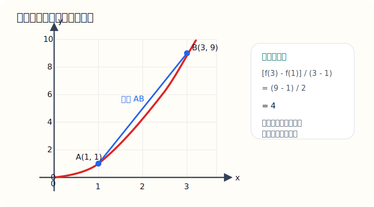
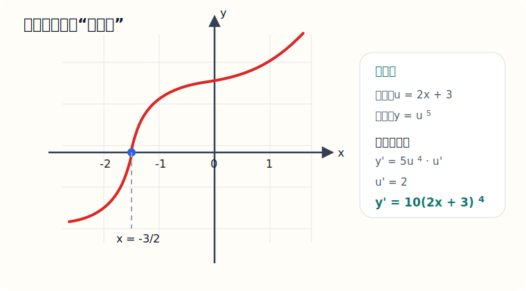
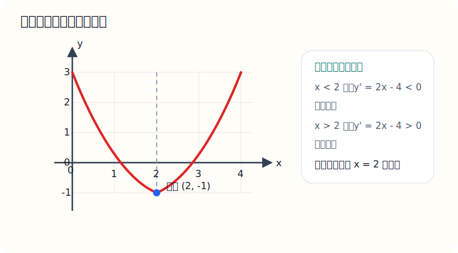

# 十、导数基础

## 章节导学

导数这一章不要只当作“求导公式”来背：

- 它最初是在描述函数变化得快不快；
- 几何上对应切线斜率，物理上对应瞬时变化率；
- 真正的做题主线是“求导数，再用导数研究单调性、极值、最值和切线”。

## 10.1 导数概念与平均变化率

这一节到底在学什么：

- 学的是“函数变化得快不快”；
- 平均变化率说的是一段区间；
- 导数说的是某一个点附近的瞬时变化率。

几何意义：

- 平均变化率对应割线斜率；
- 导数对应切线斜率。

示例题：

求函数 $f(x)=x^2$ 在区间 $[1,3]$ 上的平均变化率

图示：平均变化率对应的是两点连成的割线斜率，不是某一点的切线斜率。

讲解：

直接套平均变化率公式：

$$
\frac{f(3)-f(1)}{3-1}
$$

先算函数值：

$$
f(3)=9,\quad f(1)=1
$$

代入：

$$
\frac{9-1}{2}=4
$$

所以平均变化率是：

$$
4
$$

易错点：

- 平均变化率不是导数；
- 分母是自变量的变化量，不要漏；
- 题目说“某点切线斜率”，那就是求导数值。

## 10.2 基本求导公式与运算

这一节到底在学什么：

- 学的是“常见函数的导数怎么求”；
- 真正常用的公式不多，但要熟到一眼能写出来；
- 复杂一点的题主要靠乘积法则和链式法则。

最常用求导公式：

- $(x^n)'=nx^{n-1}$；
- $(C)'=0$；
- $(e^x)'=e^x$；
- $(\ln x)'=\frac1x$；
- $(\sin x)'=\cos x$；
- $(\cos x)'=-\sin x$；
- $(\tan x)'=\sec^2x$。

示例题：

求导：$(2x+3)^5$

图示：这是一个平移后的五次函数，图像只是帮你建立“外层五次方、内层 $2x+3$”的结构感觉。

讲解：

这是复合函数，不能直接把指数放下来就完事，还要乘里面的导数。

外层是“某个式子的五次方”，先按幂函数求导：

$$
\frac{d}{dx}(2x+3)^5=5(2x+3)^4
$$

再乘里面 $2x+3$ 的导数：

$$
(2x+3)'=2
$$

所以最终结果是：

$$
10(2x+3)^4
$$

易错点：

- 链式法则最容易漏乘“里面的导数”；
- 分式有时先化简再求导会更快；
- 三角函数的导数符号要记牢，尤其是 $(\cos x)'=-\sin x$。

## 10.3 单调性、极值与切线

这一节到底在学什么：

- 学的是“用导数研究函数长什么样”；
- 导数大于 0，函数递增；
- 导数小于 0，函数递减；
- 导数等于 0 的点，是极值点候选。

标准做法：

1. 先求导；
2. 解 $f'(x)=0$；
3. 分区间判断导数正负；
4. 写单调区间和极值；
5. 如果求切线，就再代回切点。

示例题：

求函数 $y=x^2-4x+3$ 的最小值

图示：从图像上看，函数先减后增，所以最低点就出现在顶点处，这和导数符号变化结论一致。

讲解：

先求导：

$$
y'=2x-4
$$

令导数等于 0：

$$
2x-4=0
$$

得到：

$$
x=2
$$

观察导数符号：

- 当 $x<2$ 时，$y'<0$，函数递减；
- 当 $x>2$ 时，$y'>0$，函数递增。

所以在 $x=2$ 处取得最小值。

代回原函数：

$$
y(2)=2^2-4\times2+3=4-8+3=-1
$$

所以最小值是：

$$
-1
$$

易错点：

- 不能只求出 $f'(x)=0$ 就说是极值，还要看左右符号；
- 切线方程需要“切点坐标 + 斜率”两样都算出来；
- 法线斜率是切线斜率的负倒数，但切线斜率为 0 时要单独讨论。

