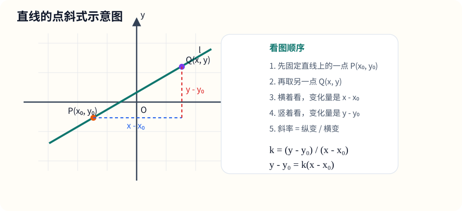
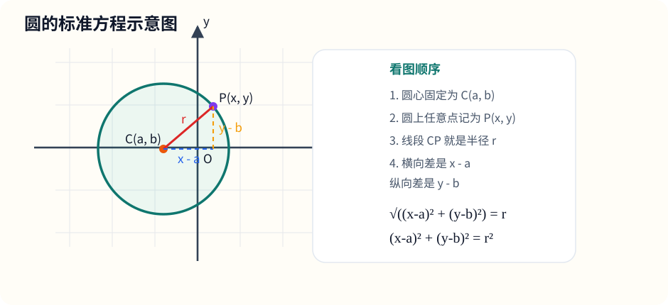
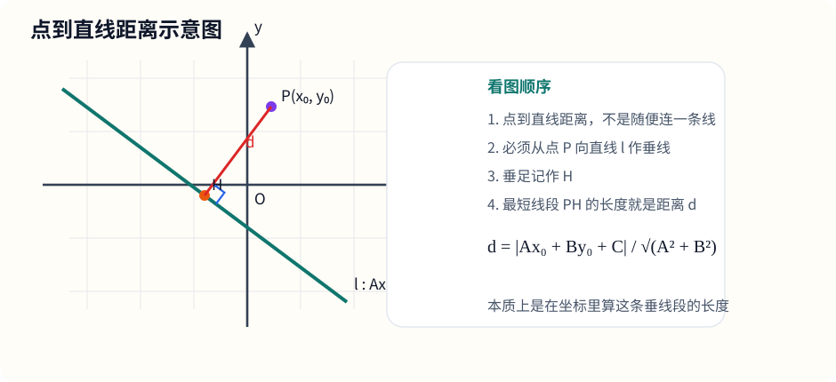

# 十、解析几何基础

## 章节导学

解析几何最核心的一句话就是：

- 把图形翻译成坐标和方程；
- 再把几何关系翻译成代数关系；
- 最后靠计算把结论做出来。

这一章你真正要覆盖到的知识点，可以按下面这张清单来对齐：

- 点：坐标、对称点、中点、距离、定比分点、三点共线、三角形面积；
- 直线：斜率、各种方程形式、平行、垂直、交点、夹角、平行线距离、过定点直线系、线段中垂线；
- 圆：标准式、一般式、配方、圆心半径、由条件构造圆方程、一般式判别、切线；
- 位置关系：点与直线、点与圆、直线与圆、圆与圆、弦长；
- 常见题型：过点、平行、垂直、相切、以某线段为直径、判断点在圆内外、求简单轨迹方程。

这章最重要的解题顺序也只有三步：

1. 先看题目在说“点、线、圆”里的哪一种对象。
2. 再看题目给的是“坐标、斜率、距离、平行、垂直、相切”中的哪种条件。
3. 最后把这些条件翻译成方程去算。

---

## 10.1 坐标系里的点、距离与中点

这一节到底在学什么：

- 学的是坐标系里最基础的“点与点之间”的公式；
- 后面直线、圆、位置关系，几乎都要靠这一节打底；
- 如果这部分不熟，后面很多题就会越算越乱。

### 1. 两点坐标差

设

$$
A(x_1,y_1),\qquad B(x_2,y_2)
$$

那么从 $A$ 到 $B$ 的横向变化量和纵向变化量分别是：

$$
x_2-x_1,\qquad y_2-y_1
$$

所以

$$
\overrightarrow{AB}=(x_2-x_1,\ y_2-y_1)
$$

你可以把它记成一句很稳的话：

- 向量、坐标差、斜率，几乎都在用“终点减起点”。

### 2. 中点公式

若线段 $AB$ 的中点为 $M$，则

$$
M\left(\frac{x_1+x_2}{2},\frac{y_1+y_2}{2}\right)
$$

为什么是这样？

因为中点就是“横坐标取平均，纵坐标也取平均”。

### 3. 两点间距离公式

点 $A(x_1,y_1)$ 与点 $B(x_2,y_2)$ 的距离为

$$
AB=\sqrt{(x_2-x_1)^2+(y_2-y_1)^2}
$$

本质上就是勾股定理：

- 横向差是 $x_2-x_1$；
- 纵向差是 $y_2-y_1$；
- 线段 $AB$ 就是那个直角三角形的斜边。

### 4. 点到坐标轴、原点的距离

若点为 $P(x,y)$，则：

- 到 $x$ 轴的距离是 $|y|$；
- 到 $y$ 轴的距离是 $|x|$；
- 到原点的距离是

$$
\sqrt{x^2+y^2}
$$

这几个小结论非常常用，特别是在圆和对称题里。

### 5. 常见对称点

若点 $P(x,y)$：

- 关于 $x$ 轴对称点是 $(x,-y)$；
- 关于 $y$ 轴对称点是 $(-x,y)$；
- 关于原点对称点是 $(-x,-y)$；
- 关于直线 $y=x$ 对称点是 $(y,x)$。

你可以这样理解：

- 关于哪条轴对称，就把“垂直于那条轴的坐标”变号；
- 关于原点对称，两个坐标都变号；
- 关于 $y=x$ 对称，就是横纵交换。

### 6. 补充：定比分点公式

如果点 $P$ 在 $A(x_1,y_1)$、$B(x_2,y_2)$ 之间，并且满足

$$
AP:PB=m:n
$$

那么

$$
P\left(\frac{nx_1+mx_2}{m+n},\frac{ny_1+my_2}{m+n}\right)
$$

中点公式其实就是它的特殊情况：当 $m=n$ 时，就退化成中点。

### 7. 补充：三点共线怎么判断

设

$$
A(x_1,y_1),\qquad B(x_2,y_2),\qquad C(x_3,y_3)
$$

最直接的想法是：

- 如果三点共线，那么从 $A$ 到 $B$、从 $A$ 到 $C$ 的方向应该一致。

所以当分母都不为 $0$ 时，常用斜率判断：

$$
\frac{y_2-y_1}{x_2-x_1}=\frac{y_3-y_1}{x_3-x_1}
$$

如果出现“分母为 $0$”的情况，就不要硬套斜率公式，而要单独看：

- 若 $x_1=x_2=x_3$，那么三点在同一条竖直直线上。

你也可以反过来理解：

- 三点不共线，才能围成一个真正有面积的三角形。

### 8. 补充：坐标法求三角形面积

设三角形三个顶点为

$$
A(x_1,y_1),\qquad B(x_2,y_2),\qquad C(x_3,y_3)
$$

如果其中一边刚好平行于坐标轴，最省事的方法还是：

$$
\text{面积}=\frac{\text{底}\times\text{高}}{2}
$$

如果三个点位置比较一般，可以直接用坐标面积公式：

$$
S_{\triangle ABC}
=\frac12\left|x_1(y_2-y_3)+x_2(y_3-y_1)+x_3(y_1-y_2)\right|
$$

这个式子看着长，但本质上还是把“底乘高除以 2”写成了坐标形式。

这里顺手记一个很有用的小结论：

- 若 $S_{\triangle ABC}=0$，则三点共线。

### 示例题

已知点

$$
A(-1,2),\qquad B(3,-4)
$$

求：

- 线段 $AB$ 的中点；
- 线段 $AB$ 的长度。

### 讲解

中点：

$$
M\left(\frac{-1+3}{2},\frac{2+(-4)}{2}\right)=(1,-1)
$$

距离：

$$
AB=\sqrt{(3-(-1))^2+(-4-2)^2}
$$

$$
=\sqrt{4^2+(-6)^2}
=\sqrt{16+36}
=\sqrt{52}
=2\sqrt{13}
$$

### 易错点

- 中点公式是“两个坐标分别平均”，不是先算完再一起除。
- 距离公式里，坐标差一定要先加括号。
- 点到坐标轴的距离一定带绝对值。
- 三点共线判断时，别忘了竖直线这种“斜率不存在”的情况。
- 面积公式最后一定要取绝对值。

---

## 10.2 直线方程

这一节到底在学什么：

- 学的是“怎么把一条直线写成方程”；
- 重点不是死记形式，而是看条件会选形式；
- 平行、垂直、交点、夹角，最后都要落到直线方程上。

### 1. 斜率

若

$$
A(x_1,y_1),\qquad B(x_2,y_2),\qquad x_1\ne x_2
$$

那么直线 $AB$ 的斜率为

$$
k=\frac{y_2-y_1}{x_2-x_1}
$$

你可以把它理解成：

- 斜率 = 纵向变化量 / 横向变化量。

特别注意：

- 若 $x_1=x_2$，那么直线是竖直直线，斜率不存在；
- 若 $y_1=y_2$，那么直线是水平直线，斜率为 $0$。

### 2. 直线的常用方程形式

#### 点斜式

已知一点 $(x_0,y_0)$ 和斜率 $k$：

$$
y-y_0=k(x-x_0)
$$

这是最常用的一种，因为“已知一点 + 已知斜率”时最顺手。

图示：点斜式为什么是这个样子

看图时抓住：

- 直线上固定一点 $P(x_0,y_0)$；
- 再取任意一点 $Q(x,y)$；
- 横向变化量是 $x-x_0$；
- 纵向变化量是 $y-y_0$；
- 所以斜率

$$
k=\frac{y-y_0}{x-x_0}
$$

移项后就得到点斜式。

#### 两点式

若已知两点 $A(x_1,y_1)$、$B(x_2,y_2)$，且 $x_1\ne x_2$，则

$$
\frac{y-y_1}{x-x_1}=\frac{y_2-y_1}{x_2-x_1}
$$

本质上还是“斜率相等”。

#### 斜截式

若直线斜率为 $k$，在 $y$ 轴上的截距为 $b$，则

$$
y=kx+b
$$

适合直接看图像，也适合判断平行。

#### 截距式

若直线在 $x$ 轴、$y$ 轴上的截距分别为 $a,b$，则

$$
\frac{x}{a}+\frac{y}{b}=1
$$

前提是 $a,b\ne0$。

#### 一般式

$$
Ax+By+C=0
$$

这是最通用的形式。很多位置关系、距离公式都更喜欢它。

如果 $B\ne0$，它的斜率是

$$
k=-\frac{A}{B}
$$

#### 特殊直线

- 竖直直线：$x=x_0$
- 水平直线：$y=y_0$

这两类直线要单独记，不要硬往 $y=kx+b$ 里套。

### 3. 看到条件时，怎么选方程形式

- 已知一点 + 斜率：优先点斜式；
- 已知两点：先求斜率，再用点斜式或两点式；
- 已知截距：优先截距式；
- 要做平行、垂直、距离：常整理成一般式；
- 竖直线和水平线：直接写 $x=x_0$ 或 $y=y_0$。

### 4. 两条直线平行、垂直，有什么特点

#### 平行

如果写成斜截式

$$
y=k_1x+b_1,\qquad y=k_2x+b_2
$$

那么平行的特点是

$$
k_1=k_2,\qquad b_1\ne b_2
$$

也就是说：

- 斜率相等，方向相同；
- 截距不同，位置不同；
- 如果截距也相同，那其实是同一条直线。

如果写成一般式

$$
A_1x+B_1y+C_1=0,\qquad A_2x+B_2y+C_2=0
$$

那么平行的特点是

$$
A_1B_2-A_2B_1=0
$$

更细一点说：

- 若 $\dfrac{A_1}{A_2}=\dfrac{B_1}{B_2}\ne\dfrac{C_1}{C_2}$，则平行但不重合；
- 若 $\dfrac{A_1}{A_2}=\dfrac{B_1}{B_2}=\dfrac{C_1}{C_2}$，则两条直线重合。

#### 垂直

若两条直线斜率都存在，则

$$
k_1k_2=-1
$$

若写成一般式，则

$$
A_1A_2+B_1B_2=0
$$

这本质上是在说：两条直线的法向量互相垂直。

#### 交点

两条直线相交，本质上就是“两个方程联立求解”。

所以你看到“求交点坐标”时，第一反应就是：

- 把两条直线方程联立；
- 解这个二元一次方程组。

### 5. 补充：两直线夹角

若两条直线斜率分别为 $k_1,k_2$，并且不互相垂直，则它们夹角 $\theta$ 满足

$$
\tan\theta=\left|\frac{k_2-k_1}{1+k_1k_2}\right|
$$

如果

$$
1+k_1k_2=0
$$

那就说明两条直线垂直，夹角是 $90^\circ$。

### 6. 补充：平行线之间的距离

若两条平行线写成

$$
Ax+By+C_1=0,\qquad Ax+By+C_2=0
$$

那么它们之间的距离为

$$
d=\frac{|C_1-C_2|}{\sqrt{A^2+B^2}}
$$

前提是前面的 $A,B$ 已经整理成完全相同的形式。

### 7. 补充：过定点的直线系

如果题目只说“过点 $(x_0,y_0)$”，但没有直接给斜率，那可以先把直线设成

$$
y-y_0=k(x-x_0)
$$

这里的 $k$ 是待定参数。

你可以把它理解成：

- 倾斜程度不同，就对应不同的 $k$；
- 但不管怎么变，这一整族直线都经过同一个定点。

要单独补一句：

- 竖直直线 $x=x_0$ 不包含在上式里，要单独考虑。

### 8. 补充：线段中垂线怎么求

线段 $AB$ 的中垂线，就是：

- 经过线段中点；
- 垂直于线段 $AB$ 的直线。

所以做法几乎固定成四步：

1. 先求线段 $AB$ 的中点 $M$；
2. 再求直线 $AB$ 的斜率 $k_{AB}$；
3. 若 $k_{AB}$ 存在且不为 $0$，则中垂线斜率为 $-\dfrac{1}{k_{AB}}$；
4. 用“中点 + 斜率”写点斜式。

特殊情况也要单独记：

- 若 $AB$ 是水平线，中垂线是竖直线；
- 若 $AB$ 是竖直线，中垂线是水平线。

从定义上看，中垂线还有一句很好用的话：

- 中垂线上的任意点，到 $A$ 和 $B$ 的距离相等。

### 示例题

求过点 $(1,2)$ 且与直线

$$
2x-y+3=0
$$

平行的直线方程。

### 讲解

先把已知直线化成斜截式：

$$
2x-y+3=0
\Longrightarrow
y=2x+3
$$

所以斜率是

$$
k=2
$$

所求直线过点 $(1,2)$，又与它平行，所以仍然斜率为 $2$。

用点斜式：

$$
y-2=2(x-1)
$$

化简得

$$
y=2x
$$

### 易错点

- 已知两点时，斜率公式里不要把顺序写乱。
- 竖直直线不能写成 $y=kx+b$。
- 平行是斜率相等，垂直是斜率乘积为 $-1$，不要混。
- 一般式判断平行时，别漏掉“重合”和“仅平行”的区别。
- 过定点直线系别忘了把竖直直线单独拎出来。
- 中垂线不是“只垂直就行”，还必须经过中点。

---

## 10.3 圆的方程

这一节到底在学什么：

- 学的是“圆心和半径怎么写进方程里”；
- 标准式最直观，一般式最常见；
- 很多题的本质都是“先找圆心和半径”。

### 1. 标准式

若圆心为 $(a,b)$，半径为 $r$，则圆的标准方程是

$$
(x-a)^2+(y-b)^2=r^2
$$

这个式子不是硬背出来的，而是直接来自圆的定义：

- 圆上每个点到圆心的距离都等于半径。

若圆上任意一点是 $(x,y)$，那么

$$
\sqrt{(x-a)^2+(y-b)^2}=r
$$

两边平方，就得到标准式。

图示：圆的标准方程为什么长这样

看图时抓住：

- 圆心是 $C(a,b)$；
- 圆上点是 $P(x,y)$；
- 半径就是线段 $CP$；
- 横向差是 $x-a$，纵向差是 $y-b$；
- 所以距离公式自然给出标准式。

### 2. 一般式

圆的一般式常写成

$$
x^2+y^2+Dx+Ey+F=0
$$

这里要特别注意：

- $x^2$ 和 $y^2$ 的系数相同；
- 不能出现 $xy$ 项；
- 最终还是要通过配方还原成标准式。

### 3. 一般式怎么化成标准式

关键就两个字：配方。

例如

$$
x^2+y^2-4x+6y-3=0
$$

先移项并分组：

$$
(x^2-4x)+(y^2+6y)=3
$$

再分别配方：

$$
(x^2-4x+4)+(y^2+6y+9)=3+4+9
$$

于是得到

$$
(x-2)^2+(y+3)^2=16
$$

所以圆心是

$$
(2,-3)
$$

半径是

$$
4
$$

### 4. 一般式里直接读圆心、半径

若

$$
x^2+y^2+Dx+Ey+F=0
$$

那么圆心是

$$
\left(-\frac D2,-\frac E2\right)
$$

半径是

$$
r=\frac{\sqrt{D^2+E^2-4F}}{2}
$$

这个公式本质上也是配方得到的，不是额外的新东西。

### 5. 常见构造圆方程的方法

#### 已知圆心和半径

最直接：

$$
(x-a)^2+(y-b)^2=r^2
$$

#### 已知圆心和圆上一点

先用距离公式算出

$$
r^2=(x_1-a)^2+(y_1-b)^2
$$

再代回标准式。

#### 已知一条线段是直径

若 $A(x_1,y_1),B(x_2,y_2)$ 是直径两端点，则：

- 圆心 = 线段 $AB$ 的中点；
- 半径 = $\dfrac{AB}{2}$。

这是非常常见的一类题。

#### 已知圆经过三个不共线点

这是“由条件反求圆方程”里非常经典的一类。

最稳的做法不是直接猜圆心，而是先设一般式

$$
x^2+y^2+Dx+Ey+F=0
$$

再把三个点的坐标分别代进去，就得到三个关于 $D,E,F$ 的一次方程。

联立解出 $D,E,F$ 后，就得到圆方程。

为什么这里强调“三个不共线点”？

- 因为三点如果共线，就不可能唯一确定一个圆。

### 6. 点和圆的位置关系

若圆为

$$
(x-a)^2+(y-b)^2=r^2
$$

点为 $P(x_0,y_0)$，那么只要比较

$$
(x_0-a)^2+(y_0-b)^2
$$

和

$$
r^2
$$

即可：

- 若 $<$，点在圆内；
- 若 $=$，点在圆上；
- 若 $>$，点在圆外。

### 7. 补充：一般式什么时候真的是圆

看到

$$
x^2+y^2+Dx+Ey+F=0
$$

不要条件反射就说它是圆，还要再看一步：

$$
r^2=\frac{D^2+E^2-4F}{4}
$$

于是：

- 若 $D^2+E^2-4F>0$，表示一个实圆；
- 若 $D^2+E^2-4F=0$，退化成一个点；
- 若 $D^2+E^2-4F<0$，在平面上没有实图形。

所以严格来说，“一般式表示圆”这个结论，默认还包含“半径平方大于 $0$”。

### 8. 补充：圆的切线怎么想

关于圆的切线，最核心只记一句：

- 切线垂直于过切点的半径。

所以如果题目给了“圆上一点 $P$ 是切点”，最稳的步骤是：

1. 先连圆心和切点；
2. 求半径的斜率；
3. 再把切线斜率写成它的负倒数；
4. 最后用“切点 + 切线斜率”写直线方程。

如果半径刚好是水平或竖直，也要单独处理：

- 半径水平，切线竖直；
- 半径竖直，切线水平。

如果你已经做题比较熟，也可以记一个原点圆的快捷式：

- 对圆 $x^2+y^2=r^2$，在点 $P(x_1,y_1)$ 处的切线是 $xx_1+yy_1=r^2$。

但不会这个快捷式也完全没关系，回到“半径垂直切线”就能做。

### 示例题

将方程

$$
x^2+y^2-6x+8y-11=0
$$

化成标准式，并求圆心和半径。

### 讲解

分组移项：

$$
(x^2-6x)+(y^2+8y)=11
$$

分别配方：

$$
(x^2-6x+9)+(y^2+8y+16)=11+9+16
$$

得到

$$
(x-3)^2+(y+4)^2=36
$$

所以圆心是

$$
(3,-4)
$$

半径是

$$
6
$$

### 易错点

- 配方后右边要同步加同样的数。
- 圆心坐标要“反着读符号”。
- 半径一定是右边常数开平方，不要直接抄常数。
- 不是所有二次方程都表示圆，要先看 $x^2$、$y^2$ 系数是否相同。
- 判断一般式是否真表示圆时，别忘了看 $D^2+E^2-4F$ 的正负。
- 切线题先找半径，不要直接凭感觉写斜率。

---

## 10.4 位置关系与常见题型

这一节到底在学什么：

- 学的是点、线、圆之间最常见的位置关系；
- 真正核心不是背分类，而是“先求距离，再比较”；
- 很多题看起来不同，其实本质都是同一套思路。

### 1. 点到直线的距离

若点为 $(x_0,y_0)$，直线为

$$
Ax+By+C=0
$$

那么点到直线的距离公式是

$$
d=\frac{|Ax_0+By_0+C|}{\sqrt{A^2+B^2}}
$$

你现在最需要会的是“怎么用”，其次才是“为什么会这样”。

最简单的理解方式是：

- 直线 $Ax+By+C=0$ 的垂直方向由 $(A,B)$ 决定；
- 所以分母 $\sqrt{A^2+B^2}$ 是这个垂直方向的长度；
- 分子 $Ax_0+By_0+C$ 反映点偏离这条直线的有向大小；
- 最后取绝对值，就是实际距离。

图示：点到直线距离为什么要作垂线

看图时抓住：

- 点到直线的距离，不是随便连一条线；
- 一定是从点向直线作垂线；
- 最短线段的长度，才叫距离。

### 2. 点与直线的位置关系

若点 $P(x_0,y_0)$，直线

$$
Ax+By+C=0
$$

那么把点坐标代入：

$$
Ax_0+By_0+C
$$

这个值虽然不能直接告诉你距离，但能告诉你：

- 点是否在直线上；
- 点在直线的哪一侧。

特别地：

- 若 $Ax_0+By_0+C=0$，点就在直线上；
- 若不等于 $0$，点不在直线上。

### 3. 直线与直线的位置关系

最常见就三种：

- 相交；
- 平行；
- 重合。

判断方法：

- 平行：斜率相同，或 $A_1B_2-A_2B_1=0$；
- 垂直：$k_1k_2=-1$，或 $A_1A_2+B_1B_2=0$；
- 相交：联立方程组有唯一解。

### 4. 直线与圆的位置关系

这是非常高频的一类题。

设圆心为 $C(a,b)$，半径为 $r$，直线为

$$
Ax+By+C=0
$$

先求圆心到直线的距离

$$
d=\frac{|Aa+Bb+C|}{\sqrt{A^2+B^2}}
$$

然后与半径比较：

- 若 $d>r$，直线与圆相离，没有交点；
- 若 $d=r$，直线与圆相切，有一个交点；
- 若 $d<r$，直线与圆相交，有两个交点。

这类题最值得记的一句话就是：

- 线圆位置关系，不是直接去硬联立，而是先看“圆心到直线距离”和“半径”的大小关系。

### 5. 点与圆的位置关系

这部分最简单，直接比较“点到圆心距离”和“半径”：

- 小于半径：在圆内；
- 等于半径：在圆上；
- 大于半径：在圆外。

### 6. 圆与圆的位置关系

设两圆圆心距离为 $d$，半径分别为 $r_1,r_2$。

比较 $d$ 与 $r_1+r_2$、$|r_1-r_2|$：

- 若 $d>r_1+r_2$，两圆外离；
- 若 $d=r_1+r_2$，两圆外切；
- 若 $|r_1-r_2|<d<r_1+r_2$，两圆相交；
- 若 $d=|r_1-r_2|$，两圆内切；
- 若 $d<|r_1-r_2|$，一圆在另一圆内且不相交；
- 若 $d=0$ 且 $r_1=r_2$，两圆重合。

### 7. “相切”题怎么翻译

你在解析几何里一看到“相切”，第一反应就该是：

- 距离 = 半径。

常见场景：

- 圆与 $x$ 轴相切：圆心到 $x$ 轴的距离等于半径；
- 圆与 $y$ 轴相切：圆心到 $y$ 轴的距离等于半径；
- 圆与直线相切：圆心到直线的距离等于半径。

### 8. 常见文字条件，怎样翻译成方程

- 过点 $(x_0,y_0)$：把点坐标代入方程。
- 与直线平行：斜率相同，或一般式前两个系数成比例。
- 与直线垂直：斜率乘积为 $-1$，或一般式法向量点积为 $0$。
- 在圆上：点到圆心距离等于半径，或代入圆方程恰好成立。
- 在圆内/圆外：比较到圆心距离与半径。
- 与圆相切：距离 = 半径。
- 以 $AB$ 为直径：圆心是中点，半径是半条直径。

### 9. 补充：直线截圆所得弦长

如果直线与圆相交，圆心到直线的距离是 $d$，半径是 $r$，那么截得的弦长为

$$
l=2\sqrt{r^2-d^2}
$$

最简单的理解是：

- 圆心向弦作垂线，会把弦平分；
- 半条弦、半径、圆心到直线距离，正好构成直角三角形。

所以半条弦长是

$$
\sqrt{r^2-d^2}
$$

全长再乘 $2$ 就行。

这个公式只在 $d<r$ 时使用；如果 $d=r$，其实已经相切，弦长就退化成 $0$。

### 10. 补充：轨迹方程题怎么下手

“求轨迹方程”本质上就是三件事：

- 设动点；
- 翻条件；
- 化方程。

你可以把步骤固定成四步：

1. 设动点 $P(x,y)$；
2. 把“距离相等、距离为定值、在某直线上、在某圆上”等条件翻成方程；
3. 化简成自己熟悉的形式；
4. 最后检查有没有增根、漏点或范围限制。

最常见的几种轨迹，先有一个直觉就行：

- 到定点距离等于定值：圆；
- 到两定点距离相等：线段中垂线；
- 到定直线距离等于定值：两条与它平行的直线；
- 横坐标或纵坐标固定：竖直线或水平线；
- 到定点与到定直线距离相等：这是抛物线的雏形，后面圆锥曲线会专门讲。

### 示例题 1

求点 $(1,2)$ 到直线

$$
3x+4y-5=0
$$

的距离。

### 讲解

直接代公式：

$$
d=\frac{|3\times1+4\times2-5|}{\sqrt{3^2+4^2}}
$$

$$
=\frac{|3+8-5|}{5}
=\frac65
$$

### 示例题 2

判断直线

$$
x+y-1=0
$$

与圆

$$
(x-2)^2+(y-1)^2=1
$$

的位置关系。

### 讲解

先看圆：

- 圆心 $C(2,1)$；
- 半径 $r=1$。

再求圆心到直线距离：

$$
d=\frac{|2+1-1|}{\sqrt{1^2+1^2}}
=\frac{2}{\sqrt2}
=\sqrt2
$$

因为

$$
\sqrt2>1
$$

所以直线与圆相离，没有交点。

### 示例题 3

求到点

$$
A(1,2),\qquad B(5,2)
$$

距离相等的点的轨迹方程。

### 讲解

设动点为

$$
P(x,y)
$$

由题意可得

$$
PA=PB
$$

平方后写成坐标式：

$$
(x-1)^2+(y-2)^2=(x-5)^2+(y-2)^2
$$

两边同时展开并化简：

$$
x^2-2x+1=x^2-10x+25
$$

$$
8x=24
$$

$$
x=3
$$

所以轨迹方程是

$$
x=3
$$

这其实就是线段 $AB$ 的中垂线。

### 易错点

- 点到直线距离公式里，分子一定要加绝对值。
- 线圆位置关系先比距离和半径，不要一上来就联立。
- 圆与圆位置关系要比较的是“圆心距”和“半径和/半径差”。
- “相切”最容易漏掉的是“距离 = 半径”这一层翻译。
- 弦长公式里的 $d$ 是“圆心到直线的距离”，不是任意点到直线的距离。
- 轨迹题化简后，要回头检查有没有不符合原条件的点。

---

## 10.5 看到题目该怎么下手

如果你做解析几何总觉得题目很乱，可以强行按下面这套顺序走：

### 第一步：先认对象

看题目里出现的是：

- 点；
- 直线；
- 圆；
- 还是它们之间的关系。

### 第二步：再认条件

题目常给的条件其实就那几类：

- 过点；
- 斜率；
- 平行；
- 垂直；
- 中点；
- 距离；
- 等距离；
- 半径；
- 相切；
- 在圆上；
- 轨迹。

### 第三步：把几何语言翻译成代数语言

比如：

- “平行”翻译成斜率相等；
- “垂直”翻译成斜率乘积为 $-1$；
- “在圆上”翻译成距离等于半径；
- “相切”翻译成点到线距离等于半径；
- “到两定点距离相等”翻译成两个距离式相等。

### 第四步：选最省事的公式

- 要直线方程：先看用点斜式还是一般式；
- 要圆方程：先看能不能直接写标准式；
- 要位置关系：先看是不是比较距离；
- 要交点：联立方程；
- 要轨迹：先设动点，再翻译条件。

### 第五步：算完以后检查结果像不像

最后一定反问自己：

- 斜率符号对吗？
- 圆心符号读反了吗？
- 半径有没有开平方？
- 平行和重合分清了吗？
- 距离有没有忘绝对值？
- 轨迹题有没有多出不符合条件的点？

这一步能替你挡下很多低级错误。

---

## 10.6 练习题（40道，浅→深）

说明：

- 这 40 题按“点与距离 → 直线 → 圆 → 位置关系 → 轨迹与综合”来排；
- 建议按顺序做，前面的基础题会给后面的综合题打底；
- 这一组暂时不附答案，方便你先独立完成。

1. 已知点 $A(1,2),B(5,-4)$，求线段 $AB$ 的中点。
2. 已知点 $A(-2,3),B(4,-5)$，求线段 $AB$ 的长度。
3. 求点 $(3,-4)$ 到 $x$ 轴、$y$ 轴和原点的距离。
4. 写出点 $(2,-5)$ 关于 $x$ 轴、$y$ 轴、原点的对称点。
5. 已知点 $A(1,1),B(7,4)$，求将线段 $AB$ 按 $1:2$ 内分的点坐标。

6. 求过点 $(1,2)$ 且斜率为 $3$ 的直线方程。
7. 求过点 $A(1,2),B(3,6)$ 的直线方程。
8. 已知直线 $2x-y+5=0$，求它的斜率。
9. 写出过点 $(4,-1)$ 的水平直线和过点 $(4,-1)$ 的竖直直线方程。
10. 求过点 $(2,-1)$ 且与直线 $y=3x+2$ 平行的直线方程。
11. 求过点 $(1,4)$ 且与直线 $2x-y+3=0$ 垂直的直线方程。
12. 求两直线 $y=2x+1$ 与 $y=-x+4$ 的交点坐标。
13. 已知两直线 $3x+2y-1=0$ 与 $6x+4y+5=0$，判断它们是平行、重合还是相交。
14. 求直线 $y=x+1$ 与 $y=-x+3$ 的夹角。
15. 求平行线 $2x-3y+1=0$ 与 $2x-3y-5=0$ 之间的距离。

16. 写出圆心为 $(2,-3)$、半径为 $4$ 的圆的方程。
17. 已知圆 $(x-1)^2+(y+2)^2=9$，求圆心和半径。
18. 将方程 $x^2+y^2-6x+8y-11=0$ 化成标准式，并求圆心和半径。
19. 已知圆心为 $(1,2)$，且经过点 $(4,6)$，求圆方程。
20. 已知点 $A(1,2),B(5,4)$，求以 $AB$ 为直径的圆方程。
21. 判断点 $(3,1)$ 是否在圆 $(x-1)^2+(y-2)^2=5$ 上。
22. 判断点 $P(5,3)$ 在圆 $(x-2)^2+(y+1)^2=25$ 内、圆上还是圆外。

23. 求点 $(2,-1)$ 到直线 $x-2y+2=0$ 的距离。
24. 判断直线 $x+y-1=0$ 与圆 $(x-2)^2+(y-1)^2=1$ 的位置关系。
25. 求与 $x$ 轴相切、圆心为 $(2,3)$ 的圆方程。
26. 求与直线 $x=3$ 相切，且圆心在原点的圆方程。
27. 已知直线 $3x-4y+12=0$ 与圆 $(x-1)^2+(y-2)^2=r^2$ 相切，求 $r$。
28. 已知两圆圆心距为 $7$，半径分别为 $3$ 和 $4$，判断两圆的位置关系。
29. 已知两圆圆心距为 $2$，半径分别为 $5$ 和 $3$，判断两圆的位置关系。
30. 求经过点 $(1,2)$ 且与直线 $x+y-1=0$ 平行的直线方程，并求点 $(4,-1)$ 到该直线的距离。

31. 判断点 $A(1,2),B(3,6),C(5,10)$ 是否共线。
32. 求三角形 $A(0,0),B(4,0),C(2,3)$ 的面积。
33. 求线段 $A(1,2),B(5,4)$ 的中垂线方程。
34. 写出过定点 $(2,-1)$ 的直线系，并指出其中竖直直线的方程。
35. 判断方程 $x^2+y^2-2x+4y+8=0$ 是否表示实圆；若不是，说明原因。
36. 求圆 $x^2+y^2=25$ 在点 $(3,4)$ 处的切线方程。
37. 已知圆 $(x-1)^2+(y+2)^2=25$ 与直线 $x=4$ 相交，求截得弦长。
38. 求到点 $A(1,2)$ 与点 $B(5,2)$ 距离相等的点的轨迹方程。
39. 求到直线 $y=1$ 的距离等于 $2$ 的点的轨迹方程。
40. 已知圆经过点 $A(0,0),B(4,0),C(0,4)$，求这个圆的方程。
