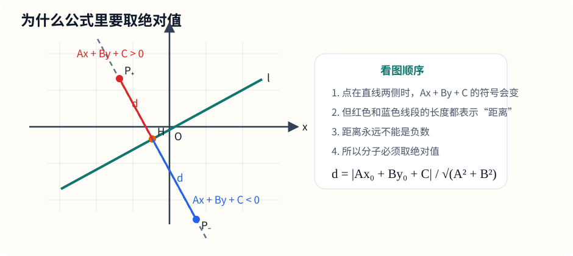
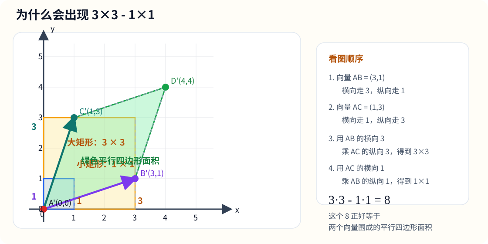
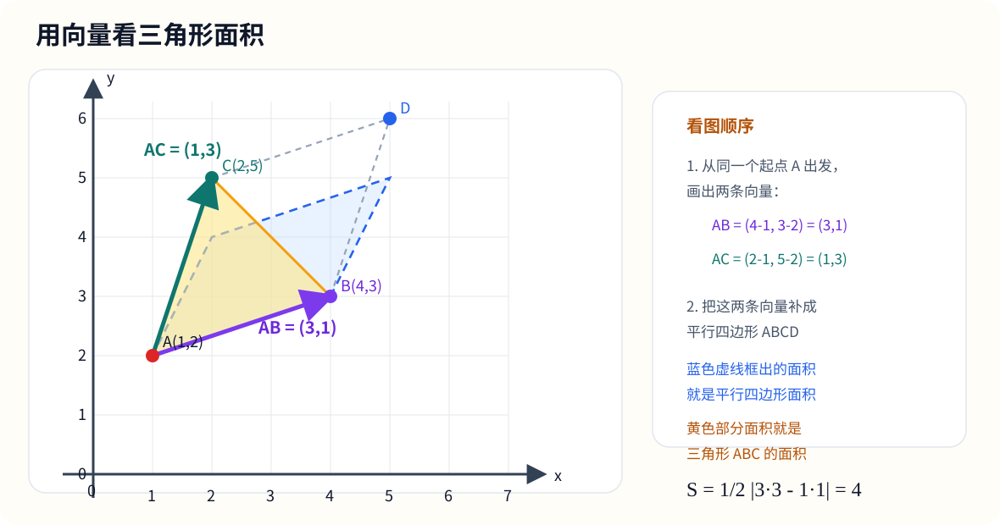
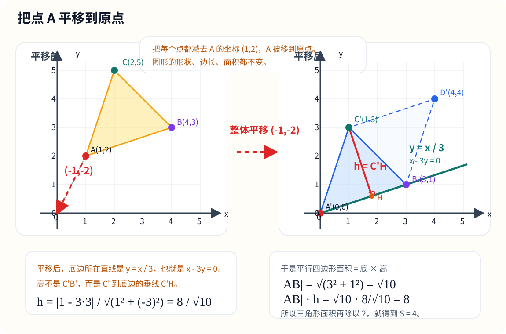

# 十、直线与圆的方程

## 章节导学

这一章最核心的想法只有一句话：

- 几何问题，尽量翻译成坐标与代数运算。

也就是说：

- 点的位置，用坐标表示；
- 线段长度，用距离公式表示；
- 中点、斜率、直线方程，都可以直接落到坐标上算；
- 面积、圆、点到直线距离，本质上也是把几何关系转成代数关系。

如果你能把“图形关系”和“坐标变化量”连起来，这一章就会顺很多。

按教材思路，这一章更适合放在“直线与圆的方程”这一条线上来理解，内容主线是：

- 先学直线怎么用坐标表示；
- 再补上与直线有关的距离、中点、共线、面积这些基础工具；
- 然后进入圆与方程；
- 最后把这些内容和后面的圆锥曲线连起来。

也就是说，第十章和第十四章虽然都属于解析几何，但教材里更自然的处理不是把它们硬并成一个大章，而是分成前后两个板块：

- 第十章先学直线与圆的方程这一块；
- 第十四章再学圆锥曲线与方程。

## 10.1 直线中的距离与中点

设平面内两点为

$$
A(x_1,y_1),\qquad B(x_2,y_2)
$$

### 1. 两点间距离公式

两点间距离为

$$
AB=\sqrt{(x_2-x_1)^2+(y_2-y_1)^2}
$$

它本质上来自勾股定理。

为什么？

因为从点 $A$ 到点 $B$：

- 横向变化量是 $x_2-x_1$；
- 纵向变化量是 $y_2-y_1$。

于是可以把线段 $AB$ 看成一个直角三角形的斜边。

图示：两点间距离公式，本质上是“横向位移、纵向位移、斜边长度”的勾股关系。

所以由勾股定理：

$$
AB^2=(x_2-x_1)^2+(y_2-y_1)^2
$$

从而

$$
AB=\sqrt{(x_2-x_1)^2+(y_2-y_1)^2}
$$

### 2. 中点公式

线段 $AB$ 的中点为

$$
M\left(\frac{x_1+x_2}{2},\ \frac{y_1+y_2}{2}\right)
$$

老师这样记：

- 横坐标取平均；
- 纵坐标也取平均。

### 示例题

已知点

$$
A(-1,2),\qquad B(3,-4)
$$

求：

- 线段 $AB$ 的中点；
- 线段 $AB$ 的长度。

### 讲解

中点：

$$
M\left(\frac{-1+3}{2},\frac{2+(-4)}{2}\right)=(1,-1)
$$

距离：

$$
AB=\sqrt{(3-(-1))^2+(-4-2)^2}
$$

$$
=\sqrt{4^2+(-6)^2}
=\sqrt{16+36}
=\sqrt{52}
=2\sqrt{13}
$$

## 10.2 直线斜率与方程

### 1. 斜率公式

若两点

$$
A(x_1,y_1),\qquad B(x_2,y_2)
$$

且 $x_1\ne x_2$，则直线 $AB$ 的斜率为

$$
k=\frac{y_2-y_1}{x_2-x_1}
$$

它表示：

- 横着走 1 个单位；
- 竖着会上升多少，或者下降多少。

### 2. 直线的几种常见方程

点斜式：

$$
y-y_0=k(x-x_0)
$$

斜截式：

$$
y=kx+b
$$

一般式：

$$
Ax+By+C=0
$$

两点式：

$$
\frac{y-y_1}{y_2-y_1}=\frac{x-x_1}{x_2-x_1}
$$

### 3. 平行与垂直

- 两条直线平行：$k_1=k_2$
- 两条直线垂直：$k_1k_2=-1$（非竖直直线时）

图示：点斜式里最重要的不是死背方程，而是看清横向变化和纵向变化。

### 示例题

已知点 $P(1,2)$，直线经过点 $P$，且斜率为 $3$，求该直线方程。

### 讲解

直接套点斜式：

$$
y-2=3(x-1)
$$

这就是所求直线方程。

若化成斜截式：

$$
y=3x-1
$$

## 10.3 三点共线

设三点为

$$
A(x_1,y_1),\qquad B(x_2,y_2),\qquad C(x_3,y_3)
$$

判断三点共线，常见有两种思路。

### 方法一：比较斜率

若

$$
\frac{y_2-y_1}{x_2-x_1}=\frac{y_3-y_1}{x_3-x_1}
$$

则三点共线。

这个方法适合：

- 横坐标不相等；
- 题目本身就和斜率联系紧。

### 方法二：看面积是否为 0

若三点围成的三角形面积为 0，则三点共线。

也就是：

- 三点不共线，才能围成真正有面积的三角形；
- 若面积算出来是 0，就说明三点落在同一条直线上。

## 10.4 补充：坐标法求三角形面积

设三角形三个顶点为

$$
A(x_1,y_1),\qquad B(x_2,y_2),\qquad C(x_3,y_3)
$$

如果其中一边刚好平行于坐标轴，最省事的方法还是：

$$
\text{面积}=\frac{\text{底}\times\text{高}}{2}
$$

如果三个点位置比较一般，可以直接用坐标面积公式：

$$
S_{\triangle ABC}
=\frac12\left|x_1(y_2-y_3)+x_2(y_3-y_1)+x_3(y_1-y_2)\right|
$$

这个式子看着长，但本质上还是把“底乘高除以 2”写成了坐标形式。

### 1. 从向量面积公式来理解

设
$$
\overrightarrow{AB}=(x_2-x_1,\ y_2-y_1),\qquad
\overrightarrow{AC}=(x_3-x_1,\ y_3-y_1)
$$

那么三角形 $ABC$ 的面积可以先写成
$$
S_{\triangle ABC}
=\frac12\left|(x_2-x_1)(y_3-y_1)-(x_3-x_1)(y_2-y_1)\right|
$$

这一步本质上就是：

- 两个向量围成一个平行四边形；
- 三角形面积等于这个平行四边形面积的一半。

### 2. 为什么会出现 $(x_2-x_1)(y_3-y_1)$

这一步表示：

- 向量 $\overrightarrow{AB}$ 的横向变化量，是 $x_2-x_1$；
- 向量 $\overrightarrow{AC}$ 的纵向变化量，是 $y_3-y_1$；
- 它们相乘，就是面积展开式里的第一部分。

同理，

$$
(x_3-x_1)(y_2-y_1)
$$

表示：

- 向量 $\overrightarrow{AC}$ 的横向变化量；
- 乘上向量 $\overrightarrow{AB}$ 的纵向变化量。

两者相减后，得到的是两个向量围成的平行四边形面积的核心量。

图示：在当前这个具体例子里，$\overrightarrow{AB}=(3,1)$、$\overrightarrow{AC}=(1,3)$。先看“横向 $3$ 乘纵向 $3$”得到的大矩形，再减去“横向 $1$ 乘纵向 $1$”得到的小矩形，就更容易看出为什么会出现
$$
3\cdot 3-1\cdot 1
$$

### 3. 代数展开推导

先展开第一项：

$$
(x_2-x_1)(y_3-y_1)=x_2y_3-x_2y_1-x_1y_3+x_1y_1
$$

再展开第二项：

$$
(x_3-x_1)(y_2-y_1)=x_3y_2-x_3y_1-x_1y_2+x_1y_1
$$

所以

$$
(x_2-x_1)(y_3-y_1)-(x_3-x_1)(y_2-y_1)
$$

$$
=x_2y_3-x_2y_1-x_1y_3+x_1y_1-(x_3y_2-x_3y_1-x_1y_2+x_1y_1)
$$

$$
=x_2y_3-x_2y_1-x_1y_3+x_1y_1-x_3y_2+x_3y_1+x_1y_2-x_1y_1
$$

$$
=x_1y_2-x_1y_3+x_2y_3-x_2y_1+x_3y_1-x_3y_2
$$

再把同一个 $x$ 提出来，就得到

$$
x_1(y_2-y_3)+x_2(y_3-y_1)+x_3(y_1-y_2)
$$

因此

$$
S_{\triangle ABC}
=\frac12\left|x_1(y_2-y_3)+x_2(y_3-y_1)+x_3(y_1-y_2)\right|
$$

所以这个三点坐标面积公式并不是新公式，本质上仍然是向量面积公式的展开形式。

### 4. 具体例子：用向量看三角形面积

设

$$
A(1,2),\qquad B(4,3),\qquad C(2,5)
$$

图示：把 $\overrightarrow{AB}$ 和 $\overrightarrow{AC}$ 放在同一个起点 $A$ 上，再补成平行四边形，就能直观看出“三角形面积 = 平行四边形面积的一半”。

先从点 $A$ 出发，分别看指向 $B$ 和 $C$ 的两个向量：

$$
\overrightarrow{AB}=(4-1,\ 3-2)=(3,1)
$$

$$
\overrightarrow{AC}=(2-1,\ 5-2)=(1,3)
$$

这两个式子的意思是：

- $\overrightarrow{AB}=(3,1)$ 表示从点 $A$ 出发，向右走 $3$，再向上走 $1$，就到点 $B$；
- $\overrightarrow{AC}=(1,3)$ 表示从点 $A$ 出发，向右走 $1$，再向上走 $3$，就到点 $C$。

于是三角形面积可以写成

$$
S_{\triangle ABC}
=\frac12|3\cdot 3-1\cdot 1|
=\frac12|9-1|
=4
$$

所以三角形 $ABC$ 的面积是

$$
4
$$

这里的

$$
3\cdot 3-1\cdot 1
$$

如果只看这个式子本身，确实会觉得“为什么一减就突然变成面积了”。  
更稳的理解方法，是回到最基本的面积公式：

$$
\text{平行四边形面积}=\text{底}\times\text{高}
$$

在这个例子里，我们把
$$
\overrightarrow{AB}=(3,1)
$$
看成底边。

那么底边长度为
$$
|\overrightarrow{AB}|=\sqrt{3^2+1^2}=\sqrt10
$$

接下来要求高。为了方便看，我们先把点 $A$ 平移到原点。  
平移不改变长度和面积，所以问题就变成：

- $A$ 看成 $(0,0)$；
- $B$ 变成 $(3,1)$；
- $C$ 变成 $(1,3)$。

图示：左边是原来的三角形，右边是把每个点都减去 $A(1,2)$ 后得到的新位置。可以直观看到，平移只改变位置，不改变形状、边长和面积。

这时底边所在直线就是
$$
y=\frac13x
$$

也就是
$$
x-3y=0
$$

点 $(1,3)$ 到直线 $x-3y=0$ 的距离，就是这个平行四边形的高。

这里最好不要一上来就硬代公式，先把公式里的字母和这道题对上：

若直线写成
$$
Ax+By+C=0
$$
点写成
$$
(x_0,y_0)
$$
那么点到直线的距离公式是
$$
d=\frac{|Ax_0+By_0+C|}{\sqrt{A^2+B^2}}
$$

现在这道题里：

- 直线是 $x-3y=0$，所以
  $$
  A=1,\qquad B=-3,\qquad C=0
  $$
- 点是 $(1,3)$，所以
  $$
  x_0=1,\qquad y_0=3
  $$

把这些数一项一项代进去：
$$
h=\frac{|Ax_0+By_0+C|}{\sqrt{A^2+B^2}}
=\frac{|1\cdot 1+(-3)\cdot 3+0|}{\sqrt{1^2+(-3)^2}}
=\frac{|1-9|}{\sqrt{1+9}}
=\frac{8}{\sqrt10}
$$

也就是说，这里的 $|1-3\cdot 3|$ 不是突然冒出来的，它其实就是
$$
|Ax_0+By_0+C|
$$
在这道题里的具体代入结果。

所以平行四边形面积为
$$
|\overrightarrow{AB}|\cdot h
=\sqrt10\cdot \frac{8}{\sqrt10}
=8
$$

而
$$
3\cdot 3-1\cdot 1=9-1=8
$$

所以这里的
$$
3\cdot 3-1\cdot 1
$$
得到的正好就是平行四边形面积。

因此三角形面积就是它的一半：
$$
S_{\triangle ABC}=\frac12\cdot 8=4
$$

也就是说，这里的式子不是“随便拼出来的”，而是和“底乘高”算出来的面积完全一致。

更一般地，如果两个向量分别是
$$
(a,b),\qquad (c,d)
$$
那么它们围成的平行四边形面积就是
$$
|ad-bc|
$$

三角形面积就是
$$
\frac12|ad-bc|
$$

这里顺手记一个很有用的小结论：

- 若 $S_{\triangle ABC}=0$，则三点共线。

## 10.5 圆与方程

圆心为

$$
(a,b)
$$

半径为

$$
r
$$

的圆，其标准方程为

$$
(x-a)^2+(y-b)^2=r^2
$$

为什么？

因为圆上的任意一点 $P(x,y)$ 到圆心 $(a,b)$ 的距离恒等于半径 $r$。

由两点间距离公式：

$$
\sqrt{(x-a)^2+(y-b)^2}=r
$$

两边平方后得到：

$$
(x-a)^2+(y-b)^2=r^2
$$

图示：圆的标准方程，本质上是在说“点到圆心的距离恒为半径”。

### 示例题

求圆心为 $(2,-1)$，半径为 $3$ 的圆的方程。

### 讲解

直接代入标准方程：

$$
(x-2)^2+(y+1)^2=9
$$

## 10.6 直线与圆中的常见距离问题

设点

$$
P(x_0,y_0)
$$

到直线

$$
Ax+By+C=0
$$

的距离为 $d$，则

$$
d=\frac{|Ax_0+By_0+C|}{\sqrt{A^2+B^2}}
$$

这个公式做题时通常直接使用即可。  
但如果只背公式，很容易一换题就乱，所以这里把推导也顺一遍。

### 为什么这个公式成立

关键先抓住一点：

- 直线
  $$
  Ax+By+C=0
  $$
  的法向量是
  $$
  (A,B)
  $$

“法向量”就是和这条直线垂直的方向向量。  
而点到直线距离，正是沿着垂直方向去量的，所以这个向量会自然地出现在公式里。

设点
$$
P(x_0,y_0)
$$

向直线作垂线，垂足为
$$
H
$$

因为 $\overrightarrow{PH}$ 和直线垂直，而直线的法向量是 $(A,B)$，所以 $\overrightarrow{PH}$ 一定和 $(A,B)$ 同方向。

也就是说，存在一个实数 $t$，使得
$$
\overrightarrow{PH}=t(A,B)
$$

于是垂足 $H$ 的坐标可以写成
$$
H(x_0-tA,\ y_0-tB)
$$

为什么要写成这个样子？

因为从点 $P(x_0,y_0)$ 沿着法向量方向走一段，就会落到垂足 $H$ 上。  
至于前面是减号还是加号，其实不重要，因为最后会取绝对值。

现在利用“垂足 $H$ 在直线上”这个条件。  
既然 $H$ 在
$$
Ax+By+C=0
$$
上，那么把 $H$ 的坐标代进去：

$$
A(x_0-tA)+B(y_0-tB)+C=0
$$

展开得
$$
Ax_0+By_0+C-t(A^2+B^2)=0
$$

所以
$$
t=\frac{Ax_0+By_0+C}{A^2+B^2}
$$

接下来算距离 $PH$。

因为
$$
\overrightarrow{PH}=t(A,B)
$$

所以它的长度就是
$$
PH=|t|\sqrt{A^2+B^2}
$$

把上面求出的 $t$ 代入：

$$
PH=
\left|\frac{Ax_0+By_0+C}{A^2+B^2}\right|\sqrt{A^2+B^2}
$$

约分后得到
$$
PH=\frac{|Ax_0+By_0+C|}{\sqrt{A^2+B^2}}
$$

而点到直线距离就是垂线段 $PH$ 的长度，所以
$$
d=\frac{|Ax_0+By_0+C|}{\sqrt{A^2+B^2}}
$$

你可以把这个公式理解成两部分：

- 分子 $|Ax_0+By_0+C|$ 表示“这个点代入直线方程以后，偏离了多少”；
- 分母 $\sqrt{A^2+B^2}$ 是把这种代数量，换算成真正的几何长度。

可以这样理解：

- 分子 $|Ax_0+By_0+C|$ 表示点代入直线方程后的“偏离量”；
- 分母 $\sqrt{A^2+B^2}$ 是把这种代数量标准化成真正的几何距离。

图示：点到直线距离，核心是从点 $P$ 向直线作垂线。

### 示例题

求点 $P(1,2)$ 到直线

$$
3x-4y+5=0
$$

的距离。

### 讲解

直接套公式：

$$
d=\frac{|3\cdot 1-4\cdot 2+5|}{\sqrt{3^2+(-4)^2}}
$$

$$
=\frac{|3-8+5|}{\sqrt{9+16}}
=\frac{0}{5}
=0
$$

所以点 $P(1,2)$ 在这条直线上，距离为 $0$。

## 10.7 和圆锥曲线的衔接

学到这里，其实解析几何最基础的一套工具已经齐了：

- 点的位置会表示；
- 两点距离会求；
- 直线方程会写；
- 三角形面积会算；
- 圆的标准方程会认；
- 点到直线距离会用。

接下来再往前走一步，就自然进入“轨迹问题”。

所谓轨迹问题，可以先理解成：

- 满足某个几何条件的点，全部连起来，形成什么图形。

圆其实已经是最早遇到的轨迹之一：

- 到定点距离等于定值的点的轨迹，是圆。

而下一章的圆锥曲线，本质上也是同样的思想继续发展：

- 到两个定点距离和为定值，对应椭圆；
- 到两个定点距离差的绝对值为定值，对应双曲线；
- 到一个定点和一条定直线距离相等，对应抛物线。

所以更顺的理解方式不是把第十章和第十四章直接并成一章，而是把它们看成教材里前后衔接的两步：

- 第十章先学“直线与圆这一块怎么坐标化”；
- 第十四章再学“更复杂的轨迹怎样写成方程”。

## 10.8 本章小结

这一章最常用的几条公式，最好能一眼写出来：

两点间距离：

$$
AB=\sqrt{(x_2-x_1)^2+(y_2-y_1)^2}
$$

中点坐标：

$$
\left(\frac{x_1+x_2}{2},\frac{y_1+y_2}{2}\right)
$$

斜率：

$$
k=\frac{y_2-y_1}{x_2-x_1}
$$

点斜式：

$$
y-y_0=k(x-x_0)
$$

圆的标准方程：

$$
(x-a)^2+(y-b)^2=r^2
$$

点到直线距离：

$$
d=\frac{|Ax_0+By_0+C|}{\sqrt{A^2+B^2}}
$$

三角形面积：

$$
S_{\triangle ABC}
=\frac12\left|x_1(y_2-y_3)+x_2(y_3-y_1)+x_3(y_1-y_2)\right|
$$

做题时最重要的不是死背，而是先判断：

- 这是长度问题？
- 是斜率问题？
- 是方程问题？
- 是面积问题？
- 还是距离问题？

一旦分类清楚，公式反而很好选。
