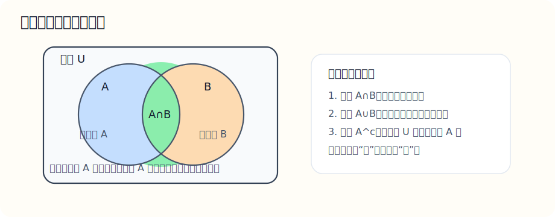

# 十一、集合与常用逻辑用语

## 章节导学

这一章像是数学的“语法课”：

- 集合负责把对象装起来、说清楚范围；
- 区间和运算负责表达定义域、解集和条件范围；
- 逻辑用语负责判断命题真假、条件强弱和推出关系。

## 11.1 集合基础

这一节到底在学什么：

- 学的是“把一类对象放到一起描述”；
- 后面函数定义域、方程解集、不等式解集，本质上都离不开集合语言；
- 如果集合不会写，很多答案会显得不完整。

最基础的概念：

- 元素：集合里的对象；
- 集合：一批确定的对象组成的整体；
- 常用记号：$\in,\notin,\subseteq,\varnothing$；
- 表示法：列举法、描述法、区间法。

老师这样讲：

- “属于”是元素和集合之间的关系；
- “包含”是集合和集合之间的关系；
- 空集不是“没有意义”，而是“一个元素也没有”的集合；
- 用描述法时，先写元素类型，再写满足的条件。

示例题：

已知集合 $A=\{x\mid x^2-5x+6=0\}$，求 $A$

讲解：

先把方程解出来：

$$
x^2-5x+6=(x-2)(x-3)=0
$$

所以方程的解是：

$$
x=2 \quad \text{或} \quad x=3
$$

因此集合 $A$ 的元素就是这两个数：

$$
A=\{2,3\}
$$

易错点：

- $\{2,3\}$ 和 $2,3$ 不是一回事，前者是集合，后者只是两个数；
- 元素不能重复写；
- 空集写作 $\varnothing$，不要写成 $\{0\}$。

## 11.2 集合运算与区间

这一节到底在学什么：

- 学的是集合之间怎么“交、并、补”；
- 这部分和不等式、定义域、区间表示高度相关；
- 区间图像感要有，不能只会符号不会想象。

核心运算：

- 交集：同时属于两个集合；
- 并集：属于其中至少一个集合；
- 补集：在全集中但不在某集合内的元素。

图示：集合运算最怕只记符号不记图像，所以这里先用文氏图建立直觉。

看图时这样对应：

- 中间重合的部分是交集 $A\cap B$；
- 两个圆一共覆盖到的全部区域是并集 $A\cup B$；
- 在全集里但不在 $A$ 里的区域，就是 $A$ 的补集。

区间记法回顾：

- $(a,b)$ 表示开区间；
- $[a,b]$ 表示闭区间；
- 半开半闭区间要特别注意端点是否取到；
- $\pm\infty$ 不能取到，所以涉及无穷一定用小括号。

示例题：

设 $A=(-\infty,2]$，$B=(1,4)$，求 $A\cap B$ 和 $A\cup B$

讲解：

先看交集。交集表示“同时在两个集合里”。

- 在 $A$ 里要求 $x\le2$；
- 在 $B$ 里要求 $1<x<4$。

同时满足就是：

$$
1<x\le2
$$

所以：

$$
A\cap B=(1,2]
$$

再看并集。并集表示“在其中至少一个里”。

$A$ 已经覆盖了所有 $x\le2$，$B$ 又继续覆盖到 $4$ 之前，所以并起来得到：

$$
A\cup B=(-\infty,4)
$$

易错点：

- 交集是“更窄”，并集是“更宽”；
- 端点是否包含，要分别看两个集合；
- 无穷远永远不能写成中括号。

## 11.3 命题与充分必要条件

这一节到底在学什么：

- 学的是“数学里的条件关系”；
- 这是很多选择题、判断题、证明题的底层语言；
- 充分条件和必要条件是高中最容易混的逻辑点之一。

核心概念：

- 命题：能判断真假的陈述句；
- 若 $p\Rightarrow q$，则说 $p$ 是 $q$ 的充分条件；
- 若 $q\Rightarrow p$，则说 $p$ 是 $q$ 的必要条件；
- 若二者都成立，就是充要条件。

老师这样讲：

- “有了它就够了”叫充分；
- “没有它就不行”叫必要；
- 判断条件关系，最稳的方法不是背概念，而是看能不能推出。

示例题：

“$x>2$”是“$x^2>4$”的什么条件？

讲解：

先看能不能推出：

如果 $x>2$，那么显然 $x^2>4$，所以：

$$
x>2 \Rightarrow x^2>4
$$

这说明“$x>2$”是“$x^2>4$”的充分条件。

再看反过来是否成立。

若 $x^2>4$，那么 $x$ 可能是：

$$
x>2 \quad \text{或} \quad x<-2
$$

所以不能推出 $x>2$。

因此结论是：

$$
x>2 \text{ 是 } x^2>4 \text{ 的充分不必要条件}
$$

易错点：

- 不要把“充分”和“必要”按中文字面硬猜；
- 判断关系时，反方向也要检验；
- 一旦出现“或”的情况，很多人会误判成充要。
