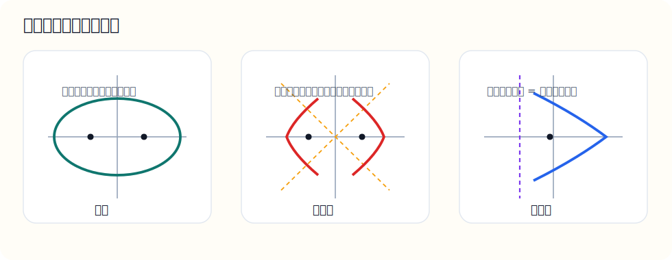

# 十四、圆锥曲线

## 章节导学

这一章一定不要只背标准方程，先抓住“轨迹定义”：

- 椭圆是到两个焦点距离和为常数的点的轨迹；
- 双曲线是到两个焦点距离差的绝对值为常数的点的轨迹；
- 抛物线是到焦点和到准线距离相等的点的轨迹。

图示：先把三类圆锥曲线放在一起看，后面记标准方程才不容易混。

看图时这样分：

- 椭圆抓“距离和”；
- 双曲线抓“距离差”；
- 抛物线抓“到焦点距离 = 到准线距离”。

## 14.1 椭圆

这一节到底在学什么：

- 学的是“平面上到两个定点距离和为定值的点的轨迹”；
- 高中阶段重点是会认标准方程、会找中心、顶点、焦点；
- 椭圆题很多看起来吓人，其实第一步总是“先认型”。

标准方程：

若长轴在 $x$ 轴上：

$$
\frac{x^2}{a^2}+\frac{y^2}{b^2}=1\quad(a>b>0)
$$

其中：

- 中心在原点；
- 顶点在 $(\pm a,0)$；
- 焦点在 $(\pm c,0)$；
- 满足 $c^2=a^2-b^2$。

示例题：

求椭圆 $\frac{x^2}{9}+\frac{y^2}{4}=1$ 的中心、顶点和焦点

讲解：

先认标准形式：

$$
\frac{x^2}{9}+\frac{y^2}{4}=1
$$

可知：

$$
a^2=9,\quad b^2=4
$$

所以：

$$
a=3,\quad b=2
$$

中心在：

$$
(0,0)
$$

因为分母较大的 $9$ 在 $x^2$ 下，所以长轴在 $x$ 轴上，顶点是：

$$
(\pm3,0)
$$

再求焦距：

$$
c^2=a^2-b^2=9-4=5
$$

所以：

$$
c=\sqrt5
$$

焦点为：

$$
(\pm\sqrt5,0)
$$

易错点：

- 分母大的一项决定长轴方向；
- 焦距公式是 $c^2=a^2-b^2$，不是加法；
- 顶点和焦点不要混。

## 14.2 双曲线

这一节到底在学什么：

- 学的是“到两个定点距离差的绝对值为定值”的轨迹；
- 双曲线最重要的就是认标准方程、找焦点、写渐近线；
- 很多题的突破口是渐近线。

标准方程：

若实轴在 $x$ 轴上：

$$
\frac{x^2}{a^2}-\frac{y^2}{b^2}=1
$$

并且：

$$
c^2=a^2+b^2
$$

渐近线是：

$$
y=\pm\frac{b}{a}x
$$

示例题：

求双曲线 $\frac{x^2}{4}-\frac{y^2}{9}=1$ 的焦点和渐近线

讲解：

由方程可知：

$$
a^2=4,\quad b^2=9
$$

所以：

$$
a=2,\quad b=3
$$

再求：

$$
c^2=a^2+b^2=4+9=13
$$

因此：

$$
c=\sqrt{13}
$$

焦点在：

$$
(\pm\sqrt{13},0)
$$

渐近线为：

$$
y=\pm\frac{3}{2}x
$$

易错点：

- 双曲线焦距公式是加法，不是减法；
- 先判断是哪一项前面是正号，才能确定开口方向；
- 渐近线斜率是 $\frac{b}{a}$，不是 $\frac{a}{b}$。

## 14.3 抛物线

这一节到底在学什么：

- 学的是“到一个定点和一条定直线距离相等”的点的轨迹；
- 高中抛物线最常见的是认标准方程、找焦点和准线；
- 这一块比椭圆、双曲线更适合用“几何定义”去理解。

标准方程：

若开口向右：

$$
y^2=2px\quad(p>0)
$$

则：

- 焦点是 $\left(\frac p2,0\right)$；
- 准线是 $x=-\frac p2$。

若开口向上，则常写成：

$$
x^2=2py
$$

示例题：

求抛物线 $y^2=8x$ 的焦点和准线

讲解：

与标准式：

$$
y^2=2px
$$

对比可知：

$$
2p=8
$$

所以：

$$
p=4
$$

因此焦点为：

$$
\left(2,0\right)
$$

准线为：

$$
x=-2
$$

易错点：

- 先和标准式比较，别直接硬猜；
- 焦点坐标是 $\frac p2$，不是 $p$；
- 准线的正负号容易写反。
