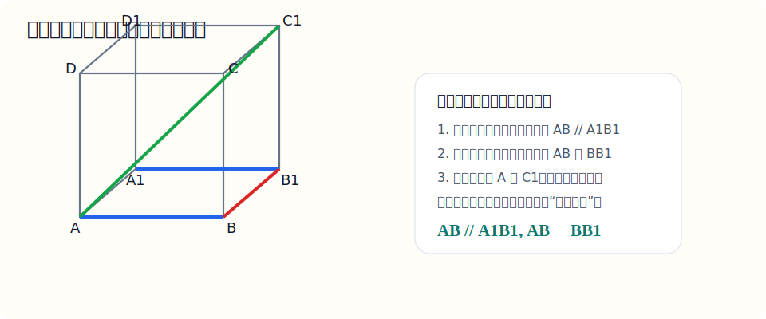

# 十五、立体几何与空间向量

## 章节导学

立体几何最容易卡住的地方，是脑中没有空间感，所以这章要分两条线学：

- 一条线是位置关系：平行、垂直、异面、线面关系、面面关系；
- 另一条线是数量关系：长度、角、距离、体积；
- 如果几何法想不清，就借助空间向量把问题坐标化。

图示：立体几何入门最好的模型就是正方体，因为平行、垂直、对角线都能在一张图里看到。

看图时先观察：

- 同方向的边可以帮助你认平行；
- 竖直棱和底面边最容易看出垂直；
- 从一个顶点连到对面顶点，就是空间对角线。
- 空间图是平面投影图，所以图上看着不像直角，也可能在空间里垂直。

## 15.1 空间几何中的平行、垂直与异面

这一节到底在学什么：

- 学的是三维空间里的位置关系；
- 和平面几何不同，空间里还会出现“异面直线”；
- 这部分最关键的是建立空间感。

最常见的关系：

- 平行；
- 垂直；
- 相交；
- 异面。

老师这样讲：

- 同一平面内，不相交也不重合的两条直线才叫平行；
- 不在同一平面内、又不相交的两条直线叫异面直线；
- 空间里判断关系，常借助正方体、长方体来想。

示例题：

在正方体 $ABCD-A_1B_1C_1D_1$ 中，判断 $AB$ 与 $A_1B_1$、$AB$ 与 $BB_1$ 的位置关系

讲解：

在正方体中：

- $AB$ 和 $A_1B_1$ 方向相同，且处在相互平行的两个面上，所以：

$$
AB\parallel A_1B_1
$$

- $BB_1$ 是竖直棱，和底面边 $AB$ 在点 $B$ 相交，而且成直角，所以：

$$
AB\perp BB_1
$$

易错点：

- 不要把“异面”误判成“平行”；
- 平行必须同方向且不相交；
- 空间图形最好自己简单画草图。

## 15.2 空间中的长度、角与距离

这一节到底在学什么：

- 学的是在空间里怎么算线段长度、夹角和一些基本距离；
- 高中最常见的模型是正方体和长方体；
- 很多空间问题其实还是在反复用勾股定理。

老师这样讲：

- 面对空间长度题，先拆成平面问题；
- 空间对角线经常用两次勾股；
- 角和距离题先找对应的线段或投影。

示例题：

在棱长为 $2$ 的正方体中，求空间对角线 $AC_1$ 的长度

讲解：

先看底面正方形对角线 $AC$：

$$
AC=\sqrt{2^2+2^2}=2\sqrt2
$$

再看直角三角形 $ACC_1$，其中：

$$
CC_1=2
$$

所以：

$$
AC_1=\sqrt{AC^2+CC_1^2}
=\sqrt{(2\sqrt2)^2+2^2}
=\sqrt{8+4}
=2\sqrt3
$$

因此空间对角线长为：

$$
2\sqrt3
$$

易错点：

- 空间题不要急着一口气算，通常是“分两步勾股”；
- 别把面对角线和空间对角线混掉；
- 先认清楚哪个三角形是直角三角形。

## 15.3 空间向量基础

这一节到底在学什么：

- 学的是把空间几何问题坐标化；
- 平面向量从二维变成三维，很多公式本质没变；
- 如果你后面要学线代，这一节会特别顺手。

核心表示：

若：

$$
\vec a=(x_1,y_1,z_1),\quad \vec b=(x_2,y_2,z_2)
$$

则：

$$
\vec a\cdot\vec b=x_1x_2+y_1y_2+z_1z_2
$$

模为：

$$
|\vec a|=\sqrt{x_1^2+y_1^2+z_1^2}
$$

示例题：

已知 $\vec a=(1,2,2)$，$\vec b=(2,-1,0)$，判断它们是否垂直

讲解：

先算数量积：

$$
\vec a\cdot\vec b=1\cdot2+2\cdot(-1)+2\cdot0=2-2+0=0
$$

因为数量积为 0，所以：

$$
\vec a\perp\vec b
$$

也就是说，这两个空间向量垂直。

易错点：

- 三维点积比二维多一个 $z$ 项；
- 垂直仍然看数量积是否为 0；
- 空间向量的模也一样要开平方。
