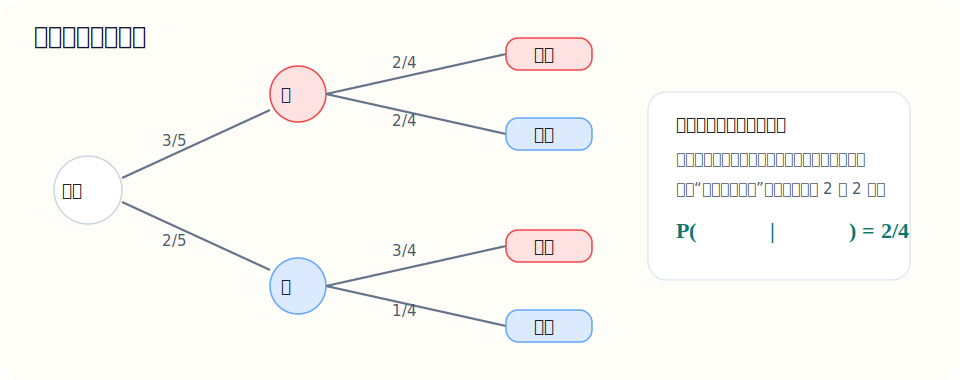

# 十六、概率统计补充

## 章节导学

这一章是在前面的概率统计基础上再往前走一步：

- 从“事件会不会发生”推进到“随机变量取什么值”；
- 从一个概率推进到整张分布列；
- 从均值、方差推进到用数字描述随机性的集中和波动程度。

## 16.1 抽样、平均数、方差与标准差

这一节到底在学什么：

- 学的是“怎么用数字描述一批数据”；
- 平均数看整体水平；
- 方差和标准差看波动大小；
- 高中统计题的核心，是会算也会解释结果。

核心公式：

若一组数据为 $x_1,x_2,\dots,x_n$，平均数为：

$$
\bar x=\frac{x_1+x_2+\cdots+x_n}{n}
$$

方差常记作：

$$
s^2=\frac{(x_1-\bar x)^2+\cdots+(x_n-\bar x)^2}{n}
$$

标准差就是：

$$
s=\sqrt{s^2}
$$

示例题：

求数据 $2,4,4,6$ 的平均数和方差

讲解：

先求平均数：

$$
\bar x=\frac{2+4+4+6}{4}=4
$$

再求方差：

$$
s^2=\frac{(2-4)^2+(4-4)^2+(4-4)^2+(6-4)^2}{4}
$$

$$
=\frac{4+0+0+4}{4}=2
$$

所以：

- 平均数是 $4$；
- 方差是 $2$。

易错点：

- 方差不是把原数据平方后再平均；
- 要先求平均数，再看每个数据离平均数有多远；
- 标准差是方差开平方，不要混。

## 16.2 条件概率与独立事件

这一节到底在学什么：

- 学的是“在某件事已经发生的前提下，再看另一件事的概率”；
- 条件概率和独立事件是两回事；
- 很多人容易把“不放回抽样”和“独立”混起来。

核心公式：

条件概率：

$$
P(A\mid B)=\frac{P(AB)}{P(B)}\quad(P(B)>0)
$$

独立事件：

$$
P(AB)=P(A)P(B)
$$

图示：条件概率最关键的变化，是“前一步一旦发生，后一步的样本空间会变”。

看图时这样理解：

- 第一层先看第一次取到什么；
- 第二层的分支概率，已经是在新的剩余样本空间里重新计算；
- 所以“不放回”时，后一步概率通常会变。

老师这样讲：

- 条件概率表示“先缩小样本空间，再重新算概率”；
- 独立表示“一个事件是否发生，不影响另一个事件的概率”。

示例题：

盒中有 $3$ 个红球、$2$ 个蓝球，不放回连续取两次。已知第一次取到红球，求第二次取到红球的概率。

讲解：

已知第一次已经取到红球，说明现在盒中还剩：

- $2$ 个红球；
- $2$ 个蓝球。

总共剩下 $4$ 个球。

所以第二次再取到红球的条件概率是：

$$
P(\text{第二次红}\mid \text{第一次红})=\frac24=\frac12
$$

易错点：

- 这是条件概率，不是独立事件；
- 不放回抽样一般不是独立的；
- 已知条件发生后，样本空间要重新改写。

## 16.3 离散型随机变量、分布列与期望

这一节到底在学什么：

- 学的是“把随机结果数值化之后，怎么描述它的分布”；
- 高中最常见的是写分布列、算期望；
- 期望可以理解成“平均水平”。

核心概念：

- 随机变量：把试验结果映射成数值；
- 分布列：列出随机变量每个取值及其概率；
- 期望：$E(X)=\sum x_ip_i$。

示例题：

抛两枚均匀硬币，设随机变量 $X$ 表示正面朝上的个数，求 $X$ 的分布列和期望

讲解：

两枚硬币的结果有：

- 反反，对应 $X=0$；
- 正反、反正，对应 $X=1$；
- 正正，对应 $X=2$。

所以分布列是：

$$
P(X=0)=\frac14,\quad P(X=1)=\frac12,\quad P(X=2)=\frac14
$$

再求期望：

$$
E(X)=0\cdot\frac14+1\cdot\frac12+2\cdot\frac14
$$

$$
=0+\frac12+\frac12=1
$$

所以：

- 分布列为 $\left\{0:\frac14,\ 1:\frac12,\ 2:\frac14\right\}$；
- 期望为 $1$。

易错点：

- 分布列中所有概率加起来必须等于 $1$；
- 期望不是“最可能取到的值”，而是平均意义下的结果；
- 写分布列时不要漏掉某个取值。
