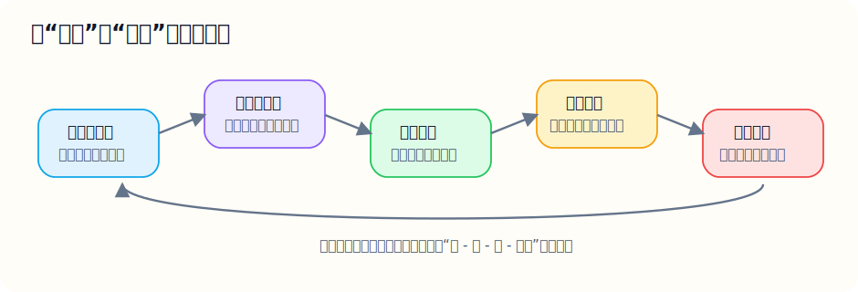

# 最后提醒

- 你现在最需要的，不是再看一堆抽象结论，而是把“看题第一反应”训练出来；
- 这份教学版里每个例题都不算难，但它们代表的是一整类题的入门模型；
- 现在这份文档已经比原来更接近“高中数学完整覆盖版”，但如果按不同教材版本细分，后面还可以继续补：

再看一眼这个复习闭环图：

你可以把它理解成一句最实用的话：

- 先看懂；
- 再会套；
- 再独立做；
- 做错了就复盘，再回来练。

1. 每节再补 2 到 3 道“课后例题”；
2. 给新补的第 11 到第 16 模块也配套题库和答案；
3. 给圆锥曲线、立体几何、解三角形再加图示版讲解。
