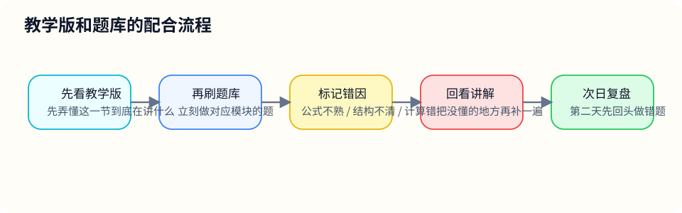

# 高中基础

来源：由 [高中数学基础知识点教学版（对应全类型题库，含示例题）](../高中数学基础知识点教学版（对应全类型题库，含示例题）.md) 按章节拆分得到。

说明：这份文档不是“公式清单版”，而是“老师带你过一遍”的教学版。每一节都尽量按“先讲这个知识点到底在干什么，再讲做题步骤，再给你看一题怎么做”的顺序来写。适合在刷题前看，也适合做错题后回头补理解。

先看整体使用路线：

这张图对应的核心顺序是：

- 先看教学版，把概念讲明白；
- 再做题库，把理解转成做题能力；
- 做错就回标记错因，再回到对应章节补理解。

推荐用法：

1. 先看本教学版，弄懂这一节在学什么；
2. 再做《高中数学基础知识点全类型题库（题目版，含导数）》对应板块；
3. 做完后看《高中数学基础知识点全类型题库答案（带推导，含导数）》；
4. 如果一类题总错，就回到本教学版，把“例题”和“易错点”重新过一遍。

## 目录

- [一、集合与常用逻辑用语](./01-集合与常用逻辑用语.md)
- [二、代数运算](./02-代数运算.md)
- [三、方程与不等式](./03-方程与不等式.md)
- [四、函数基础](./04-函数基础.md)
- [五、指数与对数](./05-指数与对数.md)
- [六、三角函数](./06-三角函数.md)
- [七、解三角形](./07-解三角形.md)
- [八、平面向量](./08-平面向量.md)
- [九、数列](./09-数列.md)
- [十、解析几何基础](./10-解析几何基础.md)
- [十一、导数基础](./11-导数基础.md)
- [十二、排列组合、概率统计](./12-排列组合、概率统计.md)
- [十三、复数](./13-复数.md)
- [十四、圆锥曲线](./14-圆锥曲线.md)
- [十五、立体几何与空间向量](./15-立体几何与空间向量.md)
- [十六、概率统计补充](./16-概率统计补充.md)
- [这份教学版怎么和题库配合](./17-这份教学版怎么和题库配合.md)
- [最后提醒](./18-最后提醒.md)
