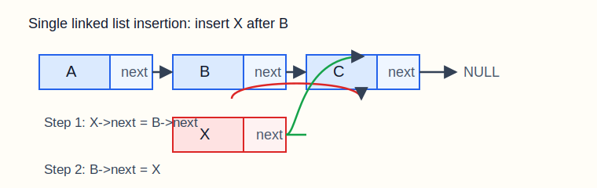

# 01-数据结构：线性表与链表（详解）

说明：这一章不是“线性表概念介绍”，而是按考研 `408` 的实际要求，把顺序表、单链表、双链表、循环链表、常见算法、复杂度、典型题型一起讲透。  
如果你后面学树、图、栈、队列总是发懵，很多时候不是后面难，而是线性表这一章的“存储结构 + 指针 + 算法步骤”没真正立住。

推荐用法：

1. 先把概念看懂
2. 再把图画出来
3. 再手推算法
4. 最后再看代码

---

## 一、这一章到底在学什么

线性表是最基础的数据结构之一。  
所谓“线性”，说的是：

- 数据元素一个接一个排成一条线
- 除了第一个元素没有前驱、最后一个元素没有后继之外
- 中间每个元素都只有一个直接前驱和一个直接后继

你可以把线性表理解成：

```text
a1 -> a2 -> a3 -> a4 -> ... -> an
```

408 里这一章真正考的不是“你会不会背定义”，而是：

- 顺序存储和链式存储各自适合什么场景
- 插入、删除、查找为什么复杂度不同
- 指针该怎么改才不会丢链
- 题目给一个过程时，你能不能手推出结果
- 能不能把常见操作写成 C 代码

---

## 二、线性表的基本概念

### 2.1 定义

线性表是具有相同数据类型的 `n` 个数据元素的有限序列。

这里面有四个关键词：

- 相同数据类型
- 有限
- 有次序
- 序列

比如：

```text
(3, 5, 8, 10)
```

这是一个线性表。

而下面这些不是：

- 一棵树：不是线性关系
- 一个图：不是“一前一后”的结构
- 不同类型随意混放：不满足“相同数据类型”

### 2.2 线性表的常见操作

最常见的操作有：

- 初始化
- 求长度
- 按位查找
- 按值查找
- 插入
- 删除
- 遍历输出
- 判空

408 里最常考的是：

- 第 `i` 个位置插入/删除
- 给出操作过程，求最终结果
- 比较顺序表与链表的时间复杂度

---

## 三、顺序表

### 3.1 什么是顺序表

顺序表就是把线性表中的元素按逻辑顺序连续存放在内存中。

你可以把它想成一排连续座位：

```text
下标:   0   1   2   3   4
元素:  10  20  30  40  50
```

因为元素是连续放的，所以：

- 找第 `i` 个元素很快
- 但中间插入/删除时，可能要整体移动

### 3.2 顺序表的存储结构

典型 C 语言写法：

```c
#define MaxSize 50

typedef struct {
    int data[MaxSize];
    int length;
} SqList;
```

这里：

- `data` 用来存元素
- `length` 表示当前实际元素个数

注意：

- `MaxSize` 是最大容量
- `length` 是当前长度
- 两者不是一回事

### 3.3 顺序表的特点

优点：

- 支持随机访问
- 存储密度高，不需要额外指针域

缺点：

- 插入、删除平均需要移动大量元素
- 必须提前分配连续空间
- 容量固定时可能装不下，容量过大又浪费

### 3.4 顺序表基本操作代码

#### 初始化

```c
void InitList(SqList *L) {
    L->length = 0;
}
```

#### 按位查找

```c
int GetElem(SqList L, int i) {
    if (i < 1 || i > L.length) {
        return -1;
    }
    return L.data[i - 1];
}
```

注意：

- 逻辑位序通常从 `1` 开始
- 数组下标从 `0` 开始
- 所以访问第 `i` 个元素时，代码里是 `data[i-1]`

#### 插入

在第 `i` 个位置插入元素 `e`：

```c
bool ListInsert(SqList *L, int i, int e) {
    int j;
    if (i < 1 || i > L->length + 1) {
        return false;
    }
    if (L->length >= MaxSize) {
        return false;
    }
    for (j = L->length; j >= i; j--) {
        L->data[j] = L->data[j - 1];
    }
    L->data[i - 1] = e;
    L->length++;
    return true;
}
```

为什么循环是从后往前？

因为如果你从前往后移，前面的值会把后面的值覆盖掉。  
所以顺序表插入的移动必须“从尾到头”。

#### 删除

删除第 `i` 个元素，并用 `e` 保存被删元素：

```c
bool ListDelete(SqList *L, int i, int *e) {
    int j;
    if (i < 1 || i > L->length) {
        return false;
    }
    *e = L->data[i - 1];
    for (j = i; j < L->length; j++) {
        L->data[j - 1] = L->data[j];
    }
    L->length--;
    return true;
}
```

删除为什么从前往后移？

因为第 `i` 个位置删掉以后，后面的元素需要往前补位，这时从前往后覆盖不会出问题。

### 3.5 顺序表复杂度分析

- 按位查找：`O(1)`
- 按值查找：`O(n)`
- 插入：
  - 最好：`O(1)`，在表尾插入
  - 最坏：`O(n)`，在表头插入
  - 平均：`O(n)`
- 删除：
  - 最好：`O(1)`，删最后一个
  - 最坏：`O(n)`，删第一个
  - 平均：`O(n)`

这里最容易错的点是：

- 很多人看到“数组访问快”，就误以为顺序表所有操作都快
- 实际上只有“按位访问”快
- 中间插删并不快

---

## 四、链表

### 4.1 为什么要链表

顺序表的主要问题在于：

- 要求连续存储空间
- 中间插删代价大

为了解决这个问题，就有了链表。

链表的思想是：

- 元素不一定连续存放
- 每个结点除了数据，还保存“下一个结点在哪儿”

也就是说，逻辑上的“线性顺序”不再靠内存连续来保证，而是靠指针连接来保证。

### 4.2 单链表的结构

单链表每个结点一般有两个域：

- 数据域
- 指针域

C 语言常见定义：

```c
typedef struct LNode {
    int data;
    struct LNode *next;
} LNode, *LinkList;
```

这里：

- `LNode` 是结点类型
- `LinkList` 是结点指针类型

### 4.3 头结点和首元结点

这是考研里特别爱混的点。

#### 首元结点

首元结点是第一个真正存数据的结点。

#### 头结点

头结点是为了操作方便而额外加在最前面的结点，通常不存有效数据。

有头结点时：

```text
头结点 -> 首元结点 -> 第二个结点 -> ...
```

没有头结点时：

```text
首元结点 -> 第二个结点 -> ...
```

为什么很多教材喜欢带头结点？

因为这样：

- 空表和非空表形式更统一
- 在表头插入、删除更方便
- 某些算法不需要单独特判第一个结点

### 4.4 单链表的画图理解

题目：在结点 `B` 后插入新结点 `X`

图示：



正确步骤是：

1. `X->next = B->next`
2. `B->next = X`

为什么不能反过来？

如果你先做：

```c
B->next = X;
```

那么原本 `B` 后面的结点地址就丢了，链就断掉了。

这个地方是链表题里最经典的失误点。

---

## 五、单链表的基本操作

### 5.1 初始化

带头结点：

```c
bool InitList(LinkList *L) {
    *L = (LNode *)malloc(sizeof(LNode));
    if (*L == NULL) {
        return false;
    }
    (*L)->next = NULL;
    return true;
}
```

这段代码做了什么？

1. 申请一个头结点
2. 让头结点的 `next` 为空
3. 表示空链表建立完成

### 5.2 判空

```c
bool Empty(LinkList L) {
    return L->next == NULL;
}
```

为什么判断 `L->next == NULL`？

因为 `L` 指向的是头结点。  
如果头结点后面没有任何真正数据结点，那就是空表。

### 5.3 按位查找

找第 `i` 个结点：

```c
LNode *GetElem(LinkList L, int i) {
    int j = 1;
    LNode *p = L->next;
    if (i == 0) {
        return L;
    }
    if (i < 1) {
        return NULL;
    }
    while (p != NULL && j < i) {
        p = p->next;
        j++;
    }
    return p;
}
```

讲解：

- `p` 从首元结点开始走
- `j` 表示当前走到了第几个结点
- 一直走到第 `i` 个

为什么单链表按位查找慢？

因为它不能像数组那样直接算出地址，只能从头一个一个找。

所以时间复杂度是：

```text
O(n)
```

### 5.4 按值查找

```c
LNode *LocateElem(LinkList L, int e) {
    LNode *p = L->next;
    while (p != NULL && p->data != e) {
        p = p->next;
    }
    return p;
}
```

按值查找和按位查找一样，也通常是线性复杂度：

```text
O(n)
```

### 5.5 插入操作

#### 方法一：先找到第 `i-1` 个结点

在第 `i` 个位置插入元素 `e`

```c
bool ListInsert(LinkList L, int i, int e) {
    int j = 0;
    LNode *p = L;
    while (p != NULL && j < i - 1) {
        p = p->next;
        j++;
    }
    if (p == NULL) {
        return false;
    }
    LNode *s = (LNode *)malloc(sizeof(LNode));
    if (s == NULL) {
        return false;
    }
    s->data = e;
    s->next = p->next;
    p->next = s;
    return true;
}
```

讲解：

- 要在第 `i` 个位置插入
- 先找到第 `i-1` 个结点
- 新结点插到它后面

为什么这里 `j` 从 `0` 开始？

因为 `p` 初始在头结点，头结点可以视作“第 0 个结点”。

#### 方法二：后插操作

如果已知结点指针 `p`，要在 `p` 后面插入新结点 `s`：

```c
bool InsertNextNode(LNode *p, LNode *s) {
    if (p == NULL || s == NULL) {
        return false;
    }
    s->next = p->next;
    p->next = s;
    return true;
}
```

这是最基础的链表插入原子操作。

### 5.6 删除操作

#### 删除第 `i` 个结点

```c
bool ListDelete(LinkList L, int i, int *e) {
    int j = 0;
    LNode *p = L;
    while (p != NULL && j < i - 1) {
        p = p->next;
        j++;
    }
    if (p == NULL || p->next == NULL) {
        return false;
    }
    LNode *q = p->next;
    *e = q->data;
    p->next = q->next;
    free(q);
    return true;
}
```

讲解：

- `p` 找到第 `i-1` 个结点
- `q = p->next` 是第 `i` 个结点
- 让 `p->next = q->next`
- 最后释放 `q`

#### 已知结点 `p`，删除其后继结点

```c
bool DeleteNextNode(LNode *p) {
    if (p == NULL || p->next == NULL) {
        return false;
    }
    LNode *q = p->next;
    p->next = q->next;
    free(q);
    return true;
}
```

### 5.7 已知结点指针，删除该结点本身

这是经典题。

如果给你一个结点 `p`，但**没有前驱指针**，要删除它自己怎么办？

在单链表里，通常不能直接删 `p`，因为你没法回去找到它的前驱，让前驱绕过它。

但如果 `p` 不是最后一个结点，可以用“偷天换日”的办法：

1. 把后继结点的数据复制到 `p`
2. 删除后继结点

代码：

```c
bool DeleteNode(LNode *p) {
    if (p == NULL || p->next == NULL) {
        return false;
    }
    LNode *q = p->next;
    p->data = q->data;
    p->next = q->next;
    free(q);
    return true;
}
```

注意：

- 这种方法不能删除最后一个结点
- 因为最后一个结点没有后继，没法“偷数据”

这类题 408 很喜欢考。

---

## 六、双链表和循环链表

### 6.1 双链表

双链表每个结点有三个域：

- 前驱指针 `prior`
- 数据域 `data`
- 后继指针 `next`

典型定义：

```c
typedef struct DNode {
    int data;
    struct DNode *prior, *next;
} DNode, *DLinkList;
```

双链表解决了什么问题？

- 单链表不能方便找前驱
- 双链表可以从后往前走
- 删除某个已知结点更方便

插入时要改四个指针，必须小心顺序。

### 6.2 循环链表

循环链表的核心特点：

- 表尾结点不再指向 `NULL`
- 而是指回头结点或首元结点

好处：

- 从任意结点出发都能继续往下走
- 某些循环处理场景更方便

常见考点：

- 如何判断循环链表遍历结束
- 带头结点和不带头结点的区别

---

## 七、顺序表与链表的对比总结

|项目|顺序表|链表|
|---|---|---|
|存储方式|连续存储|不连续存储|
|按位查找|快，`O(1)`|慢，`O(n)`|
|按值查找|`O(n)`|`O(n)`|
|中间插入删除|慢，通常 `O(n)`|若已找到位置，较快|
|空间利用|存储密度高|多一个指针域|
|容量扩展|不灵活|更灵活|

这个表非常重要，因为选择题和简答题特别爱考。

---

## 八、考研题型里怎么出

### 题型 1：概念辨析

比如：

- 头结点和首元结点的区别
- 单链表和顺序表哪个适合随机访问
- 双链表比单链表多了什么优势

### 题型 2：算法过程

比如：

- 给一个链表，问插入/删除后结果
- 给出 `i` 和 `e`，写插入算法
- 删除指定结点后链表长什么样

### 题型 3：复杂度分析

比如：

- 顺序表插入平均复杂度是多少
- 单链表按值查找复杂度是多少
- 哪些情况下最好复杂度是 `O(1)`

### 题型 4：代码填空或改错

比如：

- 漏了一句 `p->next = s`
- 插入顺序写反导致断链
- 删除后忘记 `free`

---

## 九、本章练习题

### 基础题

1. 线性表的逻辑特征是什么？
2. 顺序表为什么能随机访问？
3. 链表为什么不要求连续存储？
4. 头结点和首元结点有什么区别？

### 进阶题

5. 为什么顺序表插入时通常要从后往前移动元素？
6. 为什么单链表按位查找不能做到 `O(1)`？
7. 已知结点 `p`，为什么通常不能直接删除它本身？
8. 双链表相比单链表，多出的“前驱指针”带来了哪些便利？

### 代码题

9. 写出顺序表按位插入的核心代码。
10. 写出单链表删除第 `i` 个结点的核心代码。
11. 写出已知结点 `p` 删除其后继结点的代码。
12. 为什么删除后要 `free` 被删结点？

---

## 十、本章练习题参考答案

### 第 1 题

线性表的逻辑特征是：

- 元素之间是一对一的线性关系
- 除第一个元素外，每个元素只有一个前驱
- 除最后一个元素外，每个元素只有一个后继

### 第 2 题

因为顺序表元素连续存放，已知首地址和元素大小后，可以直接算出第 `i` 个元素地址。

### 第 3 题

因为链表靠指针连接逻辑顺序，而不是靠内存地址连续。

### 第 4 题

- 头结点：额外附加在最前面的结点，一般不存有效数据
- 首元结点：第一个真正存放有效数据的结点

### 第 5 题

如果从前往后移动，会把后面的值覆盖掉，所以必须从后往前移。

### 第 6 题

因为单链表结点地址不能通过位序直接算出，只能从头开始顺着指针一个个找。

### 第 7 题

因为删除某结点通常需要修改它前驱结点的 `next`，而单链表无法直接找到前驱。  
若不是尾结点，可用“复制后继数据再删后继”的方法间接删除。

### 第 8 题

双链表可以：

- 更方便找前驱
- 支持从后往前遍历
- 某些删除操作更方便

但代价是：

- 每个结点多一个前驱指针
- 空间开销更大

### 第 9-11 题

直接回看本章代码部分，对照理解即可。  
真正重要的不是抄代码，而是理解“为什么指针要这样改”。

### 第 12 题

因为被删除的结点原本是动态申请的空间，如果不释放，就会造成内存泄漏。

---

## 十一、最后提醒

学链表最容易出现的假象是：

- 概念觉得自己懂了
- 代码看着也能看懂
- 一到指针修改顺序和题目过程，就开始乱

所以这一章真正的学习标准不是“看完了”，而是：

- 你能自己画出链表图
- 你能手写插入和删除步骤
- 你知道每种操作为什么是这个复杂度
- 你能把顺序表和链表的区别讲给别人听

只要这一章真的立住了，后面的栈、队列、树、图会轻松很多。
