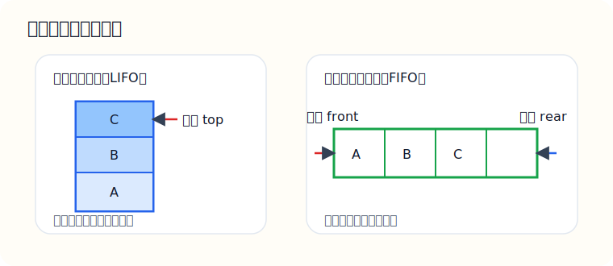
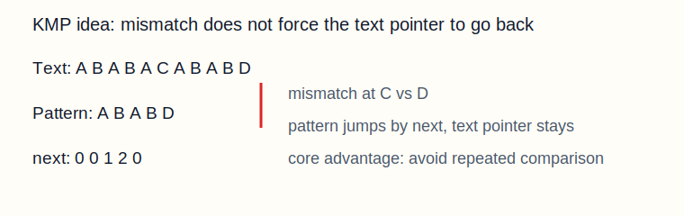

# 02-数据结构：栈、队列、串（详解）

说明：这一章是线性表往下走的第一批“应用型结构”。  
如果说顺序表和链表解决的是“怎么存一串数据”，那么栈和队列解决的就是“这串数据应该按什么规则进出”。  
而串则是把“字符序列”单独拉出来，核心考点集中在模式匹配，尤其是 KMP。

推荐用法：

1. 先搞清楚规则
2. 再画图
3. 再手推过程
4. 最后看代码

---

## 一、这一章到底在学什么

这一章有三条主线：

- 栈：后进先出（LIFO）
- 队列：先进先出（FIFO）
- 串：字符序列与模式匹配

408 真正爱考的是：

- 栈和队列的基本概念
- 顺序栈、链栈、循环队列的实现
- 表达式求值、括号匹配
- KMP 的核心思想和 `next` 数组

图示：



---

## 二、栈

### 2.1 栈的定义

栈是只允许在一端进行插入和删除的线性表。

这一端叫：

- 栈顶 `top`

另一端叫：

- 栈底 `bottom`

特点：

- 新进来的元素总在最上面
- 最后进去的最先出来

这就是“后进先出”。

### 2.2 为什么要栈

栈适合描述“最近出现、优先处理”的场景。

常见应用：

- 括号匹配
- 表达式求值
- 函数调用和递归
- 深度优先搜索

### 2.3 顺序栈

#### 存储结构

```c
#define MaxSize 50

typedef struct {
    int data[MaxSize];
    int top;
} SqStack;
```

这里：

- `top` 指向当前栈顶元素位置
- 空栈时通常让 `top = -1`

#### 初始化

```c
void InitStack(SqStack *S) {
    S->top = -1;
}
```

#### 判空

```c
bool StackEmpty(SqStack S) {
    return S.top == -1;
}
```

#### 入栈

```c
bool Push(SqStack *S, int x) {
    if (S->top == MaxSize - 1) {
        return false;
    }
    S->data[++S->top] = x;
    return true;
}
```

这里为什么是 `++S->top`？

因为：

1. 栈顶要先上移一格
2. 再把元素放进去

#### 出栈

```c
bool Pop(SqStack *S, int *x) {
    if (S->top == -1) {
        return false;
    }
    *x = S->data[S->top--];
    return true;
}
```

#### 取栈顶元素

```c
bool GetTop(SqStack S, int *x) {
    if (S.top == -1) {
        return false;
    }
    *x = S.data[S.top];
    return true;
}
```

### 2.4 链栈

链栈本质上是“用链表实现的栈”。

优点：

- 不必提前开固定空间
- 插入删除只在表头进行，非常方便

典型定义：

```c
typedef struct LinkNode {
    int data;
    struct LinkNode *next;
} LinkNode, *LiStack;
```

如果链表头就是栈顶，那么：

- 入栈：头插法
- 出栈：删表头结点

### 2.5 栈的典型题：括号匹配

题目：判断表达式中的括号是否匹配。

思路：

- 遇到左括号：入栈
- 遇到右括号：检查栈顶是否为对应左括号
- 若不对应或栈空，说明不匹配
- 最后如果栈空，说明匹配成功

例子：

```text
{ [ ( ) ] }
```

过程：

- `{` 入栈
- `[` 入栈
- `(` 入栈
- `)` 匹配栈顶 `(`
- `]` 匹配栈顶 `[`
- `}` 匹配栈顶 `{`

最后栈空，匹配成功。

### 2.6 栈的典型题：表达式求值

常见考法：

- 中缀表达式转后缀表达式
- 后缀表达式求值

后缀表达式求值规则：

- 遇到操作数：入栈
- 遇到运算符：弹出两个操作数运算，再把结果入栈

比如：

```text
3 4 + 5 *
```

过程：

1. `3` 入栈
2. `4` 入栈
3. `+`：弹出 4 和 3，算得 7，入栈
4. `5` 入栈
5. `*`：弹出 5 和 7，算得 35，入栈

最终结果：

```text
35
```

### 2.7 栈的复杂度

- 入栈：`O(1)`
- 出栈：`O(1)`
- 取栈顶：`O(1)`

注意：

- 这些操作快，是因为都只在一端完成
- 栈并不适合按位随机访问

---

## 三、队列

### 3.1 队列的定义

队列是只允许在一端插入、在另一端删除的线性表。

- 插入的一端叫队尾 `rear`
- 删除的一端叫队头 `front`

特点：

- 先进先出

所以它适合“排队处理”的场景。

### 3.2 顺序队列的缺陷

如果简单用数组实现顺序队列，会出现“假溢出”问题。

举例：

```text
数组容量 6
front 一直向后移动
rear 也一直向后移动
```

即使前面空出来位置，只要 `rear` 到头，看起来就不能再入队了。

所以考研真正重点是：

### 3.3 循环队列

#### 存储结构

```c
#define MaxSize 50

typedef struct {
    int data[MaxSize];
    int front, rear;
} SqQueue;
```

初始化：

```c
void InitQueue(SqQueue *Q) {
    Q->front = Q->rear = 0;
}
```

#### 判空

```c
bool QueueEmpty(SqQueue Q) {
    return Q.front == Q.rear;
}
```

#### 判满

常见写法是“牺牲一个单元”：

```c
bool QueueFull(SqQueue Q) {
    return (Q.rear + 1) % MaxSize == Q.front;
}
```

为什么要浪费一个单元？

因为如果不这样做：

- `front == rear`

既可能表示空，也可能表示满，状态冲突。

#### 入队

```c
bool EnQueue(SqQueue *Q, int x) {
    if ((Q->rear + 1) % MaxSize == Q->front) {
        return false;
    }
    Q->data[Q->rear] = x;
    Q->rear = (Q->rear + 1) % MaxSize;
    return true;
}
```

#### 出队

```c
bool DeQueue(SqQueue *Q, int *x) {
    if (Q->front == Q->rear) {
        return false;
    }
    *x = Q->data[Q->front];
    Q->front = (Q->front + 1) % MaxSize;
    return true;
}
```

### 3.4 链队列

链队列通常带两个指针：

- `front`
- `rear`

这样：

- 入队时只需在尾部插入
- 出队时只需从头部删除

典型定义：

```c
typedef struct LinkNode {
    int data;
    struct LinkNode *next;
} LinkNode;

typedef struct {
    LinkNode *front, *rear;
} LinkQueue;
```

### 3.5 队列的典型应用：层序遍历和 BFS

为什么层序遍历和 BFS 用队列？

因为它们都要求：

- 先访问当前层
- 再访问下一层

这正好符合“先进先出”。

你先发现的结点，应该先扩展它的邻居。

### 3.6 队列复杂度

- 入队：`O(1)`
- 出队：`O(1)`
- 取队头：`O(1)`

---

## 四、串

### 4.1 串的定义

串是由零个或多个字符组成的有限序列。

比如：

```text
"abcde"
```

这就是一个串。

本质上，串是特殊的线性表，只不过元素限定为字符。

### 4.2 朴素模式匹配

题目：

在主串 `S` 中找模式串 `T` 第一次出现的位置。

朴素算法的思路：

- 主串从左到右尝试每个起点
- 每次都让模式串从头开始比
- 一旦失配，主串起点后移一位，模式串重新回到开头

优点：

- 思想简单

缺点：

- 重复比较很多

### 4.3 KMP 的核心思想

KMP 真正的价值不是“公式炫”，而是：

- 主串指针不回退
- 模式串根据已经匹配的信息跳转

图示：



#### 什么是 `next`

`next[j]` 的核心含义可以理解成：

- 当前在模式串第 `j` 位失配时
- 模式串应该跳回哪里继续比较

它利用了这样一个事实：

- 前面已经匹配成功的部分里，可能存在“前缀 = 后缀”
- 这些信息没必要浪费

### 4.4 一个简单例子

模式串：

```text
ABABD
```

如果前面已经匹配了 `ABAB`，在比较 `D` 时失配，  
朴素算法会让模式串从头来。

但 KMP 会想：

- 前面 `ABAB` 里已经包含了可复用的结构
- 没必要完全回到头

这就是 `next` 数组存在的意义。

### 4.5 为什么 KMP 更快

朴素算法的问题是：

- 主串里很多字符被反复比较

KMP 的优势是：

- 通过 `next` 直接跳过不必要的重复比较

所以它的时间复杂度通常可以做到：

```text
O(m + n)
```

其中：

- `m` 是主串长度
- `n` 是模式串长度

### 4.6 串这一章的考点

408 里常考：

- 串和普通线性表的关系
- 朴素匹配算法思路
- KMP 核心思想
- `next` 数组作用

很多题不一定让你完整手算 `next`，但一定会考你：

- 你知不知道 KMP 为什么更优
- 你知不知道模式串为什么能跳

---

## 五、常见选择题陷阱

1. 栈是“先进先出”  
错，栈是后进先出。

2. 队列只能顺序存储  
错，也可以链式存储。

3. 循环队列判空和判满条件一样  
错，必须额外区分。

4. KMP 的主串和模式串都会大量回退  
错，KMP 的核心就是主串指针不回退。

5. 后缀表达式求值适合用队列  
错，应该用栈。

---

## 六、本章练习题

### 基础题

1. 栈和队列的进出规则分别是什么？
2. 为什么函数调用和递归通常与栈有关？
3. 为什么 BFS 通常与队列有关？
4. 串与普通线性表的区别是什么？

### 进阶题

5. 为什么顺序队列会出现假溢出？
6. 为什么循环队列常常浪费一个存储单元？
7. 后缀表达式求值为什么适合用栈？
8. KMP 为什么比朴素匹配更高效？

### 代码题

9. 写出顺序栈入栈代码。
10. 写出循环队列出队代码。
11. 写出判空、判满条件。
12. 说明 `next` 数组在 KMP 中的作用。

---

## 七、练习题参考答案

### 第 1 题

- 栈：后进先出
- 队列：先进先出

### 第 2 题

因为函数调用是“最后调用的函数先返回”，符合栈的后进先出。

### 第 3 题

因为 BFS 需要按发现顺序逐层扩展结点，符合队列的先进先出。

### 第 4 题

串是元素为字符的特殊线性表。

### 第 5 题

因为简单顺序队列中，`front` 和 `rear` 一直后移，前面空出来的位置无法复用。

### 第 6 题

为了区分：

- 空：`front == rear`
- 满：`(rear + 1) % MaxSize == front`

### 第 7 题

因为后缀表达式需要对“最近遇到的两个操作数”先运算，符合栈的后进先出。

### 第 8 题

因为 KMP 利用已匹配信息，避免让主串指针反复回退。

### 第 9-11 题

回看本章代码部分并手写一遍，比单纯看答案更重要。

### 第 12 题

`next` 数组用于在模式串失配时确定下一次继续比较的位置。

---

## 八、最后提醒

这一章真正要掌握的不是术语，而是“规则”和“过程”：

- 栈顶怎么变
- 队头队尾怎么变
- 循环队列为什么取模
- KMP 为什么能跳

如果这些过程你能在纸上手推出一遍，这一章就算真正学会了。
