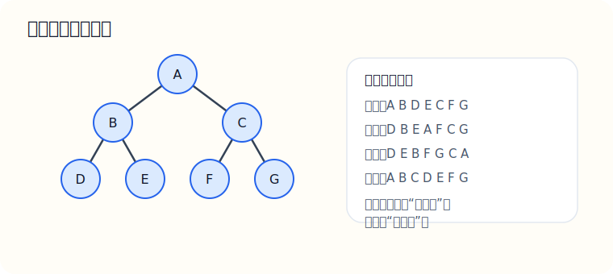

# 03-数据结构：树与二叉树（详解）

说明：树和二叉树是 408 数据结构里最重要的图形化模块之一。  
这一章既考概念，也考过程，还特别喜欢和遍历、哈夫曼树、二叉排序树结合出题。  
如果你这一章没有图像感，后面学堆、图、文件系统、表达式树都会继续吃力。

---

## 一、这一章到底在学什么

树研究的是“层次关系”，不是一条线，也不是随意乱连。

最核心的问题有四个：

1. 结点之间的层次关系是什么
2. 二叉树有哪些特殊性质
3. 怎么遍历一棵树
4. 不同类型的树适合什么任务

---

## 二、树的基本概念

### 2.1 树是什么

树是 `n` 个结点的有限集合。

当 `n = 0` 时，叫空树。  
当 `n > 0` 时：

- 有且仅有一个根结点
- 其余结点可分成若干互不相交的子树

### 2.2 必须分清的术语

- 根结点：最顶层结点
- 双亲结点：某结点的上一层直接结点
- 孩子结点：某结点的下一层直接结点
- 兄弟结点：同一双亲的孩子
- 叶子结点：没有孩子的结点
- 结点的度：孩子个数
- 树的度：所有结点度的最大值
- 结点的层次：从根开始往下数
- 树的高度（深度）：树中结点的最大层数

最容易错的地方：

- 结点深度和树高度混
- “树的度”与“结点的度”混

---

## 三、二叉树

### 3.1 二叉树的定义

二叉树是每个结点最多只有两棵子树的树结构。

这两棵子树有左右之分：

- 左子树
- 右子树

注意：

- “最多两个”不等于“恰好两个”
- 左右顺序非常重要

### 3.2 二叉树的五种基本形态

1. 空二叉树
2. 只有根结点
3. 根结点只有左子树
4. 根结点只有右子树
5. 根结点左右子树都存在

这个地方常考你：

- “只有一个孩子”的结点，左孩子和右孩子不一样
- 左右交换后，通常是不同的二叉树

### 3.3 特殊二叉树

#### 满二叉树

如果一棵高度为 `h` 的二叉树共有：

```text
2^h - 1
```

个结点，那么它是满二叉树。

特点：

- 每层都满
- 所有分支结点都有两个孩子

#### 完全二叉树

完全二叉树要求：

- 除最后一层外，其余层都满
- 最后一层结点都尽量靠左

完全二叉树特别重要，因为：

- 顺序存储很方便
- 编号关系很整齐

如果按层序从 `1` 开始编号：

- 结点 `i` 的左孩子是 `2i`
- 结点 `i` 的右孩子是 `2i + 1`
- 结点 `i` 的双亲是 `⌊i/2⌋`

---

## 四、二叉树的存储结构

### 4.1 顺序存储

适合完全二叉树。

优点：

- 编号关系明确
- 找双亲、左右孩子很方便

缺点：

- 对一般二叉树会浪费空间

### 4.2 链式存储

典型定义：

```c
typedef struct BiTNode {
    char data;
    struct BiTNode *lchild, *rchild;
} BiTNode, *BiTree;
```

每个结点保存：

- 数据
- 左孩子指针
- 右孩子指针

---

## 五、二叉树遍历

### 5.1 四种遍历

- 先序遍历：根 左 右
- 中序遍历：左 根 右
- 后序遍历：左 右 根
- 层序遍历：一层一层访问

图示：



### 5.2 为什么遍历重要

因为遍历决定了：

- 你如何系统访问整棵树
- 如何恢复二叉树
- 如何处理表达式树
- 如何把树结构转成线性输出

### 5.3 递归遍历代码

#### 先序遍历

```c
void PreOrder(BiTree T) {
    if (T != NULL) {
        visit(T);
        PreOrder(T->lchild);
        PreOrder(T->rchild);
    }
}
```

#### 中序遍历

```c
void InOrder(BiTree T) {
    if (T != NULL) {
        InOrder(T->lchild);
        visit(T);
        InOrder(T->rchild);
    }
}
```

#### 后序遍历

```c
void PostOrder(BiTree T) {
    if (T != NULL) {
        PostOrder(T->lchild);
        PostOrder(T->rchild);
        visit(T);
    }
}
```

### 5.4 层序遍历为什么要用队列

因为层序遍历要求：

- 先访问当前层
- 再访问下一层

这和队列“先进先出”的顺序完全契合。

伪代码思路：

1. 根结点入队
2. 队不空时，队头结点出队并访问
3. 若有左孩子则入队
4. 若有右孩子则入队

---

## 六、由遍历序列恢复二叉树

### 6.1 为什么需要恢复

408 特别爱考：

- 已知先序 + 中序，求后序
- 已知后序 + 中序，求先序

### 6.2 基本思想

#### 先序 + 中序

- 先序第一个一定是根
- 在中序里找到根
- 根左边是左子树
- 根右边是右子树
- 然后递归处理左右子树

#### 后序 + 中序

- 后序最后一个一定是根
- 其余步骤一样

### 6.3 代表例题

先序：

```text
A B D E C F G
```

中序：

```text
D B E A F C G
```

求后序。

讲解：

1. 先序第一个 `A` 是根
2. 在中序中，`A` 左边是 `D B E`，右边是 `F C G`
3. 左子树先序是 `B D E`
4. 右子树先序是 `C F G`
5. 递归继续拆

最后后序为：

```text
D E B F G C A
```

---

## 七、线索二叉树

### 7.1 为什么有线索二叉树

普通二叉链表中，很多空指针其实浪费了。

线索二叉树的思想是：

- 利用这些空指针
- 让它们指向遍历序列中的前驱或后继

这样可以更方便地按某种遍历次序访问结点。

### 7.2 核心考点

- 哪些空指针可以利用
- 中序线索、先序线索、后序线索区别
- 线索标志位的作用

这一块 408 常考概念题，偶尔也考判断。

---

## 八、哈夫曼树

### 8.1 哈夫曼树是什么

哈夫曼树又叫最优二叉树，常用于编码问题。

核心目标：

- 让带权路径长度最小

### 8.2 什么是带权路径长度 WPL

对于每个叶子结点：

```text
权值 × 路径长度
```

然后把所有叶子的结果加起来，就是 WPL。

### 8.3 构造思路

每次选权值最小的两棵树合并，再放回去。

反复执行，直到只剩一棵树。

### 8.4 常见误区

- 不是随便合并都行
- 一定是当前最小的两个
- 中间新结点通常不对应原始字符

---

## 九、二叉排序树与平衡二叉树

### 9.1 二叉排序树 BST

性质：

- 左子树所有结点值 < 根
- 右子树所有结点值 > 根

优势：

- 查找、插入、删除平均效率较高

问题：

- 如果树退化成链表，效率会变差

### 9.2 平衡二叉树 AVL

AVL 的核心是：

- 任一结点左右子树高度差绝对值不超过 `1`

这样做的意义：

- 不容易退化
- 查找效率更稳定

常考点：

- LL、RR、LR、RL 四种失衡调整

---

## 十、本章高频题型

1. 满二叉树、完全二叉树概念辨析
2. 遍历序列恢复二叉树
3. 根据完全二叉树编号求父子关系
4. 哈夫曼树 WPL 计算
5. BST 查找和删除
6. AVL 旋转判断

---

## 十一、本章练习题

### 基础题

1. 树和二叉树的根本区别是什么？
2. 为什么二叉树要区分左子树和右子树？
3. 满二叉树和完全二叉树有什么区别？
4. 为什么完全二叉树适合顺序存储？

### 进阶题

5. 已知先序和中序，为什么能恢复唯一二叉树？
6. 为什么层序遍历适合用队列？
7. 哈夫曼树为什么能使带权路径长度最小？
8. 为什么 AVL 比普通 BST 更稳定？

### 题型题

9. 先序：`A B D E C F G`，中序：`D B E A F C G`，写出后序。
10. 完全二叉树中编号为 `7` 的结点，其双亲编号是多少？
11. 给定若干权值，说明哈夫曼树如何一步一步构造。
12. BST 在什么情况下会退化成链表？

---

## 十二、练习题参考答案

### 第 1 题

树中一个结点可以有多个孩子；二叉树中每个结点最多只有两个孩子，并且有左右次序。

### 第 2 题

因为左右位置本身就是结构信息，交换左右后通常是不同的二叉树。

### 第 3 题

- 满二叉树：每层都满
- 完全二叉树：最后一层可以不满，但必须从左往右连续

### 第 4 题

因为完全二叉树按层编号后，父子编号关系简单，可直接用数组下标表示。

### 第 5 题

因为先序确定根，中序确定左右子树边界，二者结合后可递归唯一划分。

### 第 6 题

因为层序遍历按发现顺序逐层访问，符合队列先进先出的特点。

### 第 7 题

因为每次合并最小权值结点，能保证整体带权路径长度达到最优。

### 第 8 题

因为 AVL 强制维持平衡，不容易像普通 BST 那样退化。

### 第 9 题

后序为：

```text
D E B F G C A
```

### 第 10 题

双亲编号为：

```text
⌊7/2⌋ = 3
```

### 第 11 题

每次取当前最小的两个权值合并成新结点，再放回集合中继续比较。

### 第 12 题

当输入序列本身接近单调有序时，BST 可能不断向一边生长，最终退化成链表。

---

## 十三、最后提醒

这一章真正的门槛不是记定义，而是建立“图像感”：

- 你要能看着图说出前序、中序、后序
- 你要能看到遍历序列就想到如何拆树
- 你要知道不同树结构各自想解决什么问题

只要图像感建立起来，这一章会从“很抽象”变成“很有规律”。
