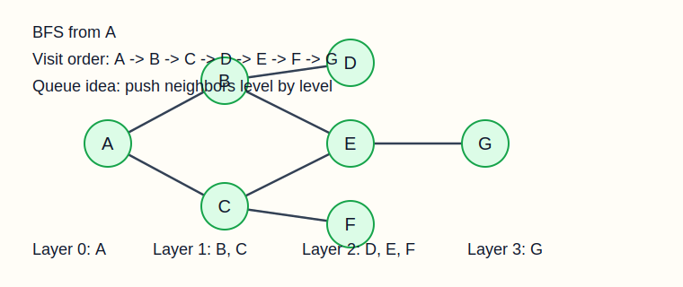

# 04-数据结构：图（详解）

说明：图是很多同学学 408 时第一个明显觉得“抽象度上来了”的章节。  
原因不是它真的比前面难很多，而是它不再是一条线，也不再是一棵层次明确的树，而是“点和点之间任意连接”的关系。  
这章一旦抽象感建立起来，其实题型非常固定。

---

## 一、这一章到底在学什么

图研究的是：

- 多个顶点之间的连接关系
- 如何表示这些关系
- 如何从一个点出发访问其它点
- 如何在连通、路径、代价最小这些目标下做算法

408 这一章最核心的考点：

- 图的基本概念
- 存储结构
- DFS/BFS
- 最小生成树
- 最短路径
- 拓扑排序
- 关键路径

---

## 二、图的基本概念

### 2.1 图的定义

图可以表示为：

```text
G = (V, E)
```

其中：

- `V` 是顶点集合
- `E` 是边集合

如果边有方向，就是有向图。  
如果边没有方向，就是无向图。

### 2.2 必须分清的概念

- 顶点：图中的点
- 边：连接两个顶点的关系
- 有向边：有方向
- 无向边：无方向
- 顶点的度
- 入度、出度（有向图）
- 路径
- 回路（环）
- 连通图
- 强连通图

### 2.3 图和树的区别

树：

- 一定无环
- 一定连通
- 有明确层次

图：

- 可以有环
- 可以不连通
- 没有天然根和层次

---

## 三、图的存储结构

### 3.1 邻接矩阵

邻接矩阵用二维数组表示顶点之间是否有边。

如果图有 `n` 个顶点，就用：

```c
int G[n][n];
```

来表示。

特点：

- 判断两点是否相连很快，`O(1)`
- 适合稠密图
- 空间开销较大

### 3.2 邻接表

邻接表本质上是：

- 每个顶点对应一个链表
- 链表中存与它相邻的顶点

特点：

- 适合稀疏图
- 节省空间
- 找某点所有邻接点很方便

### 3.3 两种结构对比

|项目|邻接矩阵|邻接表|
|---|---|---|
|适合图类型|稠密图|稀疏图|
|判断两点有无边|快|较慢|
|找某点所有邻接点|一般|方便|
|空间开销|大|较省|

这是高频选择题。

---

## 四、图的遍历

### 4.1 深度优先搜索 DFS

核心思想：

- 从一个顶点出发
- 沿一条路一直走到底
- 走不下去再回退

这和栈/递归很像。

#### 递归版伪代码

```c
void DFS(Graph G, int v) {
    visit(v);
    visited[v] = true;
    for (w 是 v 的所有邻接点) {
        if (!visited[w]) {
            DFS(G, w);
        }
    }
}
```

### 4.2 广度优先搜索 BFS

核心思想：

- 先访问当前层
- 再访问下一层

所以它和队列天然对应。

图示：



#### BFS 伪代码

```c
void BFS(Graph G, int v) {
    visit(v);
    visited[v] = true;
    EnQueue(Q, v);
    while (!QueueEmpty(Q)) {
        DeQueue(Q, &u);
        for (w 是 u 的所有邻接点) {
            if (!visited[w]) {
                visit(w);
                visited[w] = true;
                EnQueue(Q, w);
            }
        }
    }
}
```

### 4.3 DFS 和 BFS 的区别

- DFS：一条路走到底
- BFS：一层一层扩展

所以：

- DFS 更像“钻进去看”
- BFS 更像“从中心往外扩”

### 4.4 为什么 BFS 适合无权图最短路径

因为 BFS 按层扩展：

- 第一次到达某结点时
- 走过的边数一定最少

这就是为什么无权图最短路通常直接想 BFS。

---

## 五、最小生成树

### 5.1 什么是最小生成树

对于一个连通无向带权图：

- 要把所有顶点连起来
- 且边权总和最小

这棵树就叫最小生成树（MST）。

### 5.2 Prim 算法

思路：

- 先从一个顶点开始
- 每次选一条“连接已选顶点集合与未选顶点集合”的最小边

特点：

- 更像“逐步扩点”

### 5.3 Kruskal 算法

思路：

- 把边按权值从小到大排序
- 每次选当前最小边
- 只要不形成回路就加入

特点：

- 更像“逐步扩边”

### 5.4 Prim 和 Kruskal 的区别

- Prim 更关注顶点集合逐步扩大
- Kruskal 更关注边的选择顺序

选择题很爱考这个区别。

---

## 六、最短路径

### 6.1 单源最短路径

从一个源点出发，到其它点的最短路径。

### 6.2 Dijkstra 算法

适用：

- 边权非负

核心思想：

- 每次确定一个当前距离最小、且还没确定的顶点
- 再用它去更新其它顶点的最短距离

注意：

- Dijkstra 不能处理负权边

### 6.3 Floyd 算法

适用：

- 求任意两点之间最短路径

思想：

- 逐步尝试“是否经过某个中间点更短”

### 6.4 常见误区

- 最短路径树不等于最小生成树
- Dijkstra 不能乱用在负权图
- 边数最少不一定权值和最小

---

## 七、拓扑排序与关键路径

### 7.1 拓扑排序

适用图：

- 有向无环图 DAG

结果：

- 给出一个线性序列
- 使得所有有向边都从前面的顶点指向后面的顶点

最常见思路：

- 找入度为 0 的顶点
- 输出后删除它及相关边
- 重复进行

如果最后输出不了所有顶点，通常说明：

- 图中有环

### 7.2 关键路径

关键路径常用于 AOE 网。

核心目标：

- 找出完成整个工程所需时间最长的那条路径

关键活动特点：

- 一旦延迟，就会导致整个工程延迟

这类题一般要算：

- 事件最早发生时间
- 事件最迟发生时间
- 活动最早开始时间
- 活动最迟开始时间

然后找时差为 `0` 的活动。

---

## 八、图这一章常见题型

1. 邻接矩阵与邻接表对比
2. DFS / BFS 访问序列
3. 无权图最短路径
4. 最小生成树边的选择
5. Dijkstra / Floyd 适用范围
6. 拓扑排序是否存在
7. 关键路径计算

---

## 九、本章练习题

### 基础题

1. 有向图中的入度和出度分别是什么意思？
2. 为什么邻接表更适合稀疏图？
3. DFS 和 BFS 最大的访问顺序区别是什么？
4. 为什么无权图最短路径常用 BFS？

### 进阶题

5. 最小生成树和最短路径树有什么区别？
6. 为什么 Dijkstra 不能处理负权边？
7. 拓扑排序存在的前提是什么？
8. 关键路径中的“关键”活动有什么特点？

### 题型题

9. 给定一个图，写出从某顶点开始的 BFS 访问顺序。
10. 说明 Prim 和 Kruskal 的基本区别。
11. 邻接矩阵判断两顶点是否有边，时间复杂度是多少？
12. 为什么拓扑排序输出不全时通常说明图中有环？

---

## 十、练习题参考答案

### 第 1 题

- 入度：指向该顶点的边数
- 出度：从该顶点发出的边数

### 第 2 题

因为稀疏图边少，邻接表只存实际存在的边，更节省空间。

### 第 3 题

- DFS：一条路走到底
- BFS：按层扩展

### 第 4 题

因为 BFS 按层次访问结点，第一次访问到某结点时所经过边数最少。

### 第 5 题

最小生成树关注“让所有顶点连通且总代价最小”；  
最短路径树关注“从源点到其余顶点的距离最短”。

### 第 6 题

因为 Dijkstra 的贪心前提要求边权非负，负权边会破坏这种贪心正确性。

### 第 7 题

图必须是有向无环图。

### 第 8 题

关键活动的时间余量为 `0`，延迟它就会延迟整个工程。

### 第 9 题

访问顺序要根据题目给出的图和邻接次序具体分析，核心是：

- 先入队的先扩展
- 按层访问

### 第 10 题

- Prim：逐步扩点
- Kruskal：逐步选边

### 第 11 题

```text
O(1)
```

### 第 12 题

因为有环时，环上顶点都不可能最终变成入度为 0，从而无法全部输出。

---

## 十一、最后提醒

图这一章看着散，其实非常有套路：

- 存储方式就两种主流
- 遍历就 DFS / BFS
- 连通类就看最小生成树
- 路径类就看最短路径
- 顺序类就看拓扑排序

你只要把“问题类型”和“算法模型”一一对应起来，这章就会从抽象变得很清楚。
