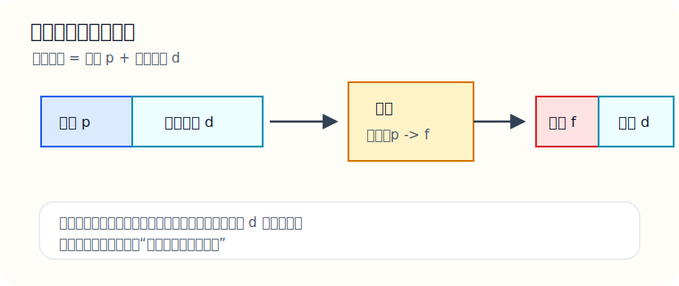
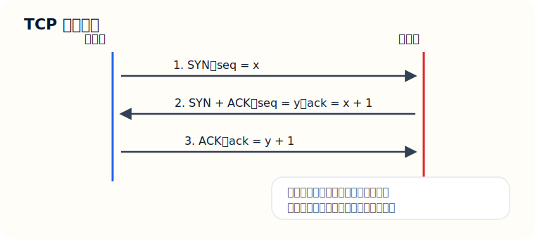

# 考研计算机408教学版（对应暨大AI专业课）

说明：这份文档按 `408 计算机学科专业基础综合` 的标准四大部分来写，即：

- 数据结构
- 计算机组成原理
- 操作系统
- 计算机网络

定位不是“只告诉你学什么”的提纲，而是“老师带你过一遍”的教学版。每个模块都尽量按下面这个顺序来写：

1. 这一节到底在学什么
2. 核心知识讲解
3. 代表例题
4. 图示
5. 练习题

推荐用法：

1. 先看本教学版，建立这一章的概念框架；
2. 再去听基础课或看教材；
3. 然后做章节选择题；
4. 做错后回来看这份文档里的“易错点”和“例题”。

配套详细章节：

- `01-数据结构-线性表与链表（详解）.md`
- `02-数据结构-栈队列串（详解）.md`
- `03-数据结构-树与二叉树（详解）.md`
- `04-数据结构-图（详解）.md`

---

## 课程覆盖对齐清单

这一部分不是拿来背的，而是让你核对“课程有没有覆盖到考研范围”。如果你后面继续扩写这份文档，也应该沿着这张清单往下补。

### A. 数据结构覆盖

- 线性表
  - 顺序表
  - 链表
  - 双链表
  - 循环链表
- 栈、队列、串
  - 顺序栈、链栈
  - 顺序队列、循环队列、链队列
  - 串的基本操作
  - 模式匹配
  - KMP
- 数组、矩阵与特殊矩阵
- 树与二叉树
  - 基本性质
  - 遍历
  - 线索二叉树
  - 树、森林与二叉树转换
  - 哈夫曼树
  - 并查集
- 图
  - 基本概念
  - 存储结构
  - 遍历
  - 最小生成树
  - 最短路径
  - 拓扑排序
  - 关键路径
- 查找
  - 顺序查找
  - 折半查找
  - B 树 / B+ 树
  - 散列表
- 排序
  - 插入类
  - 交换类
  - 选择类
  - 归并
  - 基数排序

### B. 计算机组成原理覆盖

- 数据表示与运算
  - 进制转换
  - 原码、反码、补码
  - 定点数
  - 浮点数
  - 算术逻辑运算
- 存储系统
  - 主存
  - Cache
  - 虚拟存储基础
  - 地址映射
- 指令系统
  - 指令格式
  - 寻址方式
  - RISC/CISC
- 中央处理器
  - 指令执行过程
  - 数据通路
  - 控制器
  - 流水线基础
- 总线与 I/O
  - 总线仲裁
  - 中断
  - DMA
  - I/O 控制方式

### C. 操作系统覆盖

- 操作系统概述
- 进程与线程
- 处理机调度
- 同步与互斥
- 死锁
- 内存管理
  - 连续分配
  - 分页
  - 分段
  - 段页式
  - 虚拟内存
- 文件系统
- I/O 管理

### D. 计算机网络覆盖

- 体系结构与分层模型
- 物理层
- 数据链路层
- 网络层
  - IP
  - 子网划分
  - ARP
  - ICMP
  - 路由
- 运输层
  - UDP
  - TCP
  - 流量控制
  - 拥塞控制
- 应用层
  - HTTP
  - DNS
  - FTP
  - SMTP

---

## 一、408 总体认知

### 1.1 408 到底在考什么

408 不是四门孤立的课，而是一条完整的计算机系统链路：

- 数据结构解决“数据怎么组织、怎么查、怎么改”
- 计组解决“机器怎么表示和处理数据”
- 操作系统解决“硬件资源怎么管理”
- 计网解决“多台机器之间怎么通信”

如果你觉得 408 抽象，通常是因为只看到了术语，没有看到背后的“问题”。

比如：

- 为什么要链表？因为顺序表插删代价可能大。
- 为什么要分页？因为内存不够大、需要管理更灵活。
- 为什么要三次握手？因为双方都要确认“我能发、也能收”。

### 1.2 建议学习顺序

如果你是第一次系统学 408，建议顺序：

1. 数据结构
2. 计算机组成原理
3. 操作系统
4. 计算机网络

原因：

- 数据结构最接近“看得见、推得动”的题型；
- 计组会帮你建立底层视角；
- 操作系统很多概念建立在底层硬件之上；
- 计网相对独立，后面收口更容易。

### 1.3 408 应该怎么学

前期不要一上来猛刷真题，先做到这三件事：

- 能用自己的话说清楚概念
- 能把典型过程手推出结果
- 能判断一道题在考哪种模型

这比“背了一堆定义”重要得多。

---

## 二、数据结构

### 2.1 线性表

这一节到底在学什么：

- 学的是“一串有顺序的数据”怎么存；
- 重点是顺序表和链表；
- 核心不是代码，而是它们各自适合什么操作。

#### 核心知识讲解

线性表有两个最常见的存储方式：

- 顺序存储：元素连续放在内存里
- 链式存储：元素不必连续，用指针连起来

顺序表的特点：

- 按下标访问快，时间复杂度通常是 `O(1)`
- 插入、删除时如果中间位置变化，可能要整体后移或前移，代价大

链表的特点：

- 插入、删除只要找到位置，改指针很方便
- 但按位查找不快，因为要从头顺着找

最关键的一组对比：

- 按位访问：顺序表更强
- 中间插删：链表更强
- 空间连续性：顺序表要求高
- 指针开销：链表更高

#### 代表例题

题目：单链表中，在结点 `B` 后插入新结点 `X`，指针应该怎样改？

讲解：

如果你直接先改 `B->next = X`，原来 `B` 后面的结点就丢了。

正确顺序是：

1. `X->next = B->next`
2. `B->next = X`

也就是说，先让新结点接住后面的链，再把前面的链接过来。

图示：


#### 易错点

- 头结点和首元结点不是同一个概念；
- 按位查找和按值查找不要混；
- 单链表删除某结点时，若没有前驱通常不能直接删；
- 插入和删除的复杂度分析要分“找到位置之前”和“找到位置之后”。

#### 练习题

1. 为什么顺序表适合随机访问，而单链表不适合？
2. 单链表删除结点 `p` 的后继结点时，指针如何修改？
3. 双链表相比单链表，多解决了什么问题，又增加了什么代价？
4. 如果题目问“在第 `i` 个位置插入元素”，复杂度应该怎样分析？

### 2.2 栈、队列、串

这一节到底在学什么：

- 栈解决“后进先出”
- 队列解决“先进先出”
- 串重点在模式匹配

#### 核心知识讲解

栈最常见的应用：

- 括号匹配
- 表达式求值
- 递归调用过程

队列最常见的应用：

- 层序遍历
- BFS
- 资源排队

串匹配里最关键的内容是 KMP。  
KMP 的本质不是“背 `next` 数组”，而是：

- 模式串失配时，不要让主串回头太多
- 通过已经匹配的信息，直接跳到更合理的位置

#### 代表例题

题目：判断表达式中的括号是否匹配，应该用什么结构？

讲解：

因为最后出现的左括号要最先等待匹配，所以最合适的是栈。

过程：

- 看到左括号就入栈
- 看到右括号就检查栈顶是否能配对
- 最后栈空且中间没出错，才算匹配成功

#### 易错点

- 循环队列判满、判空条件写反；
- 栈空、队空时仍然出栈/出队；
- `next` 数组背得死，换个例子就不会；
- 把递归和栈的关系完全割裂开。

#### 练习题

1. 为什么递归过程本质上可以和栈联系起来？
2. 循环队列为什么常常要“浪费一个存储单元”？
3. 什么情况下使用队列比栈更自然？
4. KMP 为什么比朴素匹配快？

### 2.3 树与二叉树

这一节到底在学什么：

- 树表示层次结构；
- 二叉树是数据结构最重要的图形化对象之一；
- 重点是遍历、性质、特殊二叉树、二叉排序树。

#### 核心知识讲解

你必须先把这些概念彻底分开：

- 结点的层次
- 结点的度
- 树的高度
- 叶子结点
- 双亲、孩子、兄弟

二叉树最核心的是遍历：

- 先序：根左右
- 中序：左根右
- 后序：左右根
- 层序：一层层来

恢复二叉树时最常见的思路：

- 先序第一个一定是根
- 后序最后一个一定是根
- 中序负责帮你切出左子树和右子树

图示：


#### 代表例题

题目：一棵二叉树的先序遍历是 `A B D E C F G`，中序遍历是 `D B E A F C G`，求后序遍历。

讲解思路：

1. 先序第一个 `A` 是根
2. 在中序中找到 `A`，左边是左子树 `D B E`，右边是右子树 `F C G`
3. 左子树先序对应 `B D E`，右子树先序对应 `C F G`
4. 继续递归拆

最后得到后序：

```text
D E B F G C A
```

#### 易错点

- 深度和高度混淆；
- 完全二叉树和满二叉树混淆；
- 遍历序列恢复二叉树时，左右子树边界切错；
- BST 和 AVL 的考点混成一团。

#### 练习题

1. 为什么先序和后序不能单独唯一确定一棵普通二叉树？
2. 完全二叉树按层编号时，结点 `i` 的左右孩子编号是什么？
3. 二叉排序树查找失败时，最后停在什么位置？
4. 平衡二叉树为什么能提升查找效率？

### 2.4 图

这一节到底在学什么：

- 图描述“多对多”的关系；
- 重点是存储方式、遍历、最短路、最小生成树、拓扑排序。

#### 核心知识讲解

图的两种常见存储：

- 邻接矩阵：适合稠密图
- 邻接表：适合稀疏图

两个核心遍历：

- BFS：一圈一圈扩展，用队列
- DFS：一条路走到底再回头，用栈/递归

图示：


#### 代表例题

题目：从结点 `A` 出发做 BFS，访问顺序是什么？

看图后：

- 第一层先访问 `A`
- 第二层访问 `B、C`
- 第三层访问 `D、E、F`
- 最后访问 `G`

所以 BFS 顺序为：

```text
A B C D E F G
```

这类题最关键的是记住：  
BFS 不会沿着一条路走到底，而是先把当前层扩完。

#### 最短路径与最小生成树

你至少要分清这三类题：

- 最小生成树：让所有点连通，边权和最小
- 单源最短路径：从一个源点到其他点尽量短
- 拓扑排序：有向无环图中的线性顺序

最常见算法：

- Prim / Kruskal：最小生成树
- Dijkstra：单源最短路径，不能有负权边
- Floyd：多源最短路径

#### 易错点

- BFS 和 DFS 的访问逻辑混；
- Dijkstra 的适用条件忘记；
- 拓扑排序不是所有图都有；
- 关键路径题中“事件”和“活动”不分。

#### 练习题

1. 稀疏图为什么更适合用邻接表？
2. BFS 为什么天然适合求无权图最短路径？
3. 最小生成树和最短路径树有什么区别？
4. 什么样的图不存在拓扑排序？

### 2.5 查找与排序

这一节到底在学什么：

- 查找关心“怎么快点找到”
- 排序关心“怎么快点排好”

#### 核心知识讲解

必须掌握的查找：

- 顺序查找
- 折半查找
- 散列表查找

必须掌握的排序：

- 插入排序
- 冒泡排序
- 选择排序
- 希尔排序
- 堆排序
- 归并排序
- 快速排序

排序题最爱考三件事：

- 时间复杂度
- 空间复杂度
- 稳定性

#### 代表例题

题目：为什么折半查找要求顺序表有序？

讲解：

因为折半查找每次是通过“比较中间值”决定去左半边还是右半边。  
如果原序列无序，那么比较中间值之后，并不能保证目标元素一定只在某一边，所以“砍半”这个动作就失效了。

#### 易错点

- 快速排序和归并排序复杂度记混；
- 堆排序不会手动调整堆；
- 稳定性判断只靠死记；
- 折半查找误以为对链表也高效。

#### 练习题

1. 为什么折半查找不适合链表？
2. 哪些常见排序是稳定的？
3. 快速排序为什么在最坏情况下会退化？
4. 堆排序为什么适合不断取最值？

---

## 三、计算机组成原理

### 3.1 数据表示与运算

这一节到底在学什么：

- 计算机里没有“天然的十进制”
- 所有数字最终都要编码成二进制
- 原码、反码、补码、浮点数，都是“表示方法”

#### 核心知识讲解

补码最重要，因为机器里整数运算基本都靠它。

为什么补码好用？

- 把减法统一成加法
- 正数和负数可以在同一套电路里处理

你必须搞懂：

- 补码的定义
- 补码范围
- 补码加法
- 溢出判断

浮点数重点不是死记 IEEE754 每一位，而是理解：

- 符号位决定正负
- 阶码决定数量级
- 尾数决定有效数字

#### 代表例题

题目：8 位补码下，`01111111 + 00000001` 会发生什么？

讲解：

- `01111111` 表示十进制 `127`
- `00000001` 表示十进制 `1`
- 相加结果应是 `128`

但 8 位有符号补码最大只能到 `127`，所以会溢出。

这类题要记住：  
两个同号数相加，如果结果变成异号，通常说明溢出。

#### 练习题

1. 为什么负数通常使用补码而不是原码直接参与运算？
2. 如何判断定点补码加法是否溢出？
3. 浮点数为什么会存在精度误差？
4. 左移和右移对无符号数、补码数各有什么影响？

### 3.2 存储系统

这一节到底在学什么：

- 存储器不是只有一种
- 计算机需要“快、小、贵”和“慢、大、便宜”之间折中
- 所以才有寄存器、Cache、主存、辅存的层次结构

#### 核心知识讲解

你至少要分清：

- 主存：CPU 直接访问的大容量工作区
- Cache：比主存更快的小容量高速缓冲
- 辅存：硬盘、SSD 等长期存储

Cache 为什么有效？

- 时间局部性：刚访问过的数据可能很快再访问
- 空间局部性：附近数据也可能很快访问

这就是为什么程序顺序访问数组很适合缓存。

#### 代表例题

题目：为什么顺序访问数组比随机访问链表更容易命中 Cache？

讲解：

- 数组元素在内存里通常连续
- 访问某个元素时，相邻元素常和它在同一个 Cache 块里
- 所以下一次再访问附近元素时，命中概率高

链表结点位置可能分散，空间局部性差，所以命中率可能更低。

#### 练习题

1. Cache 为什么能提升平均访存速度？
2. 什么是时间局部性和空间局部性？
3. 直接映射、组相联、全相联分别有什么特点？
4. 为什么主存容量大但速度慢？

### 3.3 指令系统与 CPU

这一节到底在学什么：

- 指令长什么样
- CPU 怎样取指、译码、执行
- 为什么会有各种寻址方式

#### 核心知识讲解

几个必须分开的周期：

- 时钟周期：最小时间单位
- 机器周期：完成某个基本操作所需时间
- 指令周期：执行一条指令所需时间

寻址方式本质上是在解决：  
“操作数到底放在哪儿、我怎么找到它？”

例如：

- 立即寻址：数值直接写在指令里
- 直接寻址：地址直接给出
- 间接寻址：地址里还存着地址

#### 代表例题

题目：为什么立即寻址速度快但灵活性差？

讲解：

- 快：因为操作数直接在指令里，不需要再访问内存
- 差：因为指令字长有限，能直接写进去的数值范围有限

#### 练习题

1. 指令周期、机器周期、时钟周期的关系是什么？
2. 为什么不同寻址方式会影响执行效率？
3. CPU 执行一条指令通常要经历哪些阶段？
4. 中断为什么能提升系统对外部事件的响应能力？

---

## 四、操作系统

### 4.1 进程、线程与调度

这一节到底在学什么：

- 程序只是静态文件
- 进程是运行中的程序
- 线程是进程中的执行流

#### 核心知识讲解

你一定要先把这几个概念立住：

- 并发：看起来同时推进
- 并行：真的同时执行
- 进程切换：保存现场、恢复现场，有开销
- PCB：进程控制块，记录进程运行信息

调度算法重点不是背名字，而是理解它们想优化什么：

- FCFS：先来先服务，简单但可能不公平
- SJF：追求平均周转时间更优
- RR：时间片轮转，更适合交互

#### 代表例题

题目：为什么时间片轮转适合分时系统？

讲解：

因为每个进程都能在较短时间内获得 CPU，用户会感觉“大家都在运行”，响应更及时。

但代价是：

- 时间片太小，切换频繁，系统开销大
- 时间片太大，又会退化得像 FCFS

#### 练习题

1. 进程和线程最核心的区别是什么？
2. 为什么进程切换有开销？
3. RR 中时间片为什么不能过大也不能过小？
4. 周转时间、等待时间、响应时间分别怎么理解？

### 4.2 同步、互斥与死锁

这一节到底在学什么：

- 多个执行流一起访问资源时会冲突
- OS 要保证正确顺序和资源安全

#### 核心知识讲解

互斥：同一时刻只能一个进程进入临界区  
同步：进程之间有先后配合关系

信号量题的核心不是公式，而是：

- 资源数是多少
- 谁先申请
- 谁后释放

死锁四个必要条件必须能顺口说出：

1. 互斥
2. 请求并保持
3. 不可剥夺
4. 循环等待

#### 代表例题

题目：生产者消费者问题里，为什么需要两个同步信号量和一个互斥信号量？

讲解：

- 互斥信号量保证缓冲区同一时刻只有一个进程修改
- “空缓冲区数量”信号量保证生产者不会写爆
- “满缓冲区数量”信号量保证消费者不会读空

也就是说：

- 同步信号量管“能不能做”
- 互斥信号量管“同一时刻谁能进”

#### 练习题

1. 同步和互斥的区别是什么？
2. 为什么死锁的四个条件缺一不可？
3. 银行家算法在避免什么问题？
4. 生产者消费者问题中，如果 P/V 顺序写反，会造成什么后果？

### 4.3 内存管理

这一节到底在学什么：

- 程序运行需要内存
- 但内存有限，程序又可能很大
- 所以操作系统需要把内存“切块、映射、换入换出”

#### 核心知识讲解

必须分清：

- 连续分配
- 分页
- 分段

分页最常考，因为它最适合现代系统的管理方式。

分页的关键理解：

- 逻辑地址分成“页号 + 页内偏移”
- 页表把页号映射成物理块号
- 偏移量不变

图示：



页面置换算法常见：

- OPT：最优，但通常只是理论参考
- FIFO：先进先出，简单
- LRU：最近最久未使用，更贴近局部性思想

#### 代表例题

题目：为什么地址转换中“偏移量不变”？

讲解：

因为分页做的事情只是把逻辑页映射到物理块。  
页内的相对位置没有变，所以偏移量 `d` 保持不变，只是页号换成了物理块号。

#### 练习题

1. 分页和分段最大的区别是什么？
2. 为什么分页更利于内存管理，而分段更贴近程序逻辑？
3. 为什么 FIFO 可能出现 Belady 异常？
4. TLB 的作用是什么？

---

## 五、计算机网络

### 5.1 分层模型与核心协议

这一节到底在学什么：

- 多台主机通信时，问题太复杂，所以分层解决
- 每层只做自己该做的事

#### 核心知识讲解

最常用的学习视角是五层模型：

- 应用层
- 运输层
- 网络层
- 数据链路层
- 物理层

要一直想清楚一个问题：

“这一层到底解决什么问题？”

例如：

- 运输层关心端到端通信
- 网络层关心跨网络转发
- 链路层关心一跳之内怎么传

#### 练习题

1. 为什么要分层？
2. 协议、服务、接口三者有什么区别？
3. HTTP、TCP、IP、以太网分别在哪一层？
4. 为什么说分层结构方便替换和扩展？

### 5.2 数据链路层与网络层

这一节到底在学什么：

- 数据从一个节点到相邻节点怎么传
- 再从多个网络之间怎么继续转发

#### 核心知识讲解

数据链路层的关键词：

- 帧
- MAC 地址
- 差错控制
- 以太网

网络层的关键词：

- IP 地址
- 子网划分
- 路由
- ARP
- ICMP

这里最容易卡的是子网划分题。  
你要牢牢记住：

- IP 地址 = 网络号 + 主机号
- 子网掩码决定哪些位属于网络部分

#### 代表例题

题目：为什么 ARP 不是用来解析域名的？

讲解：

因为：

- ARP 是“IP 地址 -> MAC 地址”
- DNS 是“域名 -> IP 地址”

它们都像“解析”，但解决的完全不是一个层面的问题。

#### 练习题

1. MAC 地址和 IP 地址的作用有什么区别？
2. 为什么路由器工作在网络层？
3. ARP、ICMP、DHCP 各自解决什么问题？
4. 子网掩码本质上在做什么？

### 5.3 TCP、UDP 与应用层

这一节到底在学什么：

- 运输层如何把数据可靠或高效地送到目标进程
- 应用层协议如何完成用户真正想做的事

#### 核心知识讲解

TCP 重点：

- 面向连接
- 可靠传输
- 有序
- 流量控制
- 拥塞控制

UDP 重点：

- 无连接
- 开销小
- 速度快
- 不保证可靠

三次握手的核心目的：

- 确认双方发送能力正常
- 确认双方接收能力正常
- 确认初始序号同步

图示：



#### 代表例题

题目：为什么建立连接不能只握手两次？

讲解：

如果只有两次，客户端可能知道自己能发能收，服务器也知道自己收到了请求，但客户端并不能确认“服务器也收到了我对它回应的确认”。  
第三次握手的意义，就是让双方都明确连接状态已经建立完毕。

#### 练习题

1. TCP 和 UDP 最核心的区别是什么？
2. 为什么挥手通常要四次而不是三次？
3. 流量控制和拥塞控制有什么区别？
4. HTTP、DNS、SMTP、FTP 分别适合什么场景？

---

## 六、408 阶段练习题

### 6.1 数据结构综合

1. 比较顺序表、单链表、双链表在查找、插入、删除上的差异。
2. 解释为什么 BFS 要用队列而 DFS 更适合递归或栈。
3. 已知一棵二叉树的先序和中序，如何恢复整棵树？
4. 为什么快速排序不是稳定排序？

### 6.2 计组综合

1. 为什么补码能统一加减法电路？
2. 什么是局部性原理？为什么它能支撑 Cache 的存在？
3. 指令周期、机器周期、时钟周期如何区分？
4. 为什么立即寻址快但灵活性不足？

### 6.3 操作系统综合

1. 线程为什么比进程切换代价更低？
2. 同步、互斥、死锁之间是什么关系？
3. 为什么分页地址变换中偏移量不变？
4. LRU 为什么通常比 FIFO 更符合程序访问特点？

### 6.4 计算机网络综合

1. 五层模型里各层最核心的任务是什么？
2. 为什么交换机和路由器不在同一层工作？
3. ARP 与 DNS 的区别是什么？
4. TCP 为什么要三次握手？

---

## 七、怎么把这份文档接到你的考研计划里

如果你现在同时还在补数学、学英语，建议这样用：

### 4月到5月

- 主攻数据结构
- 同时进入计组最基础部分
- 每学完一节就做基础选择题

### 6月到7月

- 推完计组
- 进入操作系统
- 图、树、排序这些数据结构重点内容回炉

### 8月

- 收完计网
- 四门一轮形成闭环

### 9月以后

- 章节题 + 真题 + 错题回炉
- 每周至少一次系统复盘

---

## 八、最后提醒

- 408 前期最怕“只听懂、不会推”
- 中期最怕“四门全开、全都半懂”
- 后期最怕“只背概念、题感不够”

真正有效的状态是：

- 你能解释概念
- 你能手推出过程
- 你能识别题型

只要做到这三步，408 就会从“很抽象的一堆名词”变成“有模型、有路径、有分数的系统课”。
