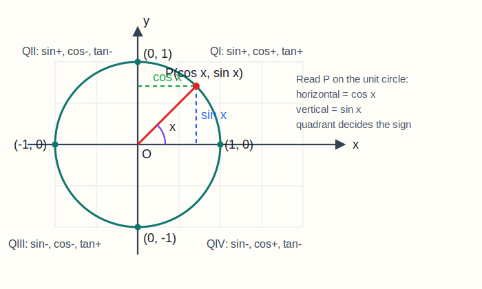
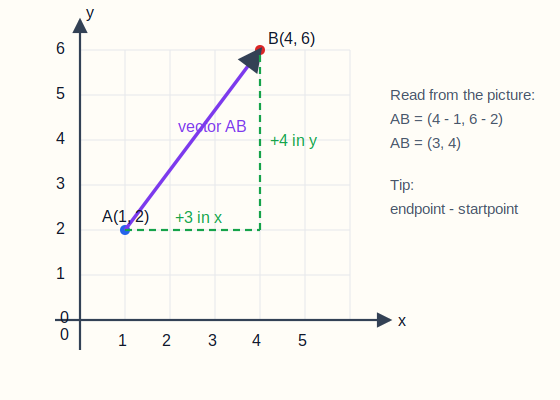
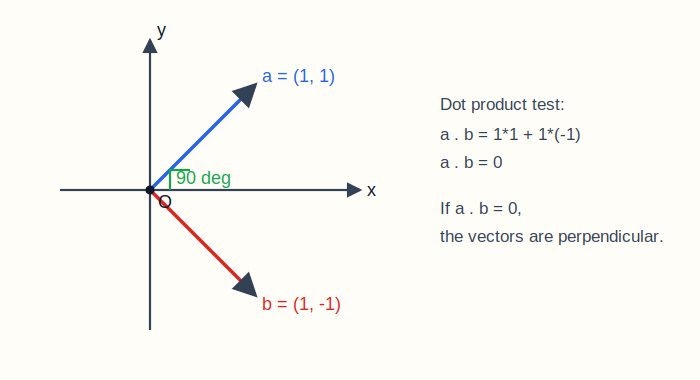
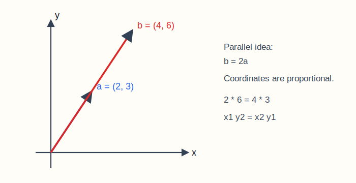

# 高中数学基础知识点教学版（对应全类型题库，含示例题）

说明：这份文档不是“公式清单版”，而是“老师带你过一遍”的教学版。每一节都尽量按“先讲这个知识点到底在干什么，再讲做题步骤，再给你看一题怎么做”的顺序来写。适合在刷题前看，也适合做错题后回头补理解。

推荐用法：

1. 先看本教学版，弄懂这一节在学什么；
2. 再做《高中数学基础知识点全类型题库（题目版，含导数）》对应板块；
3. 做完后看《高中数学基础知识点全类型题库答案（带推导，含导数）》；
4. 如果一类题总错，就回到本教学版，把“例题”和“易错点”重新过一遍。

## 一、代数运算

### 1.1 整式运算

这一节到底在学什么：

- 学的是“把式子规整地算清楚”；
- 后面因式分解、方程、不等式、函数、导数，几乎都要靠它打底；
- 如果这部分总算错，后面很多题其实不是不会，而是算崩了。

老师这样讲：

- 合并同类项，核心是“长得完全一样的字母部分才能合并”；
- 去括号，核心是“括号前有负号，要整组变号”；
- 多项式乘法，核心就是分配律；
- 整式题里最重要的，不是快，而是整齐。

看到题先怎么做：

1. 先看有没有括号；
2. 有括号先去括号；
3. 去完括号后，按次数或按字母类型整理；
4. 最后再合并同类项。

示例题：

化简：$(2x^2 - 3x + 1) + (x^2 + 4x - 5)$

讲解：

先去括号。因为前面都是加号，所以第二个括号里的每一项都不变号：

$$
2x^2 - 3x + 1 + x^2 + 4x - 5
$$

接着合并同类项：

$$
(2x^2+x^2)+(-3x+4x)+(1-5)=3x^2+x-4
$$

所以结果是：

$$
3x^2+x-4
$$

易错点：

- $x^2$ 和 $x$ 不是同类项；
- 去括号时最容易把负号漏掉；
- 乘法展开后不要漏中间项。

### 1.2 公式与因式分解

这一节到底在学什么：

- 学的是“看结构”；
- 很多题如果只会硬算，会越算越乱；
- 一旦认出平方差、完全平方、立方和差，式子会一下子变简单。

必须熟的公式：

- $a^2-b^2=(a+b)(a-b)$；
- $(a+b)^2=a^2+2ab+b^2$；
- $(a-b)^2=a^2-2ab+b^2$；
- $a^3+b^3=(a+b)(a^2-ab+b^2)$；
- $a^3-b^3=(a-b)(a^2+ab+b^2)$。

怎么判断该用哪个公式：

- 两项、而且都是平方，优先看平方差；
- 三项、两头像平方，中间像两倍积，优先看完全平方；
- 两项三次式，优先看立方和或立方差。

示例题：

因式分解：$9x^2-16$

讲解：

先看结构：

- $9x^2=(3x)^2$
- $16=4^2$

这是“两个平方的差”，所以直接套平方差公式：

$$
9x^2-16=(3x)^2-4^2=(3x-4)(3x+4)
$$

所以结果是：

$$
(3x-4)(3x+4)
$$

易错点：

- 平方差只能是“差”，不能是“和”；
- $(a-b)^2$ 不是 $a^2-b^2$；
- 立方和差公式里，后一个括号中间项符号最容易写错。

### 1.3 因式分解与分式化简

这一节到底在学什么：

- 学的是“先拆，再约，再化简”；
- 这部分和后面分式方程、函数定义域、导数里的化简关系很大；
- 核心能力是把复杂式子拆成因式。

常见方法：

- 提公因式；
- 公式法；
- 十字相乘；
- 分组分解；
- 换元。

分式题的统一思路：

1. 先分解分子分母；
2. 再看能不能约分；
3. 能约的前提是“约因式，不约项”；
4. 别忘了写限制条件。

示例题：

化简：$\frac{x^2-1}{x^2+2x+1}$

讲解：

先因式分解：

$$
x^2-1=(x-1)(x+1)
$$

$$
x^2+2x+1=(x+1)^2
$$

代回原式：

$$
\frac{(x-1)(x+1)}{(x+1)^2}
$$

约去一个 $(x+1)$，得到：

$$
\frac{x-1}{x+1}
$$

但原分母不能为 0，所以还要补一句：

$$
x\ne -1
$$

易错点：

- 约分约的是因式，不是某一项；
- 化简完之后，原来的限制条件不能丢；
- 分式加减先通分，不要直接分子加分子、分母加分母。

### 1.4 综合提升

这一节到底在学什么：

- 学的是“看到式子背后的关系”；
- 很多综合题并不难，难在你没想到用哪个恒等式；
- 如果题目给了 $x+y$、$xy$，一般就不要一个个硬求 $x,y$。

最常用关系：

- $(x+y)^2=x^2+y^2+2xy$；
- $(x-y)^2=x^2+y^2-2xy$；
- $\left(x+\frac1x\right)^2=x^2+2+\frac1{x^2}$；
- $\left(x-\frac1x\right)^2=x^2-2+\frac1{x^2}$。

示例题：

已知 $x+\frac1x=3$，求 $x^2+\frac1{x^2}$

讲解：

这题不要想着先求 $x$。因为要求的是更高次的对称式，最自然的方法是平方。

两边平方：

$$
\left(x+\frac1x\right)^2=3^2
$$

展开左边：

$$
x^2+2+\frac1{x^2}=9
$$

移项：

$$
x^2+\frac1{x^2}=7
$$

易错点：

- 平方后中间项是 $2$，不是 $1$；
- 这类题优先“整体处理”，不要先解 $x$。

## 二、方程与不等式

### 2.1 基础方程

这一节到底在学什么：

- 学的是“把未知数解出来”；
- 从一元一次方程，到一元二次方程，再到判别式、韦达定理，都是高中基础核心；
- 后面很多函数题，本质上还是在解方程。

老师这样讲：

- 一元一次方程：移项、去括号、去分母；
- 一元二次方程：能分解先分解，不行再配方或用公式；
- 有参数时，经常要用判别式；
- 已知两根关系时，经常用韦达定理。

示例题：

解方程：$2x^2-7x+3=0$

讲解：

先看能不能因式分解。我们想找两个数，使它们乘积是 $2\times3=6$，和是 $-7$。

可以想到 $-6$ 和 $-1$。

于是拆项：

$$
2x^2-7x+3=2x^2-6x-x+3
$$

分组：

$$
=2x(x-3)-1(x-3)
$$

$$
=(2x-1)(x-3)
$$

所以：

$$
(2x-1)(x-3)=0
$$

解得：

$$
x=\frac12 \quad \text{或} \quad x=3
$$

易错点：

- 先整理成标准式再做；
- 分解不出来再用求根公式，不要死扛；
- 韦达定理不是直接给根，而是给根的和与积。

### 2.2 分式方程与高次方程

这一节到底在学什么：

- 学的是“把看起来复杂的方程变回你认识的样子”；
- 分式方程本质上是去分母；
- 高次方程本质上是降次、拆因式。

分式方程统一流程：

1. 先看分母，写出限制条件；
2. 找最简公分母；
3. 两边同乘公分母；
4. 解完以后一定验根。

示例题：

解分式方程：$\frac{2}{x}=\frac{3}{x+1}$

讲解：

先写限制条件：

$$
x\ne0,\quad x\ne-1
$$

交叉相乘：

$$
2(x+1)=3x
$$

展开：

$$
2x+2=3x
$$

移项得：

$$
x=2
$$

检验：

- $x=2$ 不会让分母变成 0；
- 所以是原方程的解。

最终答案：

$$
x=2
$$

易错点：

- 分式方程不验根很容易出增根；
- 去分母后不要忘记原式的定义域限制；
- 高次方程常见套路是“提公因式”或“换元”。

### 2.3 不等式

这一节到底在学什么：

- 学的是“解出满足条件的范围”；
- 和方程不同，不等式的答案通常是区间，不是单个值；
- 一元二次不等式和绝对值不等式是重点。

老师这样讲：

- 一元一次不等式和方程差不多，只是乘除负数要变号；
- 一元二次不等式先找根，再看开口方向；
- 绝对值不等式看到“小于”想到夹在中间，看到“大于”想到两边分开。

示例题：

解不等式：$x^2-5x+6>0$

讲解：

先因式分解：

$$
x^2-5x+6=(x-2)(x-3)
$$

于是原不等式变成：

$$
(x-2)(x-3)>0
$$

要让两个因式乘积大于 0，就要同号。

- 当 $x<2$ 时，两个因式都负，乘积大于 0；
- 当 $2<x<3$ 时，一正一负，乘积小于 0；
- 当 $x>3$ 时，两个因式都正，乘积大于 0。

所以解集是：

$$
(-\infty,2)\cup(3,+\infty)
$$

易错点：

- 不等式答案要写区间；
- 大于 0 和大于等于 0 不一样，端点是否取到要分清；
- 一元二次不等式不能只靠“感觉”，最好画数轴。

## 三、函数基础

### 3.1 函数概念、定义域与值域

这一节到底在学什么：

- 学的是“函数能不能取，能取成什么样”；
- 定义域是“自变量能取什么”；
- 值域是“函数值能取什么”；
- 很多考研高数前置题，本质上都在考定义域。

定义域常见限制：

- 分母不为 0；
- 根号下大于等于 0；
- 根号在分母时，根号下大于 0；
- 对数真数大于 0。

示例题：

求函数 $f(x)=\frac{\sqrt{x+1}}{x-2}$ 的定义域

讲解：

这个式子同时有根号和分母，所以要同时满足两个条件。

先看根号：

$$
x+1\ge0
$$

所以：

$$
x\ge-1
$$

再看分母：

$$
x-2\ne0
$$

所以：

$$
x\ne2
$$

综合起来，定义域是：

$$
[-1,+\infty)\setminus\{2\}
$$

易错点：

- 多个条件是“同时满足”，不是“满足一个就行”；
- 值域常常要结合定义域一起看；
- 题目里有 $\ln x$、$\sqrt{\ln x}$ 这类复合式时，限制条件要一层层写。

### 3.2 函数性质

这一节到底在学什么：

- 学的是函数的性格：它对称不对称、越来越大还是越来越小；
- 奇偶性和单调性是最重要的两个基础性质；
- 这部分后面会和导数自然接上。

奇偶性判断口诀：

- 先看定义域是否关于原点对称；
- 再算 $f(-x)$；
- 若 $f(-x)=f(x)$，是偶函数；
- 若 $f(-x)=-f(x)$，是奇函数。

示例题：

判断函数 $f(x)=\frac1x$ 的奇偶性

讲解：

先看定义域：

$$
x\ne0
$$

它关于原点对称，可以继续判断。

计算：

$$
f(-x)=\frac1{-x}=-\frac1x=-f(x)
$$

所以这个函数是奇函数。

易错点：

- 不检查定义域，直接谈奇偶性，容易错；
- “既不是奇也不是偶”是很常见的情况；
- 单调性要看区间，不是整个数轴一刀切。

### 3.3 常见基本函数

这一节到底在学什么：

- 学的是后面所有函数题的“原型”；
- 一次函数要会看斜率；
- 二次函数要会看顶点和最值；
- 指数、对数、幂函数要会看定义域、值域和单调性。

最该会的几类：

- 一次函数：$y=kx+b$；
- 二次函数：$y=ax^2+bx+c$；
- 幂函数：$y=x^\alpha$；
- 指数函数：$y=a^x$；
- 对数函数：$y=\log_a x$。

示例题：

求二次函数 $y=x^2-4x+5$ 的顶点坐标和最小值

讲解：

二次函数最稳的方法是配方：

$$
y=x^2-4x+5=(x^2-4x+4)+1=(x-2)^2+1
$$

所以它的顶点是：

$$
(2,1)
$$

因为 $(x-2)^2\ge0$，所以最小值是：

$$
1
$$

当且仅当 $x=2$ 时取到。

易错点：

- 顶点坐标不是把式子看一眼猜出来，要通过配方或公式确定；
- 二次函数开口向上才是最小值，开口向下是最大值；
- 指数函数和对数函数都要先确认底数条件。

## 四、指数与对数

### 4.1 指数运算

这一节到底在学什么：

- 学的是“指数怎么合法变形”；
- 这部分不难，但很容易因为公式不熟算错；
- 后面函数、导数、极限都会频繁用到。

最常用公式：

- $a^m\cdot a^n=a^{m+n}$；
- $\frac{a^m}{a^n}=a^{m-n}$；
- $(a^m)^n=a^{mn}$；
- $(ab)^n=a^n b^n$；
- $a^{-n}=\frac1{a^n}$；
- $a^0=1$。

示例题：

化简：$(2a^3)^2\times(3a^2)^3$

讲解：

先分别处理两个括号：

$$
(2a^3)^2=2^2a^6=4a^6
$$

$$
(3a^2)^3=3^3a^6=27a^6
$$

再相乘：

$$
4a^6\cdot27a^6=108a^{12}
$$

所以结果是：

$$
108a^{12}
$$

易错点：

- $(a+b)^n$ 不能拆成 $a^n+b^n$；
- 负指数表示倒数，不表示负数；
- 乘方时底数和指数都要照顾到。

### 4.2 对数运算

这一节到底在学什么：

- 学的是“指数的反向语言”；
- 对数看着陌生，本质上是在问：底数的多少次方等于真数；
- 对数题很多不是难，而是条件没看清。

三个基本条件一定记住：

- 底数大于 0；
- 底数不等于 1；
- 真数大于 0。

最常用公式：

- $\log_a1=0$；
- $\log_a a=1$；
- $\log_a(MN)=\log_a M+\log_a N$；
- $\log_a\frac{M}{N}=\log_a M-\log_a N$；
- $\log_a M^n=n\log_a M$；
- $\log_a b=\frac{\ln b}{\ln a}$。

示例题：

计算：$3^{\log_3 4+\log_3 5}$

讲解：

先利用对数的加法公式：

$$
\log_3 4+\log_3 5=\log_3(4\cdot5)=\log_3 20
$$

所以原式变成：

$$
3^{\log_3 20}
$$

利用恒等式 $a^{\log_a N}=N$，得到：

$$
3^{\log_3 20}=20
$$

易错点：

- 真数必须大于 0；
- 换底公式用的时候，分子分母别写反；
- $\log_a(M+N)$ 不能拆成两个对数相加。

## 五、三角函数

### 5.1 特殊角三角函数值与定义

这一节到底在学什么：

- 学的是“常见角度下三角函数的固定值”；
- 这一块必须熟，很多题根本不值得现推；
- 单位圆和象限符号一定要有感觉。

最该背熟的角：

- $0$
- $\frac{\pi}{6}$
- $\frac{\pi}{4}$
- $\frac{\pi}{3}$
- $\frac{\pi}{2}$
- $\pi$
- $\frac{3\pi}{2}$
- $2\pi$

图示：单位圆、象限符号与正余弦投影

看图时重点抓住三件事：

- 单位圆上点 $P$ 的横坐标就是 $\cos x$，纵坐标就是 $\sin x$；
- 点落在哪个象限，就决定 $\sin x$、$\cos x$、$\tan x$ 的符号；
- 特殊角本质上是在单位圆上读固定点的坐标。

示例题：

已知 $\sin x=\frac{\sqrt2}{2}$，且 $x$ 在第二象限，求 $\cos x$ 和 $\tan x$

讲解：

先判断符号。

第二象限里：

- 正弦为正；
- 余弦为负；
- 正切为负。

由恒等式：

$$
\sin^2x+\cos^2x=1
$$

代入：

$$
\cos^2x=1-\left(\frac{\sqrt2}{2}\right)^2=1-\frac12=\frac12
$$

所以：

$$
\cos x=-\frac{\sqrt2}{2}
$$

再算正切：

$$
\tan x=\frac{\sin x}{\cos x}=\frac{\frac{\sqrt2}{2}}{-\frac{\sqrt2}{2}}=-1
$$

易错点：

- 已知一个三角函数值，不能只算绝对值，还要看象限；
- $\tan x=\frac{\sin x}{\cos x}$，前提是 $\cos x\ne0$；
- 角度制和弧度制不要混。

### 5.2 三角函数公式与化简

这一节到底在学什么：

- 学的是“三角式怎么变简单”；
- 真正的核心不是公式数量，而是你能不能一眼看出该往哪种形式变；
- 同角关系和二倍角公式最常用。

必记公式：

- $\sin^2x+\cos^2x=1$；
- $\sin(-x)=-\sin x$；
- $\cos(-x)=\cos x$；
- $\tan(-x)=-\tan x$；
- $\sin2x=2\sin x\cos x$；
- $\cos2x=2\cos^2x-1$；
- $\cos2x=1-2\sin^2x$。

示例题：

化简：$\frac{1-\cos2x}{\sin2x}$

讲解：

先把二倍角公式代进去：

$$
1-\cos2x=2\sin^2x
$$

$$
\sin2x=2\sin x\cos x
$$

所以原式变成：

$$
\frac{2\sin^2x}{2\sin x\cos x}
$$

约分得到：

$$
\frac{\sin x}{\cos x}=\tan x
$$

所以化简结果是：

$$
\tan x
$$

易错点：

- 化简三角式时，优先统一成 $\sin,\cos$；
- 分子分母同时变形时，要注意分母不能为 0；
- 看到 $\sin2x$、$\cos2x$，就要想到二倍角公式。

### 5.3 三角函数综合

这一节到底在学什么：

- 学的是“多个公式一起用”；
- 这类题最常见的是已知 $\sin x\pm\cos x$，求 $\sin2x$ 或 $\cos2x$；
- 关键手法通常是“先平方”。

示例题：

已知 $\sin x-\cos x=\frac12$，求 $\sin2x$

讲解：

两边平方：

$$
(\sin x-\cos x)^2=\left(\frac12\right)^2
$$

展开左边：

$$
\sin^2x-2\sin x\cos x+\cos^2x=\frac14
$$

利用 $\sin^2x+\cos^2x=1$：

$$
1-2\sin x\cos x=\frac14
$$

而：

$$
2\sin x\cos x=\sin2x
$$

所以：

$$
1-\sin2x=\frac14
$$

移项得：

$$
\sin2x=\frac34
$$

易错点：

- 平方后别忘了中间项；
- $\sin2x=2\sin x\cos x$，不是 $\sin^2x\cos^2x$；
- 这类题常用“平方 + 同角关系 + 二倍角”一套连招。

## 六、数列

### 6.1 等差数列

这一节到底在学什么：

- 学的是“每一步都加同一个数”的规律；
- 重点只有两个：通项公式和前 $n$ 项和；
- 做题时先分清楚你要求的是“某一项”还是“前几项和”。

核心公式：

- $a_n=a_1+(n-1)d$；
- $S_n=\frac{n(a_1+a_n)}2$。

示例题：

已知等差数列 $\{a_n\}$ 中，$a_1=2,d=3$，求 $a_5$

讲解：

直接套通项公式：

$$
a_5=a_1+(5-1)d
$$

代入：

$$
a_5=2+4\times3=14
$$

所以：

$$
a_5=14
$$

易错点：

- $a_n$ 的下标是第几项，不是乘号；
- 公差是每往后走一步加多少；
- 求和题别把 $a_n$ 公式和 $S_n$ 公式用混。

### 6.2 等比数列

这一节到底在学什么：

- 学的是“每一步都乘同一个数”的规律；
- 等比数列和指数增长很像；
- 重点是通项公式和求和公式。

核心公式：

- $a_n=a_1q^{n-1}$；
- $S_n=a_1\frac{1-q^n}{1-q}\ (q\ne1)$。

示例题：

已知等比数列 $\{a_n\}$ 中，$a_1=2,q=3$，求 $a_5$

讲解：

套通项公式：

$$
a_5=2\cdot3^{5-1}=2\cdot3^4=2\cdot81=162
$$

所以：

$$
a_5=162
$$

易错点：

- 等比数列用的是乘，不是加；
- 公比可以是负数；
- 求和公式里，$q=1$ 是特殊情况，不能直接代普通公式。

### 6.3 递推与综合

这一节到底在学什么：

- 学的是“已知前面，推出后面”；
- 看到递推式时，要先判断这到底像等差还是等比；
- 综合题经常考“第一个满足条件的项是第几项”。

示例题：

已知数列 $a_1=1,\ a_n=a_{n-1}+2$，求 $a_5$

讲解：

这个递推式表示“后一项比前一项大 2”，所以它本质上是等差数列，公差 $d=2$。

你可以逐项写：

$$
a_2=3,\ a_3=5,\ a_4=7,\ a_5=9
$$

也可以直接用等差公式：

$$
a_5=1+4\times2=9
$$

易错点：

- 递推式不要只会往后推，还要学会认结构；
- 题目没说是等差、等比，你也可以自己判断出来。

## 七、平面向量

### 7.1 向量坐标与线性运算

这一节到底在学什么：

- 学的是“带方向的量”怎么用坐标表示；
- 向量加减和数乘，都是按坐标来算；
- 这一部分和线代思维很接近。

最基础规则：

- $(a,b)+(c,d)=(a+c,b+d)$；
- $(a,b)-(c,d)=(a-c,b-d)$；
- $k(a,b)=(ka,kb)$；
- $\overrightarrow{AB}=(x_B-x_A,y_B-y_A)$。

图示：从点 $A$ 指向点 $B$ 的向量，为什么要“终点减起点”

看这张图时，重点不是记图，而是记住一句话：

- 向量 $\overrightarrow{AB}$ 的横向变化量是 $x_B-x_A$；
- 纵向变化量是 $y_B-y_A$；
- 所以坐标一定写成“终点减起点”。

示例题：

已知点 $A(1,2),B(4,6)$，求 $\overrightarrow{AB}$

讲解：

从 $A$ 指向 $B$，就是“终点减起点”：

$$
\overrightarrow{AB}=(4-1,6-2)=(3,4)
$$

所以：

$$
\overrightarrow{AB}=(3,4)
$$

易错点：

- $\overrightarrow{AB}$ 和 $\overrightarrow{BA}$ 差一个负号；
- 别把向量和点混了；
- 坐标顺序不能颠倒。

### 7.2 数量积、模与夹角

这一节到底在学什么：

- 学的是两个向量之间“有多同向”；
- 数量积既能算夹角，也能判断垂直；
- 这是平面向量最重要的计算工具之一。

核心公式：

- $\vec a\cdot\vec b=x_1x_2+y_1y_2$；
- $\vec a\cdot\vec b=|\vec a||\vec b|\cos\theta$；
- 若 $\vec a\perp\vec b$，则 $\vec a\cdot\vec b=0$。

图示：数量积为什么能判断垂直

看图时这样理解最顺：

- 两个向量如果成直角，那它们的“同向程度”就是 0；
- 而数量积正是在量化这种“同向程度”；
- 所以垂直时，数量积等于 0。

示例题：

已知 $\vec a=(1,1),\vec b=(1,-1)$，判断是否垂直

讲解：

直接算数量积：

$$
\vec a\cdot\vec b=1\times1+1\times(-1)=0
$$

因为数量积为 0，所以：

$$
\vec a\perp\vec b
$$

也就是说，这两个向量垂直。

易错点：

- 数量积结果是一个数，不是向量；
- 垂直的判定最稳的方法就是点积等于 0；
- 求模时别忘了开根号。

### 7.3 平行、垂直与综合应用

这一节到底在学什么：

- 学的是“几何关系怎么翻译成坐标关系”；
- 共线、平行、垂直，本质上都可以用向量来判；
- 这部分很适合训练你把文字条件变成式子。

平行与垂直的常用判定：

- 平行：$(x_1,y_1)$ 与 $(x_2,y_2)$ 满足 $x_1y_2=x_2y_1$；
- 垂直：$x_1x_2+y_1y_2=0$。

图示：平行向量的本质是“同方向或反方向”

你可以把“平行”理解成：

- 两个向量虽然长短可以不同；
- 但只要方向一致或相反，本质上就在同一条方向线上；
- 用坐标写出来，就是两个坐标组彼此成比例。

示例题：

求 $\lambda$，使向量 $(2,\lambda)$ 与 $(4,6)$ 平行

讲解：

平行意味着对应坐标成比例，也可以用交叉相乘：

$$
2\times6=4\times\lambda
$$

所以：

$$
12=4\lambda
$$

$$
\lambda=3
$$

易错点：

- 平行是“方向相同或相反”，不一定完全一样；
- 坐标成比例时别把顺序写乱；
- 综合题里经常要先求向量，再判关系。

## 八、解析几何基础

### 8.1 直线方程

这一节到底在学什么：

- 学的是“怎么把一条直线写成方程”；
- 直线方程写法很多，但你真正会用的就那几种；
- 关键是根据题目条件选最方便的形式。

最常用形式：

- 点斜式：$y-y_0=k(x-x_0)$；
- 斜截式：$y=kx+b$；
- 一般式：$Ax+By+C=0$。

示例题：

求过点 $(1,2)$ 且斜率为 $3$ 的直线方程

讲解：

“已知一点 + 已知斜率”最适合直接用点斜式：

$$
y-2=3(x-1)
$$

这已经是答案。

如果想化简，也可以写成：

$$
y=3x-1
$$

易错点：

- 已知两点时要先求斜率；
- 竖直直线不能写成 $y=kx+b$；
- 点斜式里的点坐标不要代错位置。

### 8.2 圆的方程

这一节到底在学什么：

- 学的是“圆心和半径怎么写进方程里”；
- 标准式最直观；
- 一般式经常要通过配方变成标准式。

标准式：

$$
(x-a)^2+(y-b)^2=r^2
$$

其中圆心是 $(a,b)$，半径是 $r$。

示例题：

求圆 $x^2+y^2-4x+6y-3=0$ 的圆心和半径

讲解：

先把 $x$、$y$ 分组：

$$
(x^2-4x)+(y^2+6y)=3
$$

分别配方：

$$
(x^2-4x+4)+(y^2+6y+9)=3+4+9
$$

得到：

$$
(x-2)^2+(y+3)^2=16
$$

所以圆心是：

$$
(2,-3)
$$

半径是：

$$
4
$$

易错点：

- 配方后右边要同步加同样的数；
- 圆心坐标要注意符号反过来读；
- 半径是右边常数开平方。

### 8.3 位置关系与综合

这一节到底在学什么：

- 学的是点、线、圆之间的位置关系；
- 常见工具是距离公式和点到直线距离公式；
- 这部分的思路很统一：先求距离，再比较。

示例题：

求点 $(1,2)$ 到直线 $3x+4y-5=0$ 的距离

讲解：

直接套点到直线距离公式：

$$
d=\frac{|Ax_0+By_0+C|}{\sqrt{A^2+B^2}}
$$

这里：

- $A=3$
- $B=4$
- $C=-5$
- $(x_0,y_0)=(1,2)$

代入：

$$
d=\frac{|3\times1+4\times2-5|}{\sqrt{3^2+4^2}}
=\frac{|3+8-5|}{5}
=\frac65
$$

所以距离是：

$$
\frac65
$$

易错点：

- 直线必须先整理成一般式；
- 分子要带绝对值；
- 分母是 $\sqrt{A^2+B^2}$，别漏平方。

## 九、排列组合、概率统计

### 9.1 计数原理

这一节到底在学什么：

- 学的是“总共有多少种可能”；
- 关键先判断是分类还是分步；
- 这部分一旦判断错类型，后面全错。

最基础的两个原理：

- 分类加法原理：几类办法彼此独立，总数相加；
- 分步乘法原理：完成一件事需要分几步，总数相乘。

示例题：

有 3 件上衣、2 条裤子，任取一套有多少种搭配

讲解：

这件事分两步：

1. 选上衣；
2. 选裤子。

上衣有 3 种选法，裤子有 2 种选法，所以总数是：

$$
3\times2=6
$$

所以共有：

$$
6 \text{ 种}
$$

易错点：

- “分类”用加，“分步”用乘；
- 至少、至多类题可以考虑反面排除。

### 9.2 排列与组合

这一节到底在学什么：

- 学的是“选”和“排”的区别；
- 排列看顺序，组合不看顺序；
- 这是很多人最容易混的地方。

判断标准：

- 如果换顺序算不同方案，用排列；
- 如果换顺序不算不同方案，用组合。

示例题：

从 6 人中选 2 名代表，有多少种选法

讲解：

这里只是“选两个人”，没说谁先谁后，顺序不重要，所以用组合：

$$
C_6^2=\frac{6\times5}{2\times1}=15
$$

所以共有：

$$
15 \text{ 种}
$$

易错点：

- “选班长和副班长”是排列，不是组合；
- “从几人中选几人”如果没有职位区分，通常是组合。

### 9.3 概率与统计

这一节到底在学什么：

- 学的是“某件事发生的可能性有多大”；
- 古典概型的核心是“等可能”；
- 统计题则是对数据做最基础的整理。

概率基础：

- $P(A)=\frac{\text{有利情况数}}{\text{总情况数}}$；
- 对立事件：$P(\overline A)=1-P(A)$；
- 互斥事件：$P(A\cup B)=P(A)+P(B)$；
- 独立事件：$P(A\cap B)=P(A)P(B)$。

示例题：

同时掷两枚均匀骰子，点数和为 7 的概率是多少

讲解：

两枚骰子总共有：

$$
6\times6=36
$$

种等可能结果。

和为 7 的结果有：

$$
(1,6),(2,5),(3,4),(4,3),(5,2),(6,1)
$$

共 6 种。

所以概率是：

$$
\frac{6}{36}=\frac16
$$

易错点：

- 先看是不是等可能；
- 放回和不放回的题不要混；
- 统计题先排序再找中位数、众数。

## 十、导数基础

### 10.1 导数概念与平均变化率

这一节到底在学什么：

- 学的是“函数变化得快不快”；
- 平均变化率说的是一段区间；
- 导数说的是某一个点附近的瞬时变化率。

几何意义：

- 平均变化率对应割线斜率；
- 导数对应切线斜率。

示例题：

求函数 $f(x)=x^2$ 在区间 $[1,3]$ 上的平均变化率

讲解：

直接套平均变化率公式：

$$
\frac{f(3)-f(1)}{3-1}
$$

先算函数值：

$$
f(3)=9,\quad f(1)=1
$$

代入：

$$
\frac{9-1}{2}=4
$$

所以平均变化率是：

$$
4
$$

易错点：

- 平均变化率不是导数；
- 分母是自变量的变化量，不要漏；
- 题目说“某点切线斜率”，那就是求导数值。

### 10.2 基本求导公式与运算

这一节到底在学什么：

- 学的是“常见函数的导数怎么求”；
- 真正常用的公式不多，但要熟到一眼能写出来；
- 复杂一点的题主要靠乘积法则和链式法则。

最常用求导公式：

- $(x^n)'=nx^{n-1}$；
- $(C)'=0$；
- $(e^x)'=e^x$；
- $(\ln x)'=\frac1x$；
- $(\sin x)'=\cos x$；
- $(\cos x)'=-\sin x$；
- $(\tan x)'=\sec^2x$。

示例题：

求导：$(2x+3)^5$

讲解：

这是复合函数，不能直接把指数放下来就完事，还要乘里面的导数。

外层是“某个式子的五次方”，先按幂函数求导：

$$
\frac{d}{dx}(2x+3)^5=5(2x+3)^4
$$

再乘里面 $2x+3$ 的导数：

$$
(2x+3)'=2
$$

所以最终结果是：

$$
10(2x+3)^4
$$

易错点：

- 链式法则最容易漏乘“里面的导数”；
- 分式有时先化简再求导会更快；
- 三角函数的导数符号要记牢，尤其是 $(\cos x)'=-\sin x$。

### 10.3 单调性、极值与切线

这一节到底在学什么：

- 学的是“用导数研究函数长什么样”；
- 导数大于 0，函数递增；
- 导数小于 0，函数递减；
- 导数等于 0 的点，是极值点候选。

标准做法：

1. 先求导；
2. 解 $f'(x)=0$；
3. 分区间判断导数正负；
4. 写单调区间和极值；
5. 如果求切线，就再代回切点。

示例题：

求函数 $y=x^2-4x+3$ 的最小值

讲解：

先求导：

$$
y'=2x-4
$$

令导数等于 0：

$$
2x-4=0
$$

得到：

$$
x=2
$$

观察导数符号：

- 当 $x<2$ 时，$y'<0$，函数递减；
- 当 $x>2$ 时，$y'>0$，函数递增。

所以在 $x=2$ 处取得最小值。

代回原函数：

$$
y(2)=2^2-4\times2+3=4-8+3=-1
$$

所以最小值是：

$$
-1
$$

易错点：

- 不能只求出 $f'(x)=0$ 就说是极值，还要看左右符号；
- 切线方程需要“切点坐标 + 斜率”两样都算出来；
- 法线斜率是切线斜率的负倒数，但切线斜率为 0 时要单独讨论。

## 这份教学版怎么和题库配合

建议你这样用：

1. 先看教学版一小节，确保你知道这节在讲什么；
2. 立刻去做题库里对应板块的前 5 到 10 题；
3. 做错后不要只看答案，先自己回来说一遍：我是哪一步不会；
4. 把不会的题型标记成“公式不熟”“结构看不出”“计算不稳”“步骤不清”这四类；
5. 第二天先复盘前一天错题，再继续往后刷。

## 最后提醒

- 你现在最需要的，不是再看一堆抽象结论，而是把“看题第一反应”训练出来；
- 这份教学版里每个例题都不算难，但它们代表的是一整类题的入门模型；
- 如果你愿意，我下一步可以继续把这份教学版升级成“更像讲义”的版本：

1. 每节再补 2 到 3 道“课后例题”；
2. 每节加“你自己试试”小练习；
3. 每个模块最后再加“常见错法展示”。
